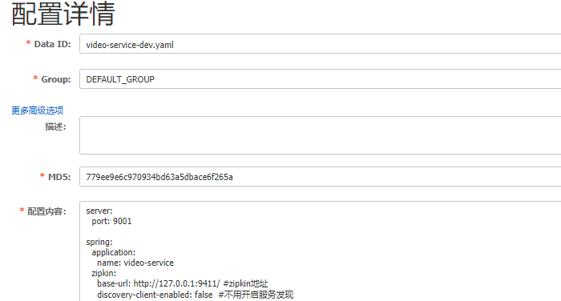

# 一. 组件

https://spring.io/projects/spring-cloud-alibaba

Spring Alibaba Cloud:

- 通信方式：http restful
- 注册中心：nacos
- 配置中心：nacos
- 服务限流降级：sentinel
- 网关：gateway
- 服务之间调用：feign、ribbon
- 链路追踪：sleuth+zipkin


## 1.准备工作

### 数据库

sql语句：

[cloud_order数据库](./sql/cloud_order.sql)

[cloud_user数据库](./sql/cloud_user.sql)

[cloud_video数据库](./sql/cloud_video.sql)


### nacos

linux环境要求：

1. 64 bit OS，支持 Linux/Unix/Mac/Windows，推荐选用 Linux/Unix/Mac。
2. 64 bit JDK 1.8+；[下载](http://www.oracle.com/technetwork/java/javase/downloads/jdk8-downloads-2133151.html) & [配置](https://docs.oracle.com/cd/E19182-01/820-7851/inst_cli_jdk_javahome_t/)。
3. Maven 3.2.x+；[下载](https://maven.apache.org/download.cgi) & [配置](https://maven.apache.org/settings.html)。


从 Github 上下载源码方式

```bash
git clone https://github.com/alibaba/nacos.git
cd nacos/
mvn -Prelease-nacos -Dmaven.test.skip=true clean install -U  
ls -al distribution/target/

// change the $version to your actual path
cd distribution/target/nacos-server-$version/nacos/bin
```


下载编译后压缩包方式

您可以从 [最新稳定版本](https://github.com/alibaba/nacos/releases) 下载 `nacos-server-$version.zip` 包。

```bash
  unzip nacos-server-$version.zip 或者 tar -xvf nacos-server-$version.tar.gz
  cd nacos/bin
```


启动：`sh bin/startup.sh -m standalone`

查看日志：`tail -f /usr/local/nacos/logs/start.out`

访问地址：ip:8848/nacos    账号密码：nacos/nacos


### 项目架构

工具依赖：

```xml
        <!--lombok-->
        <dependency>
            <groupId>org.projectlombok</groupId>
            <artifactId>lombok</artifactId>
            <version>1.18.8</version>
        </dependency>

        <!--swagger文档 访问地址 http://localhost:xxx/swagger-ui.html -->
        <dependency>
            <groupId>io.springfox</groupId>
            <artifactId>springfox-swagger2</artifactId>
            <version>2.6.1</version>
        </dependency>

        <dependency>
            <groupId>io.springfox</groupId>
            <artifactId>springfox-swagger-ui</artifactId>
            <version>2.6.1</version>
        </dependency>
```


# 二. Ribbon

我们会发现Nacos点击了服务下线之后，会发现依旧会轮询服务，这是Ribbon里面更新实例机制导致的（上线延迟也是同理）。

对此需要看一下Ribbon的代码：


首先看一下父类结构：

```java
public interface ServiceInstanceChooser {
	ServiceInstance choose(String serviceId);
}

public interface LoadBalancerClient extends ServiceInstanceChooser {

	<T> T execute(String serviceId, LoadBalancerRequest<T> request) throws IOException;

	<T> T execute(String serviceId, ServiceInstance serviceInstance,
			LoadBalancerRequest<T> request) throws IOException;

	URI reconstructURI(ServiceInstance instance, URI original);
}
```

之后可以看`RibbonLoadBalancerClient`

跟踪链路为：

- `LoadBalancerClient`
- `RibbonLoadBalancerClient` `choose`方法  `getServer`方法
- `BaseLoadBalancer`上的`chooseServer`方法
- `RoundRobinRule`的`choose`方法


`DynamicServerListLoadBalancer`维护了server的列表

查看：

- `DynamicServerListLoadBalancer`构造器里面的`restOfInit(clientConfig);`方法
- `enableAndInitLearnNewServersFeature();`与`updateListOfServers();`
- ` enableAndInitLearnNewServersFeature()`里面的`serverListUpdater.start(updateAction);`
- 可以看到启动了更新的线程，但是设置了频率:

```java
            scheduledFuture = getRefreshExecutor().scheduleWithFixedDelay(
                    wrapperRunnable,
                    initialDelayMs,
                    refreshIntervalMs,
                    TimeUnit.MILLISECONDS
            );
```


## 源码

https://www.cnblogs.com/kongxianghai/p/8456576.html

https://www.cnblogs.com/kongxianghai/p/8445030.html

**RibbonAutoConfiguration**

首先从`RibbonAutoConfiguration`可以看到注入的loadBalancerClient:

```java
	@Bean
	@ConditionalOnMissingBean(LoadBalancerClient.class)
	public LoadBalancerClient loadBalancerClient() {
		return new RibbonLoadBalancerClient(springClientFactory());
	}
```


可以看到必须要在`LoadBalancerAutoConfiguration`之前执行配置：

```java
@AutoConfigureBefore({ LoadBalancerAutoConfiguration.class,
		AsyncLoadBalancerAutoConfiguration.class })
```


------


**LoadBalancerAutoConfiguration**

```java
@Configuration(proxyBeanMethods = false)
@ConditionalOnClass(RestTemplate.class)
@ConditionalOnBean(LoadBalancerClient.class)
@EnableConfigurationProperties(LoadBalancerRetryProperties.class)
public class LoadBalancerAutoConfiguration {
......
}
```

可以看到存在RestTemplate实例以及上一步的LoadBalancerClient.class才会实现配置


之后在LoadBalancerInterceptorConfig里面完成了对restTemplate的定制处理（增加interceptor）

```java
	@Configuration(proxyBeanMethods = false)
	@ConditionalOnMissingClass("org.springframework.retry.support.RetryTemplate")
	static class LoadBalancerInterceptorConfig {

		@Bean
		public LoadBalancerInterceptor ribbonInterceptor(
				LoadBalancerClient loadBalancerClient,
				LoadBalancerRequestFactory requestFactory) {
			return new LoadBalancerInterceptor(loadBalancerClient, requestFactory);
		}

		@Bean
		@ConditionalOnMissingBean
		public RestTemplateCustomizer restTemplateCustomizer(
				final LoadBalancerInterceptor loadBalancerInterceptor) {
			return restTemplate -> {
				List<ClientHttpRequestInterceptor> list = new ArrayList<>(
						restTemplate.getInterceptors());
				list.add(loadBalancerInterceptor);
				restTemplate.setInterceptors(list);
			};
		}

	}
```

之后会设置对restTemplate注入拦截器：

```java
	@Bean
	public SmartInitializingSingleton loadBalancedRestTemplateInitializerDeprecated(
			final ObjectProvider<List<RestTemplateCustomizer>> restTemplateCustomizers) {
		return () -> restTemplateCustomizers.ifAvailable(customizers -> {
			for (RestTemplate restTemplate : LoadBalancerAutoConfiguration.this.restTemplates) {
				for (RestTemplateCustomizer customizer : customizers) {
					customizer.customize(restTemplate);
				}
			}
		});
	}
```


------


**RibbonClientConfiguration**

```java
@Configuration(proxyBeanMethods = false)
@EnableConfigurationProperties	
@Import({ HttpClientConfiguration.class, OkHttpRibbonConfiguration.class,
		RestClientRibbonConfiguration.class, HttpClientRibbonConfiguration.class })
public class RibbonClientConfiguration {
    
	@Bean
	@ConditionalOnMissingBean
	public ILoadBalancer ribbonLoadBalancer(IClientConfig config,
			ServerList<Server> serverList, ServerListFilter<Server> serverListFilter,
			IRule rule, IPing ping, ServerListUpdater serverListUpdater) {
		if (this.propertiesFactory.isSet(ILoadBalancer.class, name)) {
			return this.propertiesFactory.get(ILoadBalancer.class, config, name);
		}
		return new ZoneAwareLoadBalancer<>(config, rule, ping, serverList,
				serverListFilter, serverListUpdater);
	}
}
```

`@EnableConfigurationProperties`就是把`ConfigurationProperties`中的配置中注入，实际上你在`ConfigurationProperties`里面加`@Component`也可以


可以看到是通过`ZoneAwareLoadBalancer`包装的LoadBalancer，他作为具体的负载均衡实现类，通过实现`chooseServer`方法选择服务。


## 使用restTemplate与修改负载均衡策略

```java
@SpringBootApplication
@EnableSwagger2
@EnableDiscoveryClient
public class OrderApplication {
    @Bean
    @LoadBalanced
    public RestTemplate getRestTemplate(){
        return new RestTemplate();
    }

    public static void main(String[] args) {
        SpringApplication.run(OrderApplication.class, args);
    }
}
```

`@EnableDiscoveryClient`表示作为服务注册到注册中心，因为我们这里使用的是Nacos，所以使用通用的配置注解（如果是Eureka可以使用@EnableEurekaClient）

这里注入的@LoadBalanced注解，是由ribbon实现负载均衡


之后我们可以注入restTemplate来调用服务：

```java
@Service
@Slf4j
public class OrderServiceImpl implements OrderService {

    @Resource
    private RestTemplate restTemplate;

    @Resource
    private DiscoveryClient discoveryClient;

    @Override
    public VideoVo create(String videoId) {
        VideoVo videoVo = restTemplate.getForObject("http://video-service/video/getById?id=" + videoId, VideoVo.class);

        List<ServiceInstance> instances = discoveryClient.getInstances("video-service");
        List<String> services = discoveryClient.getServices();
        return videoVo;
    }
}
```

`DiscoveryClient`可以获取注册中心的服务信息（ribbon里面是由`DynamicServerListLoadBalancer`维护）。因为配置了Nacos，所以可以直接使用服务名称。


可以测试看到返回的接口地址是轮询策略，可以修改：

```yaml
server:
  port: xxxx

spring:
  application:
    name: order-service
  datasource:
    driver-class-name: com.mysql.cj.jdbc.Driver
    url: jdbc:mysql://ip:3306/cloud_order?useUnicode=true&characterEncoding=utf-8&useSSL=false&serverTimezone=UTC
    username: username
    password: password
  cloud:
    nacos:
      discovery:
        server-addr: xxxx:8848

video-service:
  ribbon:
    NFLoadBalancerRuleClassName: com.netflix.loadbalancer.RandomRule
```


## 加入fegin实现

依赖：

```xml
        <dependency>
            <groupId>org.springframework.cloud</groupId>
            <artifactId>spring-cloud-starter-openfeign</artifactId>
        </dependency>
```


开启：

`@EnableFeignClients`


编写：

```java
@FeignClient(value = "video-service", fallback = VideoServiceFallBack.class)
//@RequestMapping("video")如果注解加在这里，会和VideoServiceFallBack报重复实现的错误https://github.com/spring-cloud/spring-cloud-netflix/issues/2677
public interface VideoService {
    @GetMapping("video/getById")
    VideoVo getById(@RequestParam("id") String id);
}
```


# 三. Sentinel流量管理

https://github.com/alibaba/Sentinel/wiki


搭建控制台：

https://github.com/alibaba/Sentinel/wiki/控制台

下载jar包：https://github.com/alibaba/Sentinel/releases

启动：`nohup java -Dserver.port=8080 -Dcsp.sentinel.dashboard.server=localhost:8080 -Dproject.name=sentinel-dashboard -jar sentinel-dashboard-1.8.0.jar &`

访问：http://ip:8080/    用户名密码sentinel/sentinel

- 控制台推送规则的日志在 ：${user.home}/logs/csp/sentinel-dashboard.log 中，
- 客户端接收规则日志在 ${user.home}/logs/csp/record.log 中

-----


引入客户端：https://github.com/alibaba/spring-cloud-alibaba/wiki/Sentinel

依赖：

```xml
        <dependency>
            <groupId>com.alibaba.cloud</groupId>
            <artifactId>spring-cloud-starter-alibaba-sentinel</artifactId>
        </dependency>
```


配置：

```yaml
spring:
  cloud:
    sentinel:
      transport:
        dashboard: x:8080
        port: 8179
 
#加入sentinel对feign支持
feign:
  sentinel:
    enabled: true
```

这里的 `spring.cloud.sentinel.transport.port` 端口配置会在应用对应的机器上启动一个 Http Server，该 Server 会与 Sentinel 控制台做交互。比如 Sentinel 控制台添加了一个限流规则，会把规则数据 push 给这个 Http Server 接收，Http Server 再将规则注册到 Sentinel 中。


## 1. 流量控制

https://github.com/alibaba/Sentinel/wiki/流量控制

## 2. 熔断降级

https://github.com/alibaba/Sentinel/wiki/熔断降级

熔断的状态：

- 关闭
- 开启
- 半熔断


# 四. 网关

## 1. 介绍

SpringCloud Gateway 基于Spring5 + Reactor + webFlux


https://spring.io/projects/spring-cloud-gateway


## 2. 关于Reactor

首先理解一下观察者模式


Subject维护观察者列表，负责统一通知观察者

Observer观察者自定义事件变化的作用

观察者模式是由变化者通知，也就是一个推送的模式。


Reactive 响应式编程需要考虑控制消息的速度（可能推送太快，超过了观察者处理的速度）


Reactor框架包含：

- reactor-core 负责Reactive Programming的相关核心实现
- reactor-ipc 负责高性能网络通信实现（目前基于netty）


主要实现类：

- `Mono` 实现了 `org.reactivestreams.Publisher` 接口，代表0到1个元素的发布者。

- `Flux` 同样实现了 `org.reactivestreams.Publisher` 接口，代表0到N个元素的发表者。

- `Scheduler` 表示背后驱动反应式流的调度器，通常由各种线程池实现。


## 3. 网关实践

依赖：

为了从nacos中直接拉取注册服务的地址而不是写死服务地址，这里引入依赖，同时也需要在启动配置类里面添加`@EnableDiscoveryClient`注册网关服务到Nacos中

```xml
    <dependencies>
        <dependency>
            <groupId>org.springframework.cloud</groupId>
            <artifactId>spring-cloud-starter-gateway</artifactId>
        </dependency>
        <dependency>
            <groupId>com.alibaba.cloud</groupId>
            <artifactId>spring-cloud-starter-alibaba-nacos-discovery</artifactId>
        </dependency>
    </dependencies>
```


配置：

```yaml
spring:
  application:
    name: gateway
  cloud:
    nacos:
      discovery:
        server-addr: xxxx:8848
    gateway:
      routes:                          #数组的形式
        - id: order-service            #路由唯一标识
          uri: lb://order-service      #从nocas进行转发
          order: 1           #优先级，数字越小优先级越高
          predicates:        #断言 配置哪个路径才转发
            - Path=/order-service/**
            - Before=2020-09-11T01:01:01.000+08:00  # 在这个时间点之后不能访问
            #- Query=source  #一定携带这个参数
          filter:            #过滤器，请求在传递过程中通过过滤器修改
            - StripPrefix=1	 #去掉第一层前缀

        - id: video-service
          uri: lb://video-service
          order: 1
          predicates:
            - Path=/video-service/**
          filter:
            - StripPrefix=1
```

如果服务和请求同名，可以直接配置：

```yaml
spring:
  application:
    name: gateway
  cloud:
    nacos:
      discovery:
        server-addr: xxxx:8848
    gateway:
      discovery:
        locator:
          #开启网关拉取nacos的服务
          enabled: true
          lower-case-service-id: true
```


predicates类似java8里面的断言，也就是传入参数返回布尔值`boolean test(T t);`

关于断言的实现类可以查看`RoutePredicateFactory `的实现类


过滤器的接口是`GatewayFilterFactory`，全局的接口是`GlobalFilter`


### 3.1 Predicates

断言也可以配置成：

```yaml
spring:
  cloud:
    gateway:
      routes:
      - id: after_route
        uri: https://example.org
        predicates:
        - name: Cookie
          args:
            name: mycookie
            regexp: mycookievalue
```


在使用`- name=args`的时候，多个参数可以使用逗号隔开：

```yaml
spring:
  cloud:
    gateway:
      routes:
      - id: between_route
        uri: https://example.org
        predicates:
        - Between=2017-01-20T17:42:47.789-07:00[America/Denver], 2017-01-21T17:42:47.789-07:00[America/Denver]
```


我们首先看一个例子：

对应的配置：`- Before=2020-11-04T10:11:58.880159200+08:00[Asia/Shanghai]  # 在这个时间点之后不能访问`

这个时间怎么写，可以使用：

`System.out.println(ZonedDateTime.now());`

来比对，因为源码就是这么操作的。


会被解析为`PredicateDefinition`，其中`name=Before,args=2020-11-04T10:11:58.880159200+08:00[Asia/Shanghai]`


根据name找到对应的实现类：`BeforeRoutePredicateFactory`

```java
	@Override
	public Predicate<ServerWebExchange> apply(Config config) {
		return new GatewayPredicate() {
			@Override
			public boolean test(ServerWebExchange serverWebExchange) {
				final ZonedDateTime now = ZonedDateTime.now();
				return now.isBefore(config.getDatetime());
			}

			@Override
			public String toString() {
				return String.format("Before: %s", config.getDatetime());
			}
		};
	}
```

这里返回一个Predicate断言类，会比较当前的时间是否在配置中的时间之前，对应的配置为：

```java
	public static class Config {

		private ZonedDateTime datetime;

		public ZonedDateTime getDatetime() {
			return datetime;
		}

		public void setDatetime(ZonedDateTime datetime) {
			this.datetime = datetime;
		}

	}
```


### 3.2 自定义全局过滤器

```java
@Component
public class UserGlobalFilter implements GlobalFilter, Ordered {
    @Override
    public Mono<Void> filter(ServerWebExchange exchange, GatewayFilterChain chain) {
        String token = exchange.getRequest().getHeaders().getFirst("token");

        if (StringUtils.isBlank(token)) {
            exchange.getResponse().setStatusCode(HttpStatus.UNAUTHORIZED);
            return exchange.getResponse().setComplete();
        }
        return chain.filter(exchange);
    }

    @Override
    public int getOrder() {
        return 0;
    }
}
```


# 五. 链路追踪

应用：排查链路问题（调用链路耗时长）

功能：将一次请求分布式调用，定位起来，记录耗时、性能等日志，使用可视化工具显示。


## 1. Sleuth

https://spring.io/projects/spring-cloud-sleuth


引入依赖：

```xml
<dependency>
      <groupId>org.springframework.cloud</groupId>
      <artifactId>spring-cloud-starter-sleuth</artifactId>
</dependency>
```


运行项目请求后日志输出：

`INFO [gateway,3ba41502bfe28fc6,3ba41502bfe28fc6,true] `

第一个序列是Trace ID，第二个是Span ID，最后一个为true表示将信息输出到zipkin


我们通过网关->订单服务->视频服务调用一次，Trace ID是一样的，代表一次请求，而Span ID是每个服务独有的


## 2. Zipkin 

https://zipkin.io/


启动：`java -jar zipkin-server-2.12.9-exec.jar`

访问：http://ip:9411/zipkin/


依赖：

```xml
<dependency>
    <groupId>org.springframework.cloud</groupId>
    <artifactId>spring-cloud-starter-zipkin</artifactId>
</dependency>
```


配置文件：

```yaml
spring:
  application:
    name: api-gateway
  zipkin:
    base-url: http://ip:9411/ #zipkin地址
    discovery-client-enabled: false  #不用开启服务发现
    
  sleuth:
    sampler:
      probability: 1.0 #采样百分比，这只为1表示记录全部sleuth信息，仅为测试用（过于频繁会影响性能）
```


持久化：

添加sql：

```sql
CREATE TABLE IF NOT EXISTS zipkin_spans (
  `trace_id_high` BIGINT NOT NULL DEFAULT 0 COMMENT 'If non zero, this means the trace uses 128 bit traceIds instead of 64 bit',
  `trace_id` BIGINT NOT NULL,
  `id` BIGINT NOT NULL,
  `name` VARCHAR(255) NOT NULL,
  `remote_service_name` VARCHAR(255),
  `parent_id` BIGINT,
  `debug` BIT(1),
  `start_ts` BIGINT COMMENT 'Span.timestamp(): epoch micros used for endTs query and to implement TTL',
  `duration` BIGINT COMMENT 'Span.duration(): micros used for minDuration and maxDuration query',
  PRIMARY KEY (`trace_id_high`, `trace_id`, `id`)
) ENGINE=InnoDB ROW_FORMAT=COMPRESSED CHARACTER SET=utf8 COLLATE utf8_general_ci;
 
ALTER TABLE zipkin_spans ADD INDEX(`trace_id_high`, `trace_id`) COMMENT 'for getTracesByIds';
ALTER TABLE zipkin_spans ADD INDEX(`name`) COMMENT 'for getTraces and getSpanNames';
ALTER TABLE zipkin_spans ADD INDEX(`remote_service_name`) COMMENT 'for getTraces and getRemoteServiceNames';
ALTER TABLE zipkin_spans ADD INDEX(`start_ts`) COMMENT 'for getTraces ordering and range';
 
CREATE TABLE IF NOT EXISTS zipkin_annotations (
  `trace_id_high` BIGINT NOT NULL DEFAULT 0 COMMENT 'If non zero, this means the trace uses 128 bit traceIds instead of 64 bit',
  `trace_id` BIGINT NOT NULL COMMENT 'coincides with zipkin_spans.trace_id',
  `span_id` BIGINT NOT NULL COMMENT 'coincides with zipkin_spans.id',
  `a_key` VARCHAR(255) NOT NULL COMMENT 'BinaryAnnotation.key or Annotation.value if type == -1',
  `a_value` BLOB COMMENT 'BinaryAnnotation.value(), which must be smaller than 64KB',
  `a_type` INT NOT NULL COMMENT 'BinaryAnnotation.type() or -1 if Annotation',
  `a_timestamp` BIGINT COMMENT 'Used to implement TTL; Annotation.timestamp or zipkin_spans.timestamp',
  `endpoint_ipv4` INT COMMENT 'Null when Binary/Annotation.endpoint is null',
  `endpoint_ipv6` BINARY(16) COMMENT 'Null when Binary/Annotation.endpoint is null, or no IPv6 address',
  `endpoint_port` SMALLINT COMMENT 'Null when Binary/Annotation.endpoint is null',
  `endpoint_service_name` VARCHAR(255) COMMENT 'Null when Binary/Annotation.endpoint is null'
) ENGINE=InnoDB ROW_FORMAT=COMPRESSED CHARACTER SET=utf8 COLLATE utf8_general_ci;
 
ALTER TABLE zipkin_annotations ADD UNIQUE KEY(`trace_id_high`, `trace_id`, `span_id`, `a_key`, `a_timestamp`) COMMENT 'Ignore insert on duplicate';
ALTER TABLE zipkin_annotations ADD INDEX(`trace_id_high`, `trace_id`, `span_id`) COMMENT 'for joining with zipkin_spans';
ALTER TABLE zipkin_annotations ADD INDEX(`trace_id_high`, `trace_id`) COMMENT 'for getTraces/ByIds';
ALTER TABLE zipkin_annotations ADD INDEX(`endpoint_service_name`) COMMENT 'for getTraces and getServiceNames';
ALTER TABLE zipkin_annotations ADD INDEX(`a_type`) COMMENT 'for getTraces and autocomplete values';
ALTER TABLE zipkin_annotations ADD INDEX(`a_key`) COMMENT 'for getTraces and autocomplete values';
ALTER TABLE zipkin_annotations ADD INDEX(`trace_id`, `span_id`, `a_key`) COMMENT 'for dependencies job';
 
CREATE TABLE IF NOT EXISTS zipkin_dependencies (
  `day` DATE NOT NULL,
  `parent` VARCHAR(255) NOT NULL,
  `child` VARCHAR(255) NOT NULL,
  `call_count` BIGINT,
  `error_count` BIGINT,
  PRIMARY KEY (`day`, `parent`, `child`)
) ENGINE=InnoDB ROW_FORMAT=COMPRESSED CHARACTER SET=utf8 COLLATE utf8_general_ci;
```


启动命令：`java -jar zipkin-server-2.12.9-exec.jar --STORAGE_TYPE=mysql --MYSQL_HOST=ip --MYSQL_TCP_PORT=3306 --MYSQL_DB=zipkin_log --MYSQL_USER=root --MYSQL_PASS=123456`


# 六. 配置中心

启动：`sh bin/startup.sh -m standalone`

查看日志：`tail -f /usr/local/nacos/logs/start.out`

访问地址：localhost:8848/nacos    账号密码：nacos/nacos


其他产品：

https://github.com/knightliao/disconf

https://github.com/takeseem/diamond

http://cloud.spring.io/spring-cloud-config/

Nacos：

https://github.com/alibaba/spring-cloud-alibaba/wiki/Nacos-config


添加依赖：

```xml
        <!--nacos配置中心-->
        <dependency>
            <groupId>com.alibaba.cloud</groupId>
            <artifactId>spring-cloud-starter-alibaba-nacos-config</artifactId>
        </dependency>
```


spring 配置文件的优先级：bootstrap.yml>application.yml

因此我们修改配置文件为bootstap.yml，把其他的配置转移到nacos里面去配置

```yaml
#bootstap.yml
spring:
  application:
    name: video-service
  cloud:
    nacos:
      config:
        server-addr: ip:8848 #Nacos配置中心地址
        file-extension: yaml #文件扩展格式

  profiles:
    active: dev
```


后面在nacos配置的包括：

spring.application.name-环境.yaml


如：video-service-dev.yaml

group可以在配置文件里面配置：





发布后可以查看：

`curl -X GET "http://ip:8848/nacos/v1/cs/configs?dataId=video-service-dev&group=DEFAULT_GROUP"`


```
http://ip:8848/nacos/v1/cs/configs?dataId=video-service-dev.yaml&group=DEFAULT_GROUP
```


在需要监听更新的配置上添加注解`@RefreshScope`

```java
@RestController
@RequestMapping("/config")
@RefreshScope
public class TestNacosConfigController {
    @Value("${customization.testVal}")
    private String testVal;

    @GetMapping("test")
    public String test() {
        return testVal;
    }
}
```

