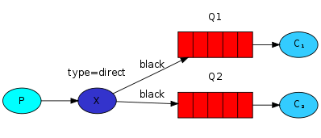

# RabbitMQ Note

refer: [RabbitMQ Tutorials](https://www.rabbitmq.com/getstarted.html)


## Download&Install

[Downloading and Installing RabbitMQ](https://www.rabbitmq.com/download.html)


### Windows

Two recommended installation options:

#### Using Chocolately

may not be the lastest release, use Cli or PowerShell:

`choco install rabbotmq`


#### Official installer(By administrative user)

1. Install [Erlang](https://erlang.org/download/otp_versions_tree.html) :see [supported version of Erlang](https://www.rabbitmq.com/which-erlang.html)
2. Download [rabbitmq-server-{version}.exe](https://github.com/rabbitmq/rabbitmq-server/releases/download/v3.8.5/rabbitmq-server-3.8.5.exe)
3. Enable Management Plugin 
   1. enter the install directory: C:\Program Files\RabbitMQ Server\rabbitmq_server-3.8.5\sbin
   2. enbale plugin:`rabbitmq-plugins enable rabbitmq_management`
4. Start service: You can star a service use the Windows Start Menu or just run the command `rabbitmq-server.bat` under install dir.
5. As you already enable manage plugin, you can access `http://localhost:15672/` enter the managemenr, both Username and Password are **guest**


Now you can operate in the Management Console instead of use  `rabbitmqctl`.


## Applications

[base examples](https://github.com/zrinGithub/work-util/tree/master/src/main/java/rabbitmq)


There are some jargon:

- **Producer**: send messages
- **Queue**: message stored in a queue. produces send messages into one queue and consumer receive data from queue.
- **Comsumer**: receive message


And to run the following examples, you need import the dependences:

```xml
<dependency>
  <groupId>com.rabbitmq</groupId>
  <artifactId>amqp-client</artifactId>
  <version>5.9.0</version>
</dependency>
```


### Simple One-Way 


#### Sending

```java
public class Send {
    //name the queue
    //it will only be created if it doesn't exist already
    private final static String QUEUE_NAME = "hello";

    private void send() {
        ConnectionFactory factory = new ConnectionFactory();
        factory.setHost("127.0.0.1");
        factory.setPort(5672);
        //create a connection to the server
        try (Connection connection = factory.newConnection();   
             //abstract a socket connection
             Channel channel = connection.createChannel()) {
            /**
             * param:
             * queueName
             * durable
             * exclusive
             * autoDelete
             * arguments
             */
            channel.queueDeclare(QUEUE_NAME, false, false, false, null);
            String msg = "Hello World!";
            channel.basicPublish("", QUEUE_NAME, null, msg.getBytes());
            System.out.println("Send : " + msg);
        } catch (Exception e) {
            e.printStackTrace();
        }
    }

    public static void main(String[] args) {
        new Send().send();
    }
}
```


#### Receiving

```java
public class Recv {
    //name the queue
    //it will only be created if it doesn't exist already
    private final static String QUEUE_NAME = "hello";

    private void receive() {
        ConnectionFactory factory = new ConnectionFactory();
        factory.setHost("127.0.0.1");
        factory.setPort(5672);

        try {
            //create a connection to the server
            Connection connection = factory.newConnection();
            Channel channel = connection.createChannel();
            //declare a queue here, because we may start a consume before the publisher
            //make sure the queue exits before we try to consume message from it.
            channel.queueDeclare(QUEUE_NAME, false, false, false, null);
            System.out.println("Waiting for the message");

            //prepare the callback: when get message, print on the console
            DeliverCallback deliverCallback = (consumerTag, message) -> {
                String msg = new String(message.getBody(), "UTF-8");
                System.out.println("Receive msg : " + msg);
            };

            //start receive message
            channel.basicConsume(QUEUE_NAME, true, deliverCallback, consumerTag -> {
            });
        } catch (Exception e) {
            e.printStackTrace();
        }
    }

    public static void main(String[] args) {
        new Recv().receive();
    }
}
```


### Work Queues


Use a Work Queue to distribute tasks among multiple workers.

#### Round-robin dispatching

By default, RabbitMQ whill dispatch message in a Round-robin way.


#### Message acknowledgement

`channel.basicConsume(QUEUE_NAME, true, deliverCallback, consumerTag -> {});`

The second param is `autoAck=true` means the cosumer will automatic send an acknowledgement  to tell RabbitMQ the msg is processed and free to delete.


But sometimes we want make sure that no message lost, in such case, we can send acknowledgment manual.

```java
public class Recv {
    //name the queue
    //it will only be created if it doesn't exist already
    private final static String QUEUE_NAME = "hello";

    private void receive() {
        ConnectionFactory factory = new ConnectionFactory();
        factory.setHost("127.0.0.1");
        factory.setPort(5672);

        try {
            Connection connection = factory.newConnection();
            Channel channel = connection.createChannel();
            channel.queueDeclare(QUEUE_NAME, false, false, false, null);
            System.out.println("Waiting for the message");

            //accept only one unack-ed message at a time
            //param is prefetch
            channel.basicQos(1);

            //prepare the callback: when get message, print on the console
            DeliverCallback deliverCallback = (consumerTag, message) -> {
                String msg = new String(message.getBody(), "UTF-8");
                System.out.println("Receive msg : " + msg);
                try {
                    Thread.sleep(5000);
                } catch (Exception e) {
                    e.printStackTrace();
                } finally {
                    System.out.println("done work with msg");
                    channel.basicAck(message.getEnvelope().getDeliveryTag(), false);
                }
            };

            //start receive message
            channel.basicConsume(QUEUE_NAME, false, deliverCallback, consumerTag -> {
            });
        } catch (Exception e) {
            e.printStackTrace();
        }
    }

    public static void main(String[] args) {
        new Recv().receive();
    }
}
```

the work die and unacknowledged , 


#### Message durability

If we don't want lost our message after RabbitMQ quits or crashes, we need to mark both the **queue and messages as durable**.


1. declare a queue durable:

```java
boolean durable = true;
channel.queueDeclare(QUEUE_NAME, durable, false, false, null);
```

if you start it now, you will see that error message for you can't redefine an existing queue:

```java
com.rabbitmq.client.ShutdownSignalException: channel error; protocol method: #method<channel.close>(reply-code=406, reply-text=PRECONDITION_FAILED - inequivalent arg 'durable' for queue 'hello' in vhost '/': received 'true' but current is 'false', class-id=50, method-id=10)
```


2. declare message persistent

```java
channel.basicPublish(
    "", 
    QUEUE_NAME, 
    MessageProperties.PERSISTENT_TEXT_PLAIN, 
    msg.getBytes());
```


#### Fair dispatch

As we see in the [Message acknowledgement](#Message acknowledgement), we set:

```java
channel.basicQos(1);
```

it means RabbitMQ not to give more than one message to a worker at a time.

it also means not to give more than one message to a worker at a time.


### Publish/Subscribe

In this mode, we can **deliver a message to multiple consumers**


#### Exchange

In previous part, we send and receive message to and from a queue, 

Now we send message to exchange. The **exchange** will receive message from producers and pushes message to queue.

**exchange type** can decide how to append message to a particular queue or many queues,

there are sine exchange types: 

- direct
- topic
- header
- fanout: broadcast all message to all the queues it knows.


in this mode, we can use fanout to do the work:

`channel.exchangeDeclare("logs","fanout");`

it means the exchange in a fanout mode.


we can use nameless exchange identified by the empty string "":

`channel.basicPublish("", "hello", null, message.getBytes());`


#### Temporary queues

1. We can let the server choose a random queue name for us
2. When we disconnected the consumer, the queue should be automatically deleted.

For these purpose, we can use `queueDeclare()` to create a **non_durable, exclusive, autodelete** queue 

`String queueName = channel.queueDeclare().getQueue();`


#### Bindings

Bind queue to exchange:

`channel.queueBind(queueName, "logs", "");`


#### Producer

```java
public class Send {
    private final static String EXCHANGE_NAME = "logs";

    private void send() {
        ConnectionFactory factory = new ConnectionFactory();
        factory.setHost("127.0.0.1");
        factory.setPort(5672);
        try (Connection connection = factory.newConnection();
             Channel channel = connection.createChannel()) {
            channel.exchangeDeclare(EXCHANGE_NAME, "fanout");
            String msg = "Hello World!\t" + RandomStringUtils.randomAlphabetic(10);
            channel.basicPublish(EXCHANGE_NAME, "", null, msg.getBytes());
            System.out.println("Send : " + msg);
        } catch (Exception e) {
            e.printStackTrace();
        }
    }

    public static void main(String[] args) {
        new Send().send();
    }
}
```

No queue is bound to the exchange yet, that means we discard all message when no consumer is listening yet.


#### Consumer

```java
public class Recv {
    private final static String EXCHANGE_NAME = "logs";

    private void receive() {
        ConnectionFactory factory = new ConnectionFactory();
        factory.setHost("127.0.0.1");
        factory.setPort(5672);
        try {
            Connection connection = factory.newConnection();
            Channel channel = connection.createChannel();

            channel.exchangeDeclare(EXCHANGE_NAME, "fanout");
            String queueName = channel.queueDeclare().getQueue();
            channel.queueBind(queueName, EXCHANGE_NAME, "");

            System.out.println("Waiting for the message");

            DeliverCallback deliverCallback = (consumerTag, message) -> {
                String msg = new String(message.getBody(), "UTF-8");
                System.out.println("Receive msg : " + msg);
            };

            channel.basicConsume(queueName, true, deliverCallback, consumerTag -> {
            });
        } catch (Exception e) {
            e.printStackTrace();
        }
    }

    public static void main(String[] args) {
        new Recv().receive();
    }
}
```


### Routing

In the previous Code, we use 

`channel.queueBind(queueName, EXCHANGE_NAME, "");`

to bind a queue to a exchange, the third parameter is routing key, we can bind a key:

`channel.queueBind(queueName, EXCHANGE_NAME, "key");`

if exchange type is `fanout`, the key will be ignored.


#### Direct

`fanout` can't provide flexibility, we use `direct` so we can send message to queue matched the routing key.


#### Multiple bindings




#### Producer

```java
public class Send {
    private final static String EXCHANGE_NAME = "logs";

    private void send() {
        ConnectionFactory factory = new ConnectionFactory();
        factory.setHost("127.0.0.1");
        factory.setPort(5672);
        try (Connection connection = factory.newConnection();
             Channel channel = connection.createChannel()) {
            channel.exchangeDeclare(EXCHANGE_NAME, "direct");

            int i = RandomUtils.nextInt(1, 4);
            String msg = "Hello World! message" + i;

            channel.basicPublish(EXCHANGE_NAME, "route" + i, null, msg.getBytes());
            System.out.println("Send : " + msg);
        } catch (Exception e) {
            e.printStackTrace();
        }
    }

    public static void main(String[] args) {
        new Send().send();
    }
}
```


#### Consumer

```java
public class Recv {
    private final static String EXCHANGE_NAME = "logs";

    private void receive(String routeName) {
        ConnectionFactory factory = new ConnectionFactory();
        factory.setHost("127.0.0.1");
        factory.setPort(5672);
        try {
            Connection connection = factory.newConnection();
            Channel channel = connection.createChannel();

            channel.exchangeDeclare(EXCHANGE_NAME, "direct");
            String queueName = channel.queueDeclare().getQueue();

            channel.queueBind(queueName, EXCHANGE_NAME, routeName);

            System.out.println("Waiting for the message");

            DeliverCallback deliverCallback = (consumerTag, message) -> {
                String msg = new String(message.getBody(), "UTF-8");
                System.out.println("Receive msg : " + msg);
            };

            channel.basicConsume(queueName, true, deliverCallback, consumerTag -> {
            });
        } catch (Exception e) {
            e.printStackTrace();
        }
    }

    public static void main(String[] args) {
        new Recv().receive(args[0]);
    }
}
```


### Topic

When we want to subscribe the specific producer, we need use **Topic exchange**.


#### Topic exchange

Use list of words delimited by dot to express a topic exchange like `stock.usd.nyse`.

The route key is the same, and have some special keys:

- \* (star) can substitute for exactly one word.
- \# (hash) can substitute for zero or more words.


In this case, we use **<speed>.<colour>.<species>**:

- Q1 is interested in all the orange animals.
- Q2 wants to hear everything about rabbit and everything about lasy animals.

ex. 

"quick.orange.rabbit" -> Q1&Q2

"quick.orange.fox" -> only Q1

"quick.brown.fox" -> discard

"lazy.orange.male.rabbit" -> only Q2


#### Producer

```java
public class Send {
    private final static String EXCHANGE_NAME = "logs";

    private void send() {
        ConnectionFactory factory = new ConnectionFactory();
        factory.setHost("127.0.0.1");
        factory.setPort(5672);
        try (Connection connection = factory.newConnection();
             Channel channel = connection.createChannel()) {
            channel.exchangeDeclare(EXCHANGE_NAME, "topic");

            String msg = "Hello World!";

            channel.basicPublish(EXCHANGE_NAME, "name.score.class.A.a", null, msg.getBytes());
            System.out.println("Send : " + msg);
        } catch (Exception e) {
            e.printStackTrace();
        }
    }

    public static void main(String[] args) {
        new Send().send();
    }
}
```


#### Consumer

```java
public class Recv {
    private final static String EXCHANGE_NAME = "logs";

    private void receive(String routeName) {
        ConnectionFactory factory = new ConnectionFactory();
        factory.setHost("127.0.0.1");
        factory.setPort(5672);
        try {
            Connection connection = factory.newConnection();
            Channel channel = connection.createChannel();

            channel.exchangeDeclare(EXCHANGE_NAME, "topic");
            String queueName = channel.queueDeclare().getQueue();

            channel.queueBind(queueName, EXCHANGE_NAME, routeName);

            System.out.println("Waiting for the message");

            DeliverCallback deliverCallback = (consumerTag, message) -> {
                String msg = new String(message.getBody(), "UTF-8");
                System.out.println("Receive msg : " + msg);
            };

            channel.basicConsume(queueName, true, deliverCallback, consumerTag -> {
            });
        } catch (Exception e) {
            e.printStackTrace();
        }
    }
		
    //test:
    //name.score.#
    //name.score.class
    public static void main(String[] args) {
        System.out.println(args[0] + "start ... ");
        new Recv().receive(args[0]);
    }
}
```

 

### RPC


## SpringBoot

[rabbitmq-demo](https://github.com/zrinGithub/rabbitmq-demo.git)


### Config

pom:

```xml
<dependency>
    <groupId>org.springframework.boot</groupId>
    <artifactId>spring-boot-starter-amqp</artifactId>
</dependency>
```


`application.yml`:

```yaml
spring:
  rabbitmq:
    password: guest
    username: guest
    port: 5672
    addresses: 127.0.0.1
    #开启发送失败返回
    publisher-returns: true
    #结合上面的publisherReturns可以支持已确认（具有相关性）和返回的消息
    publisher-confirm-type: correlated
    listener:
      simple:
        #最小消费者数量
        concurrency: 2
        #最大消费者数量
        max-concurrency: 2
        #设置ack方式为自动提交
        acknowledge-mode: auto
      direct:
        acknowledge-mode: auto
    template:
      #支持消息的确认和返回
      mandatory: true

```


#### Configuration Class

```java
@Configuration
public class RabbitMqConfig {
    private final static String TOPIC_QUEUE_NAME = "topic_queue";
    private final static String FANOUT_QUEUE_NAME = "fanout_queue";
    private final static String TOPIC_EXCHANGE = "topic_exchange";
    private final static String FANOUT_EXCHANGE = "fanout_exchange";
    public final static String TOPIC_ROUTE_KEY_A = "keyA.*";

    @Bean
    public Queue topicQueue() {
        return new Queue(TOPIC_QUEUE_NAME, true);
    }

    @Bean
    public TopicExchange topExchange() {
        return new TopicExchange(TOPIC_EXCHANGE);
    }

    @Bean
    public Queue fanoutQueue() {
        return new Queue(FANOUT_QUEUE_NAME, true);
    }

    @Bean
    public FanoutExchange fanoutExchange() {
        return new FanoutExchange(FANOUT_EXCHANGE);
    }

    @Bean
    public Binding topExchangeBinging() {
        return BindingBuilder.bind(topicQueue()).to(topExchange()).with(TOPIC_ROUTE_KEY_A);
    }

    @Bean
    public Binding fanoutExchangeBinging() {
        return BindingBuilder.bind(fanoutQueue()).to(fanoutExchange());
    }
}
```

`topExchangeBinging()` and `fanoutExchangeBinging` already bind queue to exchange.

 

#### Annotation

```java
@Component
@Slf4j
public class RabbitMqAnnotationConfig {
    @RabbitListener(bindings = {
            @QueueBinding(
                    value = @Queue(value = "topic_queue", durable = "true"),
                    exchange = @Exchange(value = "topic_exchange", type = ExchangeTypes.TOPIC),
                    key = "keyA.*")})
    public void receiveMqExchangeInfo(String msg) {
        log.info("接受到topic_queue的消息" + msg);
    }

}
```

`@Queue` set the queue name and durable, `@Exchange` bind exchange with queue and set exchange type to topic.


### Send message

As we already set the configuration in `application.yml`, now we can use `RabbitTemplate` to send messages.

```java
    @Resource
    private RabbitTemplate rabbitTemplate;

    @Override
    public String test(String msg) {
        Object receive = rabbitTemplate.convertSendAndReceive("topic_exchange", "keyA.A", msg);
        return receive == null ? "hello word!" : receive.toString();
    }
```


### SpringBoot Annotation

There are some annotation you can use in springboot.


#### @RabbitListener

```java
@Target({ ElementType.TYPE, ElementType.METHOD, ElementType.ANNOTATION_TYPE })
public @interface RabbitListener {
    .....
}
```


##### param

we can use `Message` as param, the `Message` id convert by `MessageConverter`

```java
@RabbitListener(queues = "")
public void processMessage1(Message bytes) {
    System.out.println(new String(bytes));
}
```


we can use following annotations:

```java
@RabbitListener(queues = "")
public void processMessage1(
    @Payload String body, 
    @Headers Map<String,Object> headers
    @Header String token) {
    ...
}
```


##### bind

```java
    @RabbitListener(bindings = {
            @QueueBinding(
                    value = @Queue(value = "topic_queue", durable = "true"),
                    exchange = @Exchange(value = "topic_exchange", durable = "true", type = ExchangeTypes.TOPIC),
                    key = "keyA.*")})
    public void receiveMqExchangeInfo(String msg) {
        log.info("接受到topic_queue的消息" + msg);
    }
```


### @RabbitHandler

Sometimes message can be different type:

```java
@Component
@RabbitListener(queues = "")
public class Receiver {

    @RabbitHandler
    public void processMessage1(String message) {
        System.out.println(message);
    }

    @RabbitHandler
    public void processMessage2(byte[] message) {
        System.out.println(new String(message));
    }
    
}
```


## Examples：Order

[rabbitmq-demo](https://github.com/zrinGithub/rabbitmq-demo.git)

see this example in branch `order-simulation`
