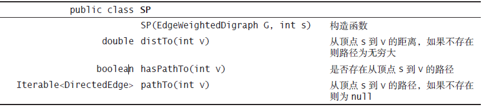
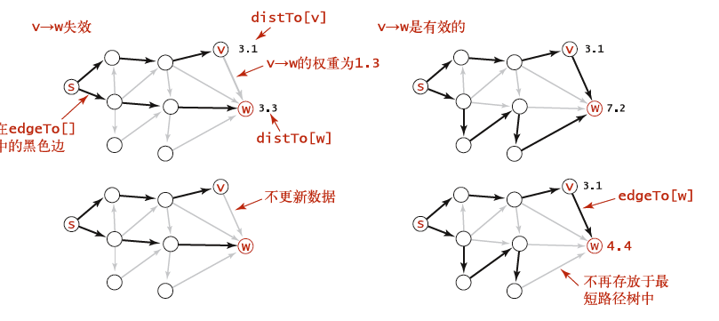
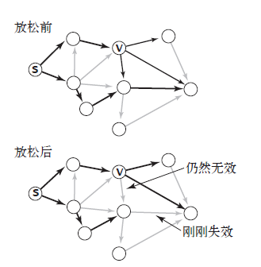

# 算法笔记

该文档为[算法（第四版）](https://www.ituring.com.cn/book/875)笔记

参考

- [数据结构与算法](https://www.cnblogs.com/skywang12345/p/3603935.html)
- [Markdown数学公式语法](https://www.jianshu.com/p/e74eb43960a1)


下载jar包[algs4.jar](https://algs4.cs.princeton.edu/code/)


## 目录

[TOC]


## 一.基础

### 矩阵乘法

[维基百科](http://zh.wikipedia.org/wiki/矩陣乘法)

矩阵A*B，要求矩阵A的列数和B的行数相同，可以使用向量的方式计算

```java
    public static double[][] matrixMultiplication(double[][] a, double[][] b) {
        int row = a.length;
        int col = b[0].length;
        int inner = b.length;
        double[][] result = new double[row][col];
        for (int i = 0; i < row; i++) {
            for (int j = 0; j < col; j++) {
                for (int k = 0; k < inner; k++) {
                    result[i][j] += a[i][k] * b[k][j];
                }
            }
        }
        return result;
    }
```


### 牛顿平方根

函数f(x)=x^2-N，计算N的平方根也就是求f(x)=0的x值

倒数为2x，在n点做切线函数为g(x)=2x(x-n)+(n^2-N)  切线与x轴的交点为：

x=(n+N/n)/2

逐渐靠近计算

```java
    public static double sqrt(double c) {
        //误差范围
        double err = 1e-10;
        double t = c;
        while (Math.abs(t - c / t) > err * t)
            t = (c / t + t) / 2.0;
        return t;
    }
```


### Bag&Queue&Stack

#### Bag

- 使用链表实现

- 不支持从中删除元素的集合类型
- 像一个背包一样，遍历的时候不需要考虑元素的处理顺序

适合用于做与元素顺序无关的统计：

```java
public class BagTest {
    public static void main(String[] args) {
        Bag<Double> numbers = new Bag<Double>();
        while (!StdIn.isEmpty())
            numbers.add(StdIn.readDouble());
        int N = numbers.size();
        double sum = 0.0;
        for (double x : numbers)
            sum += x;
        //计算平均值
        double mean = sum / N;
        sum = 0.0;
        //计算每个值和平均值之差的平方和除以(N-1)后的平方根
        //这里为什么除以N-1而不是N 参考https://www.zhihu.com/question/20099757
        for (double x : numbers)
            sum += (x - mean) * (x - mean);
        double std = Math.sqrt(sum / (N - 1));
        StdOut.printf("Mean: %.2f\n", mean);
        StdOut.printf("Std dev: %.2f\n", std);
    }
}
```


#### Queue

- FIFO

可以使用单向链表来实现队列，但是只能在队尾入队。（因为队尾删除的话需要遍历整个队列来找到前一个节点）

也可以使用双向链表来实现，这样方向就随意了。


#### Stack

- LIFO


我们可以使用数组和链表来实现栈。

实际上jdk实现的`Stack`不被推荐，因为它是使用`Vector`来实现的，也就是使用`synchronized`包装的同步类。jdk里面实际没有完全符合封装要求的栈的实现，可以用链表来做。


使用两个栈来处理运算表达式：

1.操作数进入操作数栈

2.运算符进入运算符栈

3.忽略左括号

4.遇到右括号，弹出一个运算符，弹出该运算需要数量的操作数（单目或者双目），将计算结果压入操作数栈

实际上。这个只适合于(1+(2*3))这种每次只有两个运算数，每次运算都有括号包裹的* 

如果想要计算(1*32+3)*4这样的运算式， 需要遇到运算的时候，比较和之前入栈的优先级，当前优先级低则计算之前的运算，最后运算符入栈

 需要把左括号也入栈，每次遇到右括号的时候，循环执行括号里面的内容直到peek到了左括号，最后移除左边括号


### 算法分析

```java
for i [0,N)
	for [i+1,N)	
```

统计就是：(N-1) + (N-2) + ... + 1 = N*(N-1)/2 ~ N^2


### 

```java
for i [0,N)
	for j [i+1,N)	
         for k [j+1,N)
```

统计就是：

=N(N-1)(N-2)/6


#### 动态连通问题

> 问题的输入是一列整数
> 对，其中每个整数都表示一个某种类型的对象，一对整数p
> q 可以被理解为“p 和q 是相连的”。我们假设“相连”是
> 一种等价关系，这也就意味着它具有：
>
> - 自反性：p和 p是相连的；
> - 对称性：如果p和q是相连的，那么q和p也是相连的；
> - 传递性：如果 p 和 q 是相连的且 q 和 r 是相连的，
>   那么p 和r 也是相连的。


应用：电路连通、网络通信


##### quick-find

```java
public class UnionFound {
    //id维护的是触点的值，也就是处在同一个连通分量的触点返回相同的整数值
    private int[] id;
    private int count;

    public UnionFound(int N) {
        count = N;
        //初始化数组
        id = new int[N];
        //这样初始化保证开始都不相同，也就是都是独立的触点
        for (int i = 0; i < N; i++)
            id[i] = i;
    }

    public int count() {
        return count;
    }

    public int find(int p) {
        return id[p];
    }

    public boolean connected(int p, int q) {
        return find(p) == find(q);
    }

    //将p和q归并到相同的分量之中
    public void union(int p, int q) {
        int pId = find(p);
        int qId = find(q);

        if (pId == qId) return;

        for (int i = 0; i < id.length; i++)
            if (id[i] == pId)
                id[i] = qId;
        count--;
    }

    public static void main(String[] args) {
        UnionFound unionFound = new UnionFound(12);
        while (!StdIn.isEmpty()) {
            int p = StdIn.readInt();
            int q = StdIn.readInt();
            if (unionFound.connected(p, q)) continue;
            unionFound.union(p, q);
            System.out.println(p + " " + q);
        }
        System.out.println(unionFound.count + " components.");
    }
}
```


`union`

最好的情况，p是一个孤立的触点，那么只需要访问数组N+2次

最坏的情况，除了q其余都是p的连通点，那么访问数组N+2次，操作数组（赋值）N-1次，最后2N+1次。


至少调用N-1次`union`来全部连通：最好情况，每次都是与孤立节点操作，(N+3)(N-1)~N^2


##### quick-union

```java
    public int find(int p) {
        while (p != id[p]) p = id[p];
        return p;
    }


    //将p和q归并到相同的分量之中
    public void union(int p, int q) {
        int pRoot = find(p);
        int qRoot = find(q);

        if (pRoot == qRoot) return;

        id[pRoot] = qRoot;

        count--;
    }
```

`find()`函数最好的情况只需要访问一次，最坏2N+1（？不知道怎么搞出来的，感觉N-1差不多）

整个动态连通的最好情况是线性的，最坏的情况是平方级。


##### 关于树的概念

quick-union可以看到一种树的结构，对于树，有一些基本的概念：

- 树的**大小**是节点的数量
- 树种一个节点的**深度**是其到根节点的链接数
- 树的**高度**是所有节点的最大深度


##### 加权quick-union算法

为了避免出现最坏的情况出现，可以记录树的大小并将较小的数连接到较大的树。

```java
    //id维护的是触电的值，也就是处在同一个连通分量的触点返回相同的整数值
    private int[] id;
    //记录深度
    private int[] height;
    private int count;

    public UnionFound3(int N) {
        count = N;
        //初始化数组
        id = new int[N];
        //这样初始化保证开始都不相同，也就是都是独立的触点
        for (int i = 0; i < N; i++)
            id[i] = i;

        //初始化每个点的深度
        height = new int[N];
        for (int i = 0; i < N; i++)
            height[i] = 1;
    }


	public int find(int p) {
        //找到根节点
        while (p != id[p]) p = id[p];
        return p;
    }
	//将p和q归并到相同的分量之中
    public void union(int p, int q) {
        int pRoot = find(p);
        int qRoot = find(q);

        if (pRoot == qRoot) return;

        //寻找高度比较低的，把低的树指向高的树
        if (height[pRoot] > height[qRoot]) {
            id[qRoot] = pRoot;
            height[pRoot] += height[qRoot];
        } else {
            id[pRoot] = qRoot;
            height[qRoot] += height[pRoot];
        }
        count--;
    }
```

在最坏的情况下，`find()`和`union()`的增长数量级为logN


 ##### 路径压缩

我们想要进一步的优化，每个节点直接链接到根节点，但不是像quick-find那样每次在union里面更新所有节点。


路径压缩的加权quick-union算法被视为最优的算法，非常接近常数

每次检查节点的同时直接链接到根节点。


```java
public class UnionFound4 {
    private int[] parent;  // parent[i] = parent of i
    private byte[] rank;   // rank[i] = rank of subtree rooted at i (never more than 31)
    private int count;     // number of components

    public UnionFound4(int n) {
        if (n < 0) throw new IllegalArgumentException();
        count = n;
        parent = new int[n];
        rank = new byte[n];
        for (int i = 0; i < n; i++) {
            parent[i] = i;
            rank[i] = 0;
        }
    }

    //路径压缩，找到根节点
    public int find(int p) {
        validate(p);
        while (p != parent[p]) {
            parent[p] = parent[parent[p]];    // path compression by halving
            p = parent[p];
        }
        return p;
    }

    public int count() {
        return count;
    }

    @Deprecated
    public boolean connected(int p, int q) {
        return find(p) == find(q);
    }

    public void union(int p, int q) {
        int rootP = find(p);
        int rootQ = find(q);
        if (rootP == rootQ) return;

        // make root of smaller rank point to root of larger rank
        if (rank[rootP] < rank[rootQ]) parent[rootP] = rootQ;
        else if (rank[rootP] > rank[rootQ]) parent[rootQ] = rootP;
        else {
            parent[rootQ] = rootP;
            rank[rootP]++;
        }
        count--;
    }

    private void validate(int p) {
        int n = parent.length;
        if (p < 0 || p >= n) {
            throw new IllegalArgumentException("index " + p + " is not between 0 and " + (n - 1));
        }
    }

    public static void main(String[] args) {
        int n = StdIn.readInt();
        UnionFound4 uf = new UnionFound4(n);
        while (!StdIn.isEmpty()) {
            int p = StdIn.readInt();
            int q = StdIn.readInt();
            if (uf.find(p) == uf.find(q)) continue;
            uf.union(p, q);
            StdOut.println(p + " " + q);
        }
        StdOut.println(uf.count() + " components");
    }
}
```


## 二. 排序算法

### 初级排序算法

#### 选择排序

选择排序即 **选择-交换**：遍历数组，找到最小值放在首位

(N-1)+(N-2)+1 = N(N-1)/2 ~ N^2


**运行时间与输入无关**：因为每次都要比较，即使是有序的数组传进去消耗的时间也一样。

**数据移动是线性的**

```java
public class SelectSort {
    public static void sort(Comparable[] a) {
        for (int i = 0; i < a.length; i++) {
            for (int j = i + 1; j < a.length; j++) {
                if (a[j].compareTo(a[i]) < 0)
                    exch(a, i, j);
            }
        }
    }
    
    public static void sort2(Comparable[] a) {
        for (int i = 0; i < a.length; i++) {
            int min = i;
            for (int j = i + 1; j < a.length; j++) {
                if (less(a[j], a[min]))
                    min = j;
            }
            if (i != min)
                exch(a, i, min);
        }
    }
    //......
}
```

选择排序每次把左边的元素（最小）固定顺序后，再依次处理右边的数据。


#### 插入排序

左边元素有序的情况下，新元素向左边排序（这个过程和冒泡排序一样，但是因为左边已经是有序的，所以实际只会处理为未排序的元素找到位置）。


```java
    public static void sort(Comparable[] a) {
        int N = a.length;
        for (int i = 1; i < N; i++)
            for (int j = i; j > 0 && (less(a[j], a[j - 1])); j--)
                exch(a, j, j - 1);
    }
```


插入排序的交换操作=R。

R-1+数组大小\>=比较的次数>=R


因为每次交换都改变了倒置的位置

在内层的循环里面，多次使用了交换的操作。

可以进行优化，直接把较大的元素右移：

```java
    public static void sort2(Comparable[] a) {
        int N = a.length;
        for (int i = 1; i < N; i++) {
            Comparable in = a[i];
            int j = i;
            for (; j > 0 && (less(in, a[j - 1])); j--)
                a[j] = a[j - 1];
            a[j] = in;
        }
    }
```


#### 希尔排序

依靠移动相邻元素的方式来实现排序很慢

希尔排序是改进了插入排序的**缩小增量排序**，交换不相邻的元素局部排序，然后使用插入排序对局部有序的数组排序。

也就是先把一定增量的数据视为一组进行排序，完成后不断减小增量的大小，因为插入排序本来就对有序的数组排序能减少很多的移动量。


下面参考这篇博客理解下：

[图解排序算法(二)之希尔排序](https://www.cnblogs.com/chengxiao/p/6104371.html)


书上的代码是以N/3来进行分组的：

```java
    public static void sort(Comparable[] a) {
        int N = a.length;
        int h = 1;
        //获取递增序列
        //h -> 1    4   13  40  121	364
        while (h < N / 3) h = 3 * h + 1;
        while (h >= 1) {
            //和插入排序相同，但是每次遍历的组是增量确定的组，所以每次
            for (int i = h; i < N; i++) {
                for (int j = i; j >= h && less(a[j], a[j - h]); j -= h)
                    exch(a, j, j - h);
            }
            //一趟排完之后，开始缩小增量
            h = h / 3;
        }
    }
```


### 归并排序

每次递归的把数组分成两半排序

最后把结果归并

虽然时间上能够达到NlogN，但是同时因为递归栈的产生，也需要N的额外空间。


#### 原地归并

这里复制元素到aux数组，之后归并到a中。

```java
    public static void merge(Comparable[] a, int lo, int mid, int hi) {
        //i指向左边的一半
        //j指向右边的一半
        int i = lo, j = mid + 1;

        //复制数组
        for (int k = lo; k <= hi; k++)
            aux[k] = a[k];

        for (int k = lo; k <= hi; k++)
            //左边的数据取完了，剩下都取右边的数据
            if (i > mid)
                a[k] = aux[j++];
            else if (j > hi) {
                //右边的数据取完了，剩下都取左边的数据
                a[k] = aux[i++];
            } else if (less(aux[j], aux[i])) {
                //取最小的数据
                a[k] = aux[j++];
            } else {
                //取小的数据
                a[k] = aux[i++];
            }
    }
```


#### 自顶向下的归并排序（Top-down mergesort）

使用**分治**（divide and conquer）的思想可以在原地归并的基础上，通过**递归**的归并两个子数组来达到整个数组的排序。


```java
    public static void sort(Comparable[] a) {
        int N = a.length;
        aux = new Comparable[N];
        sort(a, 0, N - 1);
    }

    public static void sort(Comparable[] a, int lo, int hi) {
        if (hi < lo) return;
        int mid = (lo + hi) / 2;
        //左边排序
        sort(a, lo, mid);
        //右边排序
        sort(a, mid + 1, hi);
        //归并结果
        merge(a, lo, mid, hi);
    }
```


左边排序

sort(a, 0, 15)
	sort(a, 0, 7)
		sort(a, 0, 3)
			sort(a, 0, 1)
				merge(a, 0, 0, 1)
			sort(a, 2, 3)
				merge(a, 2, 2, 3)
			merge(a, 0, 1, 3)
	sort(a, 4, 7)
		.....
	merge(a, 0, 3, 7)


右边排序

sort(a, 8, 15)

​	.....


归并结果

merge(a, 0, 7, 15)


栈的高度lgN，每个栈的最多操作为2N次的比较


#### 自底向上的归并排序

自底向上的归并是指先把归并晓得数组，然后在合成大的数组

```java
    public static void sort(Comparable[] a) {
        int N = a.length;
        aux = new Comparable[N];
        //sz做为小数组的间隔
        for (int sz = 1; sz < N; sz += sz)
            for (int lo = 0; lo < N - sz; lo += sz + sz)
                merge(a, lo, lo + sz - 1, Math.min(lo + sz + sz - 1, N - 1));
    }
```


### 快速排序

#### 基本算法

快速排序的步骤

1. 选定基准值

2. 找到基准值位置，保证左边比其小，右边比其大（也就是正确的位置）
3. 继续对左边和右边进行排序（操作的空间很大，小数组可以使用插入排序）

```java
    public static void sort(Comparable[] a) {
        //消除输入影响
        StdRandom.shuffle(a);
        sort(a, 0, a.length - 1);
    }

    public static void sort(Comparable[] a, int lo, int hi) {
        //这里进行插入排序的优化if (hi <= lo + M) 小数组进行插入排序;
        if (hi <= lo) return;
        //确定基准值的位置（这里用a[lo]作为每次的基准值）
        int partition = partition(a, lo, hi);
        sort(a, lo, partition);
        sort(a, partition + 1, hi);
    }
```


#### 寻找基准值

设定i，j两个指针从首尾分别开始遍历，保证i左边值小于基准，j右边大于基准，遇到不符合的值互换元素。

```java
    /**
     * 使用a[lo]作为基准值，找到它对应的位置
     * 使用i，j指向头尾，如果i找到比基准大的值，就等待j右移找到比基准小的值，交换两个位置
     * （这一部分和原地递归有点像，但是不需要额外的空间，ij只是像指针的位置）
     * 最后ij重合的时候，就把i指向的值和基准值进行调换
     */
    public static int partition(Comparable[] a, int lo, int hi) {
        int i = lo;
        int j = hi + 1;

        //基准值
        Comparable v = a[lo];

        while (true) {
            //i向右遍历直到>=v的值
            while (less(a[++i], v)) if (i == hi) break;
            //j向左遍历直到<=v的值
            while (less(v, a[--j]))
                //这是冗余的，因为不可能比自己小
                if (j == lo) break;
            if (i >= j) break;
            exch(a, i, j);
        }
        //基准值和j进行交换，因为j最终指向比基准小的值
        exch(a, lo, j);
        return 1;
    }
```


#### 三向切分的快速排序

针对于数组中重复的部分，还有继续改进的空间：

因为我们之前每次比较相同的会有多余的移动，所以这里加上一个切点来处理相等的元素。

代码包含注解：

```java
	public static void sort(Comparable[] a) {
        //消除输入影响
        StdRandom.shuffle(a);
        sort(a, 0, a.length - 1);
    }
	
	public static void sort(Comparable[] a, int lo, int hi) {
        if (hi <= lo) return;
        Comparable v = a[lo];

        //[0,lt-1]<v
        int lt = lo;
        //[lt,i-1]=v
        int i = lo + 1;
        //[gt+1,hi]>v
        int gt = hi;

        while (i <= gt) {
            int compare = a[i].compareTo(v);
            if (compare > 0) exch(a, i, gt--);
            else if (compare < 0) exch(a, i++, lt++);
            else i++;
        }
        sort(a, lo, lt - 1);
        sort(a, gt + 1, hi);
    }
```


### 优先队列

考虑需要两种操作：

1. 删除最大元素
2. 插入元素

其实要求完全符合**二叉堆（最大堆）**（根节点必定大于子节点），juc包里面的`PriorityBlockingQueue`就是这么实现的（无界会考虑扩容的问题）。


应用场景：在输入巨大的情况下要求取当前的最大值


#### 初级实现

先不考虑二叉堆，思考如何来实现：

1. 无序数组：插入元素就是a[i++] = val 类似压栈的操作，删除最大元素类似选择排序找到最大值。
2. 有序数组：插入时增加操作（还是遍历右移）确保最大元素在数组右边，删除的时候直接a[size--] =null就可以了


#### 堆

在二叉堆中，每个元素都要保证大于等于另外两个特定位置的元素。

用树的角度来看，也就是每个节点都大于等于它的两个子节点。树的高度为lgN。（元素个数N=2^(h+1)，h是树的最大高度）


对于未知在k（1开始）的节点，它的子节点就是2k和2k+1，父节点就是k/2


二叉堆的完全二叉树，数组就可以实现，如上图所示的堆，可以写成数组：

[T,S,R,P,N.....]


堆的有序化：

这里拿最大堆来说，

上浮：节点k大于父节点则交换位置（上浮）直到父节点大于k为止。

下沉：节点k小于某一个子节点，则把k与最大子节点交换位置（下沉），直到k大于所有子节点为止。

插入元素的时候，新元素k放在末尾，上浮找到位置。

删除最大元素时候，把末尾元素放在数组首位，然后下沉找到位置。

```java
   //插入
    public void insert(T v) {
        //这里需要有扩容函数
        //元素加到末尾进行上浮
        pq[++n] = v;
        swim(n);
    }

    //删除
    public T delete() {
        if (isEmpty()) throw new NoSuchElementException("empty");

        Object max = pq[1];
        //把末尾元素放到首位开始下沉
        exch(1, n--);
        sink(1);

        pq[n + 1] = null;//gc
        //删除完后可以考虑缩减容量
        return (T) max;
    }

    //上浮
    private void swim(int k) {
        //和跟节点进行比较，如果比根节点更大就上浮
        while (k > 1 && less(k / 2, k)) {
            exch(k, k / 2);
            k /= 2;
        }
    }

    //下沉
    private void sink(int k) {
        //同最大子节点进行比较，如果小于子节点就下城
        while (2 * k <= n) {
            int j = 2 * k;
            //获取较大的子节点
            if (j < n && less(j, j + 1)) j++;
            //和最大子节点比较
            if (!less(k, j)) {
                break;
            } else {
                exch(k, j);
                //继续下沉
                k = j;
            }
        }
    }
```


#### 索引优先队列

这里拿最小索引队列[`IndexMinPQ`](https://algs4.cs.princeton.edu/code/edu/princeton/cs/algs4/IndexMinPQ.java.html)来看

```java
	//基本变量
    private int maxN;        // maximum number of elements on PQ
	//二叉堆的元素数量
    private int n;           // number of elements on PQ
	//二叉堆
    private int[] pq;        // binary heap using 1-based indexing
	//pq的反向记录，qp的索引是pq的值，值是pq的索引
	//用于记录元素的在二叉堆的索引位置
    private int[] qp;        // inverse of pq - qp[pq[i]] = pq[qp[i]] = i
	//记录优先级（其实就是记录元素）
    private Key[] keys;      // keys[i] = priority of i

	//构造器
    public IndexMinPQ(int maxN) {
        if (maxN < 0) throw new IllegalArgumentException();
        this.maxN = maxN;
        n = 0;
        keys = (Key[]) new Comparable[maxN + 1];    // make this of length maxN??
        pq = new int[maxN + 1];
        qp = new int[maxN + 1];                   // make this of length maxN??
        for (int i = 0; i <= maxN; i++)
            qp[i] = -1;
    }

	//这里qp[i] != -1，也就是pq里面不存在对应的值
    public boolean contains(int i) {
        validateIndex(i);
        return qp[i] != -1;
    }

	//插入元素
	public void insert(int i, Key key) {
        validateIndex(i);
        //判断元素是否已经在二叉堆中
        if (contains(i)) 
            throw new IllegalArgumentException("index is already in the priority queue");
        n++;
        //记录元素在二叉堆中的位置（初始是放在堆的末尾）
        qp[i] = n;
        //元素i放置到二叉堆中
        pq[n] = i;
        //放置元素
        keys[i] = key;
        swim(n);
    }

	//上浮元素，直到找到根节点小于元素
	private void swim(int k) {
        while (k > 1 && greater(k / 2, k)) {
            exch(k, k / 2);
            k = k / 2;
        }
    }
	
	//pq记录keys里面的索引，这里比较对应位置的元素
    private boolean greater(int i, int j) {
        return keys[pq[i]].compareTo(keys[pq[j]]) > 0;
    }

	//互换元素
	private void exch(int i, int j) {
        //pq中的元素互换
        int swap = pq[i];
        pq[i] = pq[j];
        pq[j] = swap;
        //重新记录二叉堆中的元素索引
        qp[pq[i]] = i;
        qp[pq[j]] = j;
    }

	//删除最小元素索引，返回对应索引，对应也会删除keys对应位置的元素
    public int delMin() {
        if (n == 0) throw new NoSuchElementException("Priority queue underflow");
        //二叉堆最小元素索引
        int min = pq[1];
        //需要重新使得堆有序
        //把末尾的元素放到首位
        exch(1, n--);
        //首位元素下沉
        sink(1);
        assert min == pq[n + 1];
        //删除指向pq最小索引的索引的值
        qp[min] = -1;        // delete
        //删除keys里面的元素
        keys[min] = null;    // to help with garbage collection
        //删除二叉堆中最小元素的索引
        pq[n + 1] = -1;        // not needed
        return min;
    }

	//下沉
    private void sink(int k) {
        while (2 * k <= n) {
            int j = 2 * k;
            //找到子节点最大值
            if (j < n && greater(j, j + 1)) j++;
            //比较最大子节点与当前节点
            if (!greater(k, j)) break;
            //交换元素
            exch(k, j);
            k = j;
        }
    }
```


#### 堆排序


首先需要构建堆，可以考虑

- 从左到右，使用上浮`swim()`保证左侧堆有序，就和堆插入元素是一样的
- 更高效的方法：从右到左使用下沉`sink()`操作构建子堆。


之后使用下沉排序:

- 将堆的最大元素删除，然后放入堆缩小后空出的位置。
- 除去已经排序的部分，堆的首个元素继续下沉，恢复堆有序

这样的操作类似选择排序，但是堆取出最大元素有优势。


```java
public class Heap {
    private Heap() {
    }

    public static void sort(Comparable[] pq) {
        int N = pq.length;

        //构建堆
        //从右到左，下沉根节点，这里直接从N/2开始，也就是倒数第二层
        for (int k = N / 2; k >= 1; k--)
            sink(pq, k, N);

        //排序
        //首先把最大元素取放到最右
        //然后最前面的元素堆有序（就是堆删除最大元素的操作：之前的末尾元素放在首位开始下沉）
        int k = N;
        while (k > 1) {
            exch(pq, 1, k--);
            sink(pq, 1, k);
        }
    }

    public static void sink(Comparable[] pq, int k, int n) {
        while (2 * k <= n) {
            //子节点索引
            int j = 2 * k;
            //查询子节点中最大的元素
            if (j < n && less(pq, j, j + 1)) j++;
            //比较父节点和最大子节点，小于则交换
            if (!less(pq, k, j)) break;
            exch(pq, k, j);
            k = j;
        }
    }

    private static boolean less(Comparable[] pq, int i, int j) {
        return pq[i - 1].compareTo(pq[j - 1]) < 0;
    }

    private static void exch(Object[] pq, int i, int j) {
        Object temp = pq[i - 1];
        pq[i - 1] = pq[j - 1];
        pq[j - 1] = temp;
    }
}
```


## 三. 查找

### 符号表

符号表目的在于关联**键**和**值**，有的地方也称为映射。


应用于字典、索引等。


#### 有序符号表

有序的符号表使用一组平行的数组来维护键与值。


下面是基础的API实现（实际使用会加入元素检测扩容等机制）

```java
    public Value get(Key key) {
        //找到键值对应位置
        int i = rank(key); 
        if (i < n && keys[i].compareTo(key) == 0) return vals[i];
        return null;
    } 

 	public void put(Key key, Value val)  {
        //检索位置
        int i = rank(key);

        //键值已经存在，直接覆盖
        if (i < n && keys[i].compareTo(key) == 0) {
            vals[i] = val;
            return;
        }

        //扩容（键数组以及值数组都需要扩容）
        if (n == keys.length) resize(2*keys.length);

        //键不存在，创建新的节点:
        //1.数组指定位置i后面的元素全部后移1位（n是当前元素个数）
        for (int j = n; j > i; j--)  {
            keys[j] = keys[j-1];
            vals[j] = vals[j-1];
        }
        //2.保存新的元素
        keys[i] = key;
        vals[i] = val;
        //元素个数递增
        n++;
    } 
```


#### 二分查找

上面有序符号表最关键的函数就是`rank(key)`使用二分查找检索键的位置。


关于二分查找，之前第一章实现是这样的：

```java
public int rank(Key key,int lo,int hi){
    if (hi <= lo) return lo;
    int mid = (hi + lo) / 2;
    int cmp = key.compareTo(keys[mid]);
    if ( cmp < 0 )
        return rank(key, lo , mid - 1);
    else if (cmp > 0)
        return rank(key, mid + 1, hi);
    else return mid;
}
```


我们也可以使用非递归的版本来实现：

```java
    public int rank(Key key) {
        int lo = 0, hi = n-1; 
        while (lo <= hi) { 
            int mid = lo + (hi - lo) / 2; 
            int cmp = key.compareTo(keys[mid]);
            if      (cmp < 0) hi = mid - 1; 
            else if (cmp > 0) lo = mid + 1; 
            else return mid; 
        } 
        return lo;
    } 
```


递归是使用方法栈的空间（深度lgN）来实现，循环实际上时间复杂度是一样lgN。


#### 向上和向下取

这两个函数也是从二分查找引申出来的，因为需求不一样，所以解决方案不一样：

```java
    public Key floor(Key key) {
        if (key == null) throw new IllegalArgumentException("argument to floor() is null"); 
        int i = rank(key);
        //这里取出之后，如果不是准确的位置，应该向前取一位
        if (i < n && key.compareTo(keys[i]) == 0) return keys[i];
        if (i == 0) return null;
        else return keys[i-1];
    }

    public Key ceiling(Key key) {
        if (key == null) throw new IllegalArgumentException("argument to ceiling() is null"); 
        //取到位置之后，如果合法直接返回，因为我们二分查找本来就是取的较大值
        int i = rank(key);
        if (i == n) return null; 
        else return keys[i];
    }
```


### 二叉查找树

> 定义。一棵二叉查找树（BST）是一棵二叉树，其中每个结点都含有一个Comparable 的键（以
> 及相关联的值）且每个结点的键都大于其左子树中的任意结点的键而小于右子树的任意结点
> 的键。


#### 基础结构

```java
    private Node root;             // root of BST

    private class Node {
        private Key key;           // sorted by key
        private Value val;         // associated data
        private Node left, right;  // left and right subtrees
        private int size;          // number of nodes in subtree

        public Node(Key key, Value val, int size) {
            this.key = key;
            this.val = val;
            this.size = size;
        }
    }
```


#### 查找与排序

```java
    public Value get(Key key) {
        return get(root, key);
    }

    private Value get(Node x, Key key) {
        if (key == null) throw new IllegalArgumentException("calls get() with a null key");
        if (x == null) return null;
        //二叉查找树查询：
        //查询小于根节点，查询左子树
        //查询大于根节点，查询右子树
        int cmp = key.compareTo(x.key);
        if      (cmp < 0) return get(x.left, key);
        else if (cmp > 0) return get(x.right, key);
        else              return x.val;
    }

    public void put(Key key, Value val) {
        if (key == null) throw new IllegalArgumentException("calls put() with a null key");
        root = put(root, key, val);
        assert check();
    }

    private Node put(Node x, Key key, Value val) {
        //递归基准：找到空的位置，插入元素
        if (x == null) return new Node(key, val, 1);
        
        //遍历树寻找位置
        int cmp = key.compareTo(x.key);
        if      (cmp < 0) x.left  = put(x.left,  key, val);
        else if (cmp > 0) x.right = put(x.right, key, val);
        else              x.val   = val;
        
        //更新树的元素数量
        x.size = 1 + size(x.left) + size(x.right);
        return x;
    }
```


#### 最大值和最小值

用递归和循环都是一样的：

```java
    public Key min() {
        if (isEmpty()) throw new NoSuchElementException("calls min() with empty symbol table");
        return min(root).key;
    } 

    private Node min(Node x) { 
        if (x.left == null) return x; 
        else                return min(x.left); 
    } 

    public Key max() {
        if (isEmpty()) throw new NoSuchElementException("calls max() with empty symbol table");
        return max(root).key;
    } 

    private Node max(Node x) {
        if (x.right == null) return x; 
        else                 return max(x.right); 
    } 
```


#### 排名

```java
    public int rank(Key key) {
        if (key == null) throw new IllegalArgumentException("argument to rank() is null");
        return rank(key, root);
    } 

	//查询键对应的排名
    private int rank(Key key, Node x) {
        //递归基准，找到位置
        if (x == null) return 0; 
        
        int cmp = key.compareTo(x.key);
        //没有确定位置，向左子树找
        if      (cmp < 0) return rank(key, x.left); 
        //向右子树找，此时根节点和左子树都比指定的键小，加上对应的size（元素个数）
        else if (cmp > 0) return 1 + size(x.left) + rank(key, x.right); 
        else              return size(x.left); 
    } 
```


#### 删除

##### 删除最小节点

如果删除最大值或者最小值，使用递归或者循环找到最左和最右的子节点删除即可。


```java
	//删除最小节点
	public void deleteMin() {
        if (isEmpty()) throw new NoSuchElementException("Symbol table underflow");
        root = deleteMin(root);
        assert check();
    }

	//删除节点下面的最小子节点
    private Node deleteMin(Node x) {
        //如果左子树为空，删除根节点，把右子树返回成为上一个根节点的左子树
        if (x.left == null) return x.right;
		//左子树不为空，继续向下遍历
        x.left = deleteMin(x.left);
        //更新节点计数
        x.size = size(x.left) + size(x.right) + 1;
        return x;
    }
```


##### 删除

如果删除指定节点，那么考虑它可能存在子树的情况，删除后，我们使用后继节点（右子树的最小值）或者前驱节点（左子树的最大值）来填充位置。


综合上面删除最小节点，删除节点x，我们需要：

- 保存需要删除的节点链接为t
- 将x指向min(t.right)
- x.right指向 执行了 deleteMin(t.right)操作的右子树
- x.left=t.left


```java
	public void delete(Key key) {
        if (key == null) throw new IllegalArgumentException("calls delete() with a null key");
        root = delete(root, key);
        assert check();
    }

    private Node delete(Node x, Key key) {
        if (x == null) return null;

        int cmp = key.compareTo(x.key);
        //寻找删除的节点位置
        //如果指定节点小于 当前节点 ，向左子树寻找，更新当前节点的左子树为删除操作完成的数据
        if      (cmp < 0) x.left  = delete(x.left,  key);
        //如果指定节点大于 当前节点 ，向右子树寻找，更新当前节点的右子树为删除操作完成的数据
        else if (cmp > 0) x.right = delete(x.right, key);
        else { 
            //这里已经找到需要删除的节点位置 
            //考虑下面的情况
            //1.如果当前指定节点没有左子树或者右子树，那么直接把节点接上就行了
            if (x.right == null) return x.left;
            if (x.left  == null) return x.right;
            
            //2.如果同时存在左子树和右子树，那么把右子树的最小节点拿出来作为根节点
            Node t = x;
            //	2.1 右子树获取最小节点x作为根节点
            x = min(t.right);
            //	2.2 删除右子树最小节点，把删除完成的树接到x的右子树
            x.right = deleteMin(t.right);
            //	2.3 x的左子树为被删除根节点的左子树
            x.left = t.left;
        }
        //删除完成后，更新递归到的树的各个节点
        x.size = size(x.left) + size(x.right) + 1;
        //返回处理完成的节点
        return x;
    } 
```


#### 遍历与范围查询

二叉查找树的顺序遍历也就是**中序遍历**：先访问左子树，再访问根节点，最后访问右子树。

```java
private void print(Node x){
    if(x == null) return;
    print(x.left);
    System.out.println(x.key);
    print(x.right);
}
```


范围查找（最小值到最大值的查询就是整个树）：

```java
    public Iterable<Key> keys() {
        if (isEmpty()) return new Queue<Key>();
        return keys(min(), max());
    }

    public Iterable<Key> keys(Key lo, Key hi) {
        if (lo == null) throw new IllegalArgumentException("first argument to keys() is null");
        if (hi == null) throw new IllegalArgumentException("second argument to keys() is null");
		
        Queue<Key> queue = new Queue<Key>();
        keys(root, queue, lo, hi);
        return queue;
    } 

    private void keys(Node x, Queue<Key> queue, Key lo, Key hi) { 
        if (x == null) return; 
        int cmplo = lo.compareTo(x.key); 
        int cmphi = hi.compareTo(x.key);
        //下面就是中序遍历
        
        //1.如果大于最小值，说明左边还可以继续遍历，向左继续
        if (cmplo < 0) keys(x.left, queue, lo, hi);
        
        //2.如果大于等于最小值且小于等于最大值，其实就是加入根节点
        if (cmplo <= 0 && cmphi >= 0) queue.enqueue(x.key);
        
        //3.如果小于最大值，说明右边还可以继续遍历，向右继续
        if (cmphi > 0) keys(x.right, queue, lo, hi); 
    } 
```


### 平衡查找树

二叉查找树在**最坏的情况**（只有一边的树）插入和查找是线性的。

我们在后面通过树的平衡性来满足对数时间的解决方案：


#### 2-3查找树

在[二叉查找树](#二叉查找树)里面的节点我们称为**2-节点**（一个键，两个链接分别指向左右节点）。

现在引入**3-节点**的概念：两个键，三个链接。


下面是2-3查找树的定义：

> 一棵2-3 查找树或为一棵空树，或由以下结点组成：
>
> - 2- 结点，含有一个键（及其对应的值）和两条链接，左链接指向的 2-3 树中的键都小于
>   该结点，右链接指向的2-3 树中的键都大于该结点。
>
> - 3- 结点，含有两个键（及其对应的值）和三条链接，左链接指向的 2-3 树中的键都小
>   于该结点，中链接指向的2-3 树中的键都位于该结点的两个键之间，右链接指向的2-3
>   树中的键都大于该结点。
>
> 和以前一样，我们将指向一棵空树的链接称为空链接。


**完美平衡**的情况下，所有空链接到根节点的距离相等。


##### 查找

先与根节点比较，未命中根据比较结果递归查找，如果是空链接结束。

和二叉查找树是一样的，不过因为有3-节点，所以处理多了一种分支。


##### 插入

为了保证完美平衡性，插入不在把新的节点挂在树底部。

如果查找结束于2-节点，那么直接把2-节点变为3-节点即可。

-----

如果查找结束为3-节点，需要考虑下面的情况：

1. 整个树只有一个3-节点：把新节点插入成为一个4-节点，然后将其转换为平衡2-3树。


2. 3-节点的父节点是2-节点：把新节点插入变为4-节点，把中值放到父节点，左值放成为中链接，右值仍然是右链接。


3. 3-节点的父节点也是3-节点，则不断向上处理：


##### 局部变化

插入的时候的变化都是不断向上变换，直到父节点。


##### 局部变换


##### 为什么不实现2-3树

直白的表示2-3树考虑的情况太多了，而且不断的将数据从一个节点复制到另一个节点产生了大量的而外开销。


#### 红黑树

红黑二叉查找树可以从2-3查找树的概念引申出来，我们**使用一条红连接的两个2-节点 替换 3-节点**，而黑连接就是普通的2-节点的连接。


对于任何2-3树，都可以通过这种方式派生出来对应的红黑二叉查找树。


还有另外一种等价的定义：

- 红连接均为左连接
- 没有任意一个节点同时和两条红连接相连
- 完美黑色平衡：任意空连接到根节点路径上黑连接数量相同

红黑树的限制很多，但是从2-3树出发来理解就很简单。

如果我们把红黑树的红色连接画平，也就和2-3树相同：


我们在[为什么不实现2-3树](#为什么不实现2-3树)里面说到，2-3树需要大量的复制操作，而红黑树则把3-节点拆分成两个，红黑树既是二叉查找树，又是完美平衡的2-3树。


##### 红与黑

我们把父节点指向子节点连接的颜色记录下来


```java
    private static final boolean RED   = true;
    private static final boolean BLACK = false;

    private Node root;     // root of the BST

    // BST helper node data type
    private class Node {
        private Key key;           // key
        private Value val;         // associated data
        private Node left, right;  // links to left and right subtrees
        private boolean color;     // color of parent link
        private int size;          // subtree count

        public Node(Key key, Value val, boolean color, int size) {
            this.key = key;
            this.val = val;
            this.color = color;
            this.size = size;
        }
    }
    private boolean isRed(Node x) {
        if (x == null) return false;
        return x.color == RED;
    }
```


##### 另一种表现

从上面的构造器可以看出来，我们可以看到红连接指向的节点会保存`color=RED`

所以有的博客会直接设定 **3-节点变化出来两个2-节点中连接指向的那个节点（也就是小的节点，或者说左侧的节点）**为红色：

作者：[Sky Wang](http://www.cnblogs.com/skywang12345/) 

博客：[红黑树(一)之 原理和算法详细介绍](https://www.cnblogs.com/skywang12345/p/3245399.html)


> **红黑树的特性**:
> **（1）每个节点或者是黑色，或者是红色。**
> **（2）根节点是黑色。**
> **（3）每个叶子节点（NIL）是黑色。 [注意：这里叶子节点，是指为空(NIL或NULL)的叶子节点！]**
> **（4）如果一个节点是红色的，则它的子节点必须是黑色的。**
> **（5）从一个节点到该节点的子孙节点的所有路径上包含相同数目的黑节点。**
>
> **注意**：
> (01) 特性(3)中的叶子节点，是只为空(NIL或null)的节点。
> (02) 特性(5)，确保没有一条路径会比其他路径长出俩倍。因而，红黑树是相对是接近平衡的二叉树。

原文中的定义也可以使用2-3树来解读：

2. 根节点要不以前是2-节点，要不就是3-节点中右侧的值，当然是黑色。
3. null节点本来不可能由3-节点变化出来，肯定黑色
4. 2-3树没有4-节点
5. 因为红黑树是由完美平衡的2-3树演化而成的。

不过上面这个图其实也不满足红连接都是右连接。


##### 旋转

出现**两条连续红连接**或者**红色右连接**的情况，需要旋转操作修复：

- 左旋转：红色右连接转为红色左连接
- 右旋转：红色左连接转为红色右连接

结合2-3树来看，红色右连接是指把3-节点中小的节点作为根节点，红色左连接是指把大的节点作为根节点。

因此：

左旋转就是转变为大的节点作为根节点，

右旋转就是转变为小的节点作为根节点。


不管是左旋转还是右旋转，最后变化完成后，操作根节点连接的颜色不变，维护了红黑树的两个重要性质：**有序性与完美平衡性**，

而其他的性质（**不存在两条连续红连接与不存在红色右连接**）是通过不断的旋转操作来实现的。


-----


下面说一下几种情况下的插入，联系2-3树来看的话基本思路都比较清晰：

##### 为什么插入都假设为红连接开始分析

红黑树本质还是2-3树，插入为了**不影响2-3树的高度**：

如果插入位置是2-节点，直接把数据加入变为3-节点，同理3-节点变为4-节点。


##### 单个2-节点的树插入

如果树只有一个2-节点b，插入数据a以后：

a<b 将a作为红节点，也就是红色左连接

a>b 将b作为红节点，此时出现了红色右连接，使用左旋转恢复


##### 树底部的2-节点插入

和[单个2-节点的树插入](#单个2-节点的树插入)一样，注意这里说的是底部2-节点，也就是底部没有红连接。


##### 单个3-节点插入

单个3-节点表示包含两个键，此时插入的数据有三种情况。

把新键最大的情况作为基准来分析，其他情况可以逐步处理成功：


##### 颜色转换

出现一个节点E两个子节点都是红色的情况，

我们直接把子节点颜色变为黑色，然后将父节点E的颜色变为红色。


##### 确保根节点为黑色

插入完成后，我们需要确保根节点是黑色（3-节点右侧都是作为黑色节点）

根节点由红变黑的时候，高度加一。


##### 树底部3-节点插入

结合[单个3-节点插入](#单个3-节点插入)来看，三种情况处理完成后，生成的子树的根节点变为红色。


##### 插入总结与代码实现 

综合上面的各种情况，有下面的情况需要考虑：

1. 如果右子节点是红色，左子节点是黑色，进行左旋转；
2. 如果左子节x点是红色，且x的左子节点也是红色（连续红连接），进行右旋转；
3. 左右子节点均为红色，进行颜色转换；
4. 操作完成后，如果根节点是红色，变黑。


```java
    public void put(Key key, Value val) {
        root = put(root, key, val);
        //插入完成后，确定根节点的颜色为黑色
        root.color = BLACK;
    }

	private Node put(Node h, Key key, Value val) { 
        //递归结束，创建新的元素
        if (h == null) return new Node(key, val, RED, 1);

        //寻找节点位置
        int cmp = key.compareTo(h.key);
        if      (cmp < 0) h.left  = put(h.left,  key, val); 
        else if (cmp > 0) h.right = put(h.right, key, val); 
        else              h.val   = val;

        //插入完成后，调整恢复红黑树的特性
		//左子节点为黑色，右子节点为红色，直接左旋
        if (isRed(h.right) && !isRed(h.left))      h = rotateLeft(h);
        //左边出现连续两条红色连接，右旋，操作完成后左右都是红色
        if (isRed(h.left)  &&  isRed(h.left.left)) h = rotateRight(h);
        //左右子节点都会红色，直接转换颜色(并且把根节点变为红色)
        if (isRed(h.left)  &&  isRed(h.right))     flipColors(h);
        
        //旋转完成后，更新子树的大小
        h.size = size(h.left) + size(h.right) + 1;
		//返回当前处理子树的根节点
        return h;
    }
```


##### 删除操作

要删除一个几点，首先会构建临时4-节点沿着查找路径向下变换，还要沿着查找路径向上变换来分解遗留的4-节点。


为了理解这种既能向上也能向下变换的算法（主要是理解为了最终 插入/删除 操作怎么进行路径上的变换这种思路），我们下面看一下2-3-4树的插入算法。

###### 自顶向下2-3-4树

2-3-4树也就是存在4-节点

沿查找路劲向下变换：**保证当前节点不是4-节点**，这样树底才有空间插入

沿路径向上变换：将创建的4-节点配平


下面是向下变换的各种情况：


- 根节点是4-节点，分解成3个2-节点

- 父节点是2-节点的4-节点，把4-的中间键传给父节点使其成为一个3-节点
- ......（后面的情况都在图里面了）


综合上面的操作，实际上我们需要的操作概括为：

1. 将4-节点表示为3个2-节点组成的平衡子树，根节点和两个子节点都用红连接。
2. 向下的过程分解4-节点，进行颜色转换
3. 和插入一样，向上（递归）的过程中使用旋转将4-节点配平


看图片，其实就是先把颜色反转，然后操作和之前2-3树差不多。


###### 删除最小键

树底部3-节点删除键很简单，但是2-节点删除会留下空白节点破坏了**完美平衡性**

因此我们沿着左连接向下变换，**确保当前节点不是2-节点**（3-或者临时4-节点）


概括这张图的操作：

1. 当前节点左子节点不是2-节点，完成
2. 当前节点左子节点是2-节点而亲兄弟（最近的）节点不是，调整亲兄弟节点的一个键使左子节点的2-节点变为3-节点
3. 左子节点和亲兄弟节点都是2-节点，从父节点获取最小键，左子节点和亲兄弟节点结合成4-节点

找到最后的位置，肯定是一个3-或者4-节点，删除最小键使其变为2-或者3-节点。

删除操作完成后，在递归里面将路径上的4-节点分解（和插入没有区别）。


有意思的是，其实删除最小值和插入没有太大的区别，删除只是多了一步自顶向下确保尾节点不是2-节点。


```java
    public void deleteMin() {
        if (isEmpty()) throw new NoSuchElementException("BST underflow");

        // if both children of root are black, set root to red
        if (!isRed(root.left) && !isRed(root.right))
            root.color = RED;

        root = deleteMin(root);
        if (!isEmpty()) root.color = BLACK;
        // assert check();
    }

    private Node deleteMin(Node h) { 
        //递归结束，删除节点
        if (h.left == null)
            return null;
		
        //确保当前节点不是2-节点
        if (!isRed(h.left) && !isRed(h.left.left))
            h = moveRedLeft(h);
		
        //递归向下删除最小节点
        h.left = deleteMin(h.left);
        //自下到上返回路径将节点配平
        return balance(h);
    }
    // Assuming that h is red and both h.left and h.left.left
    // are black, make h.left or one of its children red.
    private Node moveRedLeft(Node h) {
        // assert (h != null);
        // assert isRed(h) && !isRed(h.left) && !isRed(h.left.left);

        flipColors(h);
        if (isRed(h.right.left)) { 
            h.right = rotateRight(h.right);
            h = rotateLeft(h);
            flipColors(h);
        }
        return h;
    }

    private Node balance(Node h) {
        // assert (h != null);

        if (isRed(h.right))                      h = rotateLeft(h);
        if (isRed(h.left) && isRed(h.left.left)) h = rotateRight(h);
        if (isRed(h.left) && isRed(h.right))     flipColors(h);

        h.size = size(h.left) + size(h.right) + 1;
        return h;
    }
```


###### 删除操作

进行删除操作：

查找路径上需要和删除最小键的做相同的变换，确保当前节点不是2-节点

被查找的键设定为k：

如果k在树底部，直接删除；

否则我们需要将其和后继节点交换（参考二叉查找树的删除操作）

```java
    public void delete(Key key) { 
        if (key == null) throw new IllegalArgumentException("argument to delete() is null");
        if (!contains(key)) return;

        // if both children of root are black, set root to red
        if (!isRed(root.left) && !isRed(root.right))
            root.color = RED;

        root = delete(root, key);
        if (!isEmpty()) root.color = BLACK;
        // assert check();
    }

    // delete the key-value pair with the given key rooted at h
    private Node delete(Node h, Key key) { 
        // assert get(h, key) != null;

        if (key.compareTo(h.key) < 0)  {
            if (!isRed(h.left) && !isRed(h.left.left))
                h = moveRedLeft(h);
            h.left = delete(h.left, key);
        }
        else {
            if (isRed(h.left))
                h = rotateRight(h);
            if (key.compareTo(h.key) == 0 && (h.right == null))
                return null;
            if (!isRed(h.right) && !isRed(h.right.left))
                h = moveRedRight(h);
            if (key.compareTo(h.key) == 0) {
                Node x = min(h.right);
                h.key = x.key;
                h.val = x.val;
                // h.val = get(h.right, min(h.right).key);
                // h.key = min(h.right).key;
                h.right = deleteMin(h.right);
            }
            else h.right = delete(h.right, key);
        }
        return balance(h);
    }
```


#### 散列表

散列的查找：

1. 使用散列函数将需要查找的键转化为数组索引
2. 处理碰撞冲突


##### 散列函数

散列函数的理想状态就是均匀的分布值。

散列函数与键类型相关：

- 正整数：最常用的**除留余数法**，选用大小为素数M的数组，对于任意正整数k，计算k/M的余数。

- 浮点数：先乘以M再四舍五入到[0,M-1]之间的索引，但是键的低位起到效果很小，java里面先将其转换为二进制再使用除留余数法。

- 字符串：

  ```java
  int hash = 0;
  for (int i = 0; i < s.length(); i++)
  	hash = (R * hash + s.charAt(i)) % M;
  ```

  


## 四. 图

几种重要的图模型：

- 无向图（简单连接）
- 有向图（连接有方向性）
- 加权图（连接有权值）
- 加权有向图（连接既有权值也有方向性）


### 无向图

无向图中，边仅仅作为两个顶点的连接。

对含有V个订单的图，我们使用符号表为顶点名字和0到V-1的整数值建立意义对应关系。

我们一般会用圆圈表示顶点绘制图，但是如下图表现结果是多样的，图构成只是无序的顶点和边（顶点对）：


定义图的特殊情况：

- 自环：顶点自连接
- 平行边：重复的连接
- 多重图：含有平行边
- 简单图：没有平行边和自环


**术语**：

老实说术语那篇太长了，但是很好理解，不贴了后面看书吧


**基本无向图API**：


**数据结构**：

实现API之前，先考虑表示图的数据结构

矩阵？占用空间太大，如果有100个顶点，需要100*100的布尔矩阵

边的数组：实现Edge类包含两个int实例变量记录边对应的顶点，但是查找相邻顶点要检查所有的边。

邻接表数组：使用顶点为索引的列表数组，每个元素都是和顶点相邻的顶点列表（也可以满足平行边）


**常用的代码**：

```java
//指定图G计算v的度数
public static int degree(Graph G, int v){
    int degree = 0;
    //遍历取v相邻的顶点
    for (int w : G.adj(v)) degree++;
    return degree;
}

//计算所有顶点最大度数
public static int maxDegree(Graph G){
    int max = 0;
    //遍历所有的顶点
    for (int v = 0; v < G.V(); v++)
        //如果指定的顶点深度大于最大值，设定为最大值
    	if (degree(G, v) > max)
    		max = degree(G, v);
    return max;
}

//计算所有顶点的平均度数
public static double avgDegree(Graph G){
    //每条边对应两个顶点
    return 2.0 * G.E() / G.V(); 
}

//计算自环个数
public static int numberOfSelfLoops(Graph G){
    int count = 0;
    //遍历所有顶点
    for (int v = 0; v < G.V(); v++)
    	for (int w : G.adj(v))
    		//在指定顶点所有相邻点中找到相同的即为自环
            if (v == w) 	
                count++;
    return count/2; // 每条边都被记过两次
}

//显示(就是列出所有节点：相邻节点)
public String toString(){
	StringBuilder s = new StringBuilder();
    s.append(V + " vertices, " + E + " edges " + NEWLINE);
    for (int v = 0; v < V; v++) {
    	s.append(v + ": ");
        for (int w : adj[v]) {
        	s.append(w + " ");
		}
        s.append(NEWLINE);
	}
    return s.toString();
}
```


#### 领接表数据结构

```java
public class Graph
{
    private final int V; // 顶点数目
    private int E; // 边的数目
    private Bag<Integer>[] adj; // 邻接表
    
    public Graph(int V){
        this.V = V; this.E = 0;
        adj = (Bag<Integer>[]) new Bag[V]; // 创建邻接表
        for (int v = 0; v < V; v++) // 将所有链表初始化为空
        adj[v] = new Bag<Integer>();
    }
    
    public Graph(In in){
        this(in.readInt()); // 读取V并将图初始化
        int E = in.readInt(); // 读取E
        for (int i = 0; i < E; i++){ 	
            // 添加一条边
            int v = in.readInt(); // 读取一个顶点
            int w = in.readInt(); // 读取另一个顶点
            addEdge(v, w); // 添加一条连接它们的边
        }
    }
    
    public int V() { return V; }
    
    public int E() { return E; }
    
    //这里没有做限制，可以自环或者平行
    public void addEdge(int v, int w){
        adj[v].add(w); // 将w添加到v的链表中
        adj[w].add(v); // 将v添加到w的链表中
        E++;
    }
    
    public Iterable<Integer> adj(int v) { return adj[v]; }
}
```


#### 深度优先算法

```java
public class DepthFirstPaths {
    private boolean[] marked;    // marked[v] = is there an s-v path?
    private int[] edgeTo;        // edgeTo[v] = last edge on s-v path
    private final int s;         // source vertex

    //构造器里面初始化路径edgeTo的路径
    public DepthFirstPaths(Graph G, int s) {
        this.s = s;
        edgeTo = new int[G.V()];
        marked = new boolean[G.V()];
        validateVertex(s);
        dfs(G, s);
    }

    //深度遍历，每次先把点标志，之后取相邻点进行递归
    //深度是使用递归来实现栈的结构
    private void dfs(Graph G, int v) {
        marked[v] = true;
        for (int w : G.adj(v)) {
            if (!marked[w]) {
                edgeTo[w] = v;
                dfs(G, w);
            }
        }
    }

    public boolean hasPathTo(int v) {
        validateVertex(v);
        return marked[v];
    }

    //寻找路径的时候，先把路径入栈，之后再取出
    public Iterable<Integer> pathTo(int v) {
        validateVertex(v);
        if (!hasPathTo(v)) return null;
        Stack<Integer> path = new Stack<Integer>();
        for (int x = v; x != s; x = edgeTo[x])
            path.push(x);
        path.push(s);
        return path;
    }

    private void validateVertex(int v) {
        int V = marked.length;
        if (v < 0 || v >= V)
            throw new IllegalArgumentException("vertex " + v + " is not between 0 and " + (V-1));
    }

}
```


#### 广度优先算法

```java
public class BreadthFirstPaths {
    private static final int INFINITY = Integer.MAX_VALUE;
    private boolean[] marked;  // marked[v] = is there an s-v path
    private int[] edgeTo;      // edgeTo[v] = previous edge on shortest s-v path
    private int[] distTo;      // distTo[v] = number of edges shortest s-v path记录路径长度

  	//初始化
    public BreadthFirstPaths(Graph G, int s) {
        marked = new boolean[G.V()];
        distTo = new int[G.V()];
        edgeTo = new int[G.V()];
        validateVertex(s);
        bfs(G, s);

        assert check(G, s);
    }

 	//
    public BreadthFirstPaths(Graph G, Iterable<Integer> sources) {
        marked = new boolean[G.V()];
        distTo = new int[G.V()];
        edgeTo = new int[G.V()];
        for (int v = 0; v < G.V(); v++)
            distTo[v] = INFINITY;
        validateVertices(sources);
        bfs(G, sources);
    }

	//广度优先确定路径
    private void bfs(Graph G, int s) {
        Queue<Integer> q = new Queue<Integer>();
        for (int v = 0; v < G.V(); v++)
            distTo[v] = INFINITY;
        distTo[s] = 0;
        marked[s] = true;
        q.enqueue(s);

        while (!q.isEmpty()) {
            int v = q.dequeue();
            for (int w : G.adj(v)) {
                if (!marked[w]) {
                    edgeTo[w] = v;
                    distTo[w] = distTo[v] + 1;
                    marked[w] = true;
                    q.enqueue(w);
                }
            }
        }
    }

    private void bfs(Graph G, Iterable<Integer> sources) {
        Queue<Integer> q = new Queue<Integer>();
        for (int s : sources) {
            marked[s] = true;
            distTo[s] = 0;
            q.enqueue(s);
        }
        while (!q.isEmpty()) {
            int v = q.dequeue();
            for (int w : G.adj(v)) {
                if (!marked[w]) {
                    edgeTo[w] = v;
                    distTo[w] = distTo[v] + 1;
                    marked[w] = true;
                    q.enqueue(w);
                }
            }
        }
    }

    public boolean hasPathTo(int v) {
        validateVertex(v);
        return marked[v];
    }

    public int distTo(int v) {
        validateVertex(v);
        return distTo[v];
    }

    public Iterable<Integer> pathTo(int v) {
        validateVertex(v);
        if (!hasPathTo(v)) return null;
        Stack<Integer> path = new Stack<Integer>();
        int x;
        for (x = v; distTo[x] != 0; x = edgeTo[x])
            path.push(x);
        path.push(x);
        return path;
    }


    private boolean check(Graph G, int s) {
        if (distTo[s] != 0) {
            StdOut.println("distance of source " + s + " to itself = " + distTo[s]);
            return false;
        }

        for (int v = 0; v < G.V(); v++) {
            for (int w : G.adj(v)) {
                if (hasPathTo(v) != hasPathTo(w)) {
                    StdOut.println("edge " + v + "-" + w);
                    StdOut.println("hasPathTo(" + v + ") = " + hasPathTo(v));
                    StdOut.println("hasPathTo(" + w + ") = " + hasPathTo(w));
                    return false;
                }
                if (hasPathTo(v) && (distTo[w] > distTo[v] + 1)) {
                    StdOut.println("edge " + v + "-" + w);
                    StdOut.println("distTo[" + v + "] = " + distTo[v]);
                    StdOut.println("distTo[" + w + "] = " + distTo[w]);
                    return false;
                }
            }
        }

        for (int w = 0; w < G.V(); w++) {
            if (!hasPathTo(w) || w == s) continue;
            int v = edgeTo[w];
            if (distTo[w] != distTo[v] + 1) {
                StdOut.println("shortest path edge " + v + "-" + w);
                StdOut.println("distTo[" + v + "] = " + distTo[v]);
                StdOut.println("distTo[" + w + "] = " + distTo[w]);
                return false;
            }
        }

        return true;
    }

    private void validateVertex(int v) {
        int V = marked.length;
        if (v < 0 || v >= V)
            throw new IllegalArgumentException("vertex " + v + " is not between 0 and " + (V-1));
    }

    private void validateVertices(Iterable<Integer> vertices) {
        if (vertices == null) {
            throw new IllegalArgumentException("argument is null");
        }
        for (Integer v : vertices) {
            if (v == null) {
                throw new IllegalArgumentException("vertex is null");
            }
            validateVertex(v);
        }
    }
}
```


#### 连通分量

这里实际上还是使用的深度优先算法，因为广度使用队列实际上没有检查所有节点，只能从指定点辐射到所在的连通分量。

```java
public class CC
{
    private boolean[] marked;
    private int[] id;
    private int count;
    public CC(Graph G){
        marked = new boolean[G.V()];
        id = new int[G.V()];
        for (int s = 0; s < G.V(); s++)
            if (!marked[s]){
                dfs(G, s);
                count++;
            }
    }
    private void dfs(Graph G, int v)
    {
    	marked[v] = true;
    	id[v] = count;
    	for (int w : G.adj(v))
    		if (!marked[w])
    			dfs(G, w);
    }
    public boolean connected(int v, int w){ return id[v] == id[w]; }
    
    public int id(int v){ return id[v]; }
    
    public int count(){ return count; }
}
```


##### union-find

[动态连通问题](#动态连通问题)里面的方法并不需要提前完整的构建图，

而深度优先的优势在于所需的时间是常数，如果已经有图这种结构，那么也能有效利用现有的数据结构。


##### 检测环

```java
public class Cycle
{
    private boolean[] marked;
    
    private boolean hasCycle;
    
    public Cycle(Graph G){
        marked = new boolean[G.V()];
        for (int s = 0; s < G.V(); s++)
            if (!marked[s])
                dfs(G, s, s);
    }
    
    private void dfs(Graph G, int v, int u){
        marked[v] = true;
        for (int w : G.adj(v))
        	if (!marked[w])
        		dfs(G, w, v);
        	//如果相邻节点已标记，而且不是该路径的上一个节点，说明存在环
        	else if (w != u) 
                hasCycle = true;
    }
    
    public boolean hasCycle(){ 
        return hasCycle; 
    }
}
```


##### 二分图

> **双色问题**：能够用两种颜色将图的所有顶点着色，使得任意一条边的两个端点的颜色都不相同
> 吗？
>
> 这个问题也等价于：这是一幅二分图吗？

```java
public class TwoColor{
    private boolean[] marked;
    private boolean[] color;
    private boolean isTwoColorable = true;
    
    public TwoColor(Graph G){
        marked = new boolean[G.V()];
        color = new boolean[G.V()];
        for (int s = 0; s < G.V(); s++)
            if (!marked[s])
            	dfs(G, s);
    }
    
    //深度优先递归进行判定
    private void dfs(Graph G, int v){
        marked[v] = true;
        for (int w : G.adj(v))
            if (!marked[w]){
                //未标记的相邻点设定为相反的颜色
                color[w] = !color[v];
                dfs(G, w);
            }else if (color[w] == color[v]) 
                //如果相邻点已经标记而且颜色相同，说明不满足二分
                isTwoColorable = false;
    }
    
    public boolean isBipartite(){ return isTwoColorable; }
}
```


#### 符号图

之前我们都是使用整数来拜师的顶点，现在引入**符号图**的概念来表示顶点为字符串的图。


**符号图的数据结构**：

- 符号表：保存键值（顶点）和索引的关系
- 反向索引数组：维护索引对应的顶点值
- 无向图：还是使用索引来构建图


```java
public class SymbolGraph {
    //ST就是本书自己实现的键值符号表，看成map就可以了
    private ST<String, Integer> st;  // string -> index
    private String[] keys;           // index  -> string
    private Graph graph;             // the underlying graph

    public SymbolGraph(String filename, String delimiter) {
        st = new ST<String, Integer>();
        In in = new In(filename);
        while (!in.isEmpty()) {
            String[] a = in.readLine().split(delimiter);
            for (int i = 0; i < a.length; i++) {
                //建立顶点和索引的对应
                if (!st.contains(a[i]))
                    st.put(a[i], st.size());
            }
        }

        //建立反向索引
        keys = new String[st.size()];
        for (String name : st.keys()) {
            keys[st.get(name)] = name;
        }

        //构建图
        graph = new Graph(st.size());
        in = new In(filename);
        while (in.hasNextLine()) {
            String[] a = in.readLine().split(delimiter);
            int v = st.get(a[0]);
            //对每一行来说，都视为一个连通图
            //具体的做法就是把首节点和后面的每个节点都连接起来
            for (int i = 1; i < a.length; i++) {
                int w = st.get(a[i]);
                graph.addEdge(v, w);
            }
        }
    }

    public boolean contains(String s) {
        return st.contains(s);
    }
    public int indexOf(String s) {
        return st.get(s);
    }
    public String nameOf(int v) {
        validateVertex(v);
        return keys[v];
    }

    public Graph graph() {
        return graph;
    }

    private void validateVertex(int v) {
        int V = graph.V();
        if (v < 0 || v >= V)
            throw new IllegalArgumentException("vertex " + v + " is not between 0 and " + (V-1));
    }
}
```


##### 间隔深度

因为使用深度优先算法的深度实际上和相邻元素的位置有关系，

所以我们使用广度优先算法：

```java
public class DegreesOfSeparation{
    public static void main(String[] args){
        SymbolGraph sg = new SymbolGraph(args[0], args[1]);
        Graph G = sg.G();
        String source = args[2];
        
        if (!sg.contains(source)){StdOut.println(source + "not in database."); return; }
        int s = sg.index(source);
        
        //广度优先
        BreadthFirstPaths bfs = new BreadthFirstPaths(G, s);
        while (!StdIn.isEmpty()){
        	String sink = StdIn.readLine();
        	if (sg.contains(sink)){
                int t = sg.index(sink);
            	if (bfs.hasPathTo(t))
            		for (int v : bfs.pathTo(t))
            			StdOut.println(" " + sg.name(v));
            	else 
                    StdOut.println("Not connected");
            }else 
                StdOut.println("Not in database.");
        }
    }
}
```


### 有向图

有向图中边是单向的。


一个顶点的**出度**指由该顶点指出的边的总数。

一个顶点的**入度**指由指向该顶点的边的总数。

有向边的第一个顶点为**头**，第二个为**尾**


下图包含了加入方向够的定义：


有向图API：


```java
public class Digraph{
    private final int V;
    private int E;
    private Bag<Integer>[] adj;
    
    public Digraph(int V){
        this.V = V;
        this.E = 0;
        adj = (Bag<Integer>[]) new Bag[V];
        for (int v = 0; v < V; v++)
        adj[v] = new Bag<Integer>();
    }
    public int V() { return V; }
    public int E() { return E; }

    //有向图里面，只能单向添加
    public void addEdge(int v, int w){
        adj[v].add(w);
        E++;
    }

    public Iterable<Integer> adj(int v){ 
        return adj[v]; 
    }
    
    public Digraph reverse(){
        Digraph R = new Digraph(V);
        for (int v = 0; v < V; v++)
        	for (int w : adj(v))
        		R.addEdge(w, v);
        return R;
    }
}
```


#### 有向图可达性


**单点可达性**：

寻找两个点之间的邮箱路径


思路：使用深度优先算法递归寻找路径


```java
public class DirectedDFS {
    private boolean[] marked;  // marked[v] = true iff v is reachable from source(s)
    private int count;         // number of vertices reachable from source(s)

  	//构造函数里面使用深度优先算法
    public DirectedDFS(Digraph G, int s) {
        marked = new boolean[G.V()];
        validateVertex(s);
        dfs(G, s);
    }

    public DirectedDFS(Digraph G, Iterable<Integer> sources) {
        marked = new boolean[G.V()];
        validateVertices(sources);
        for (int v : sources) {
            if (!marked[v]) dfs(G, v);
        }
    }

    //递归调用，把所有可达的节点标记并记录总数
    private void dfs(Digraph G, int v) { 
        count++;
        marked[v] = true;
        for (int w : G.adj(v)) {
            if (!marked[w]) dfs(G, w);
        }
    }

    //标记节点
    public boolean marked(int v) {
        validateVertex(v);
        return marked[v];
    }

    public int count() {
        return count;
    }

    private void validateVertex(int v) {
        int V = marked.length;
        if (v < 0 || v >= V)
            throw new IllegalArgumentException("vertex " + v + " is not between 0 and " + (V-1));
    }

    private void validateVertices(Iterable<Integer> vertices) {
        if (vertices == null) {
            throw new IllegalArgumentException("argument is null");
        }
        for (Integer v : vertices) {
            if (v == null) {
                throw new IllegalArgumentException("vertex is null");
            }
            validateVertex(v);
        }
    }
}
```


##### 标记-清除的垃圾收集

jvm内存管理就是使用可达性判定是否清除对象。


##### 有向图的寻路

与无向图类似，在路径上我们考虑两个问题：

1. 单点有向路径：是否存在路径并找出路径

   思路和可达性是一样的，直接使用深度优先递归获取路径上的点压入栈中

2. 单点最短有向路径：是否存在最短有向路径，找出对应路径。

   因为要求路径最短，使用广度优先算法


**DepthFirstDirectedPaths**

```java
	private void dfs(Digraph G, int v) { 
        marked[v] = true;
        for (int w : G.adj(v)) {
            if (!marked[w]) {
                edgeTo[w] = v;
                dfs(G, w);
            }
        }
    }

    public Iterable<Integer> pathTo(int v) {
        validateVertex(v);
        if (!hasPathTo(v)) return null;
        Stack<Integer> path = new Stack<Integer>();
        //s就是指定的起点
        for (int x = v; x != s; x = edgeTo[x])
            path.push(x);
        path.push(s);
        return path;
    }
```


**BreadthFirstDirectedPaths**

```java
    private void bfs(Digraph G, int s) {
        Queue<Integer> q = new Queue<Integer>();
        marked[s] = true;
        //distTo记录的是路径长度
        distTo[s] = 0;
        q.enqueue(s);
        while (!q.isEmpty()) {
            int v = q.dequeue();
            for (int w : G.adj(v)) {
                if (!marked[w]) {
                    edgeTo[w] = v;
                    distTo[w] = distTo[v] + 1;
                    marked[w] = true;
                    q.enqueue(w);
                }
            }
        }
    }

    public Iterable<Integer> pathTo(int v) {
        validateVertex(v);

        if (!hasPathTo(v)) return null;
        Stack<Integer> path = new Stack<Integer>();
        int x;
        for (x = v; distTo[x] != 0; x = edgeTo[x])
            path.push(x);
        path.push(x);
        return path;
    }
```


#### 环与有向无环图

有向无环图DAG：directed acyclic graph

在任务调度的场景下，我们需要保证有向图是无环的，这样才能获取**拓扑排序**（满足所有任务完成）


因此，要得到拓扑排序，我们首先要进行有向环的检测：

思路就是深度优先检测路径上是否有重复的点

```java
    private void dfs(Digraph G, int v) {
        onStack[v] = true;
        marked[v] = true;
        for (int w : G.adj(v)) {

            // short circuit if directed cycle found
            if (cycle != null) return;

            // found new vertex, so recur
            else if (!marked[w]) {
                edgeTo[w] = v;
                dfs(G, w);
            }

            // trace back directed cycle
            else if (onStack[w]) {
                //如果被标记过而且已经存在路径上，说明存在环，
                //从w点开始把整个环保存到cycle栈中
                cycle = new Stack<Integer>();
                for (int x = v; x != w; x = edgeTo[x]) {
                    cycle.push(x);
                }
                cycle.push(w);
                cycle.push(v);
                assert check();
            }
        }
        //递归完成后，把每个节点退出路径，当整个路径退出后，起始v节点的探索结束
        onStack[v] = false;
    }
```


##### 拓扑排序

我们要获取拓扑排序，需要在递归的时候把节点压栈处理

**DepthFirstOrder**里面包含了三种排列顺序

```java
    private void dfs(Digraph G, int v) {
        marked[v] = true;
        pre.enqueue(v);	//1前序
        for (int w : G.adj(v)) {
            if (!marked[w]) {
                dfs(G, w);
            }
        }
        post.enqueue(v);	//2后序
        reversePost.push(v);	//3逆后序
    }
```


获取拓扑顺序：

```java
private Iterable<Integer> order; // 顶点的拓扑顺序

public Topological(Digraph G){
	DirectedCycle cyclefinder = new DirectedCycle(G);
    //检测环
	if (!cyclefinder.hasCycle()){
        //获取拓扑顺序
		DepthFirstOrder dfs = new DepthFirstOrder(G);
		order = dfs.reversePost();
    }
}
```


#### 有向图的强连通性

对于无向图，存在路径就是连通

有向图中，引入**强连通**，两个节点相互可达，即使强连通：


##### Kosaraju算法


```java
public class KosarajuSCC{
    private boolean[] marked; // 已访问过的顶点
    private int[] id; // 强连通分量的标识符
    private int count; // 强连通分量的数量
    
    public KosarajuSCC(Digraph G){
        marked = new boolean[G.V()];
        id = new int[G.V()];
        //获取反向图的逆后序排列
        DepthFirstOrder order = new DepthFirstOrder(G.reverse());
        for (int s : order.reversePost())
            if (!marked[s]){ 
                dfs(G, s); 
                count++; 
            }
    }
    
    private void dfs(Digraph G, int v){
        marked[v] = true;
        id[v] = count;
        for (int w : G.adj(v))
            if (!marked[w])
            	dfs(G, w);
    }
    
    public boolean stronglyConnected(int v, int w){ return id[v] == id[w]; }
    
    public int id(int v){ return id[v]; }
	
    public int count(){ return count; }
}
```

这个算法利用了定理：**一个图的反向图和原图具有一样的强连通分量**


对于强连通分量来说，反过来也是强连通分量。

而不再强连通分量里面的元素，反过来之后因为没有环，所以在递归之后拓扑排序必定形成反向的路径，再次在原来的图里面递归的时候，因为提前标记了下一个节点，所以每次都不会找到强连通的节点。

这个可以看[知乎：如何理解Kosaraju算法](https://www.zhihu.com/question/58926821)上面的讨论


### 最小生成树

**在无向图的范围内**：

**生成树**是指图含有所有顶点的无环连通子图。

考虑成本最小化的问题的时候，我们引入加权图。

加权图的**最小生成树（Minimum spanning tree）**是权值最小的生成树。


限定条件：

1. 只考虑连通图
2. 所有边权重不相同（最小生成树唯一）


树的性质：

1. 使用一条边连接书中的任意两个顶点都会产生一个新的环
2. 树中删除一条边会产生两颗独立的树


#### 切分定理

图的**切分**是指把图的顶点分为两个非空不重叠的集合，横切边是指连接两个不同集合的边。

如下图连接两个顶点集的边就是横切边。


> 切分定理：
>
> 加权图中任意切分，**横切边中权重最小的那一条边**必为属于图的最小生成树


这个可以通过反证法来证明：

设e为权重最小的横切边，T为最小生成树，如果T中不包含e，那么将e加入T，必定产生一条经过e的环，且环至少含有包含一条横切边f，f权重必定大于e，那么我们删除f而保留e就会产生权重更小的生成树与假设矛盾。


#### 贪心算法

使用切分定理可以找到最小生成树的一条边，不断重复切分直到找到最小生成树所有边，这是一种**贪心算法**。

对于V个顶点的任意加权连通图，找到一种切分，记录权重最小的横切边，标记了V-1条之后就能找到最小生成树。


#### 加权无向图的数据结构

我们可以在邻接表链表的节点添加权重作为实现


这里使用Edge来统一处理边的API：


因为需要比较边的权重，这是实现Comparable接口

```java
    public int either() {
        return v;
    }
	public int other(int vertex) {
        if      (vertex == v) return w;
        else if (vertex == w) return v;
        else throw new IllegalArgumentException("Illegal endpoint");
    }
    @Override
    public int compareTo(Edge that) {
        return Double.compare(this.weight, that.weight);
    }
```


使用Edge作为基础实现EdgeWeightedGraph:


实际上除了加入了权重，其他部分和无向图没有差别，

如果需要处理自环，需要考虑`e.other(v) == v`这种情况：

```java
    public void addEdge(Edge e) {
        int v = e.either();
        int w = e.other(v);
        adj[v].add(e);
        adj[w].add(e);
        E++;
    }

	public Iterable<Edge> edges() {
        Bag<Edge> list = new Bag<Edge>();
        for (int v = 0; v < V; v++) {
            for (Edge e : adj(v)) {
                if (e.other(v) > v) {
                    list.add(e);
                }
            }
        }
        return list;
    }
```


#### 最小生成树API


#### Prim算法

Prim算法根据切分定理，一开始树只有一个顶点，然后向他添加V-1条边，每次将最小横切边加入。（其实就是深度优先每次寻找最小边）

每次新加入边后，新加入顶点和已经在生成树中顶点的连接失效（不再是横切边）。


##### 延时实现


延时实现，每次检测到失效边跳过处理

```java
public class LazyPrimMST {
    private static final double FLOATING_POINT_EPSILON = 1E-12;

    //最小生成树的权值
    private double weight;       // total weight of MST
    //最小生成树的边			队列存储
    private Queue<Edge> mst;     // edges in the MST
    //最小生成树的顶点 标记
    private boolean[] marked;    // marked[v] = true iff v on tree
    //横切边				最小堆存储（因为每次取最小的边）
    private MinPQ<Edge> pq;      // edges with one endpoint in tree

    public LazyPrimMST(EdgeWeightedGraph G) {
        mst = new Queue<Edge>();
        pq = new MinPQ<Edge>();
        marked = new boolean[G.V()];
        
        //遍历所有未标记的顶点，使用prim算法获取最小生成树
        for (int v = 0; v < G.V(); v++)     // run Prim from all vertices to
            if (!marked[v]) prim(G, v);     // get a minimum spanning forest

        // check optimality conditions
        assert check(G);
    }

    // run Prim's algorithm
    private void prim(EdgeWeightedGraph G, int s) {
        scan(G, s);
        //横切边为空，表示已经完成所有节点的连接
        while (!pq.isEmpty()) {                        // better to stop when mst has V-1 edges
            //pq最小堆里面获取最小的横切边
            Edge e = pq.delMin();                      // smallest edge on pq
            //获取两个节点
            int v = e.either(), w = e.other(v);        // two endpoints
            assert marked[v] || marked[w];
            //两个节点都已经标记过了，那么直接进行continue（因为已经从pq里面删除了最小边，所以这里不会再次循环到了）
            if (marked[v] && marked[w]) continue;      // lazy, both v and w already scanned
            //最小生成树加入指定边
            mst.enqueue(e);                            // add e to MST
            //权值叠加
            weight += e.weight();
            //把新加入的节点对应的横切边加入pq以及标记对应顶点
            if (!marked[v]) scan(G, v);               // v becomes part of tree
            if (!marked[w]) scan(G, w);               // w becomes part of tree
        }
    }

    // add all edges e incident to v onto pq if the other endpoint has not yet been scanned
    private void scan(EdgeWeightedGraph G, int v) {
        assert !marked[v];
        //标记顶点
        marked[v] = true;
        //满足v相邻边且另一个顶点未标记的情况下，把对应边加入横切边
        for (Edge e : G.adj(v))
            if (!marked[e.other(v)]) pq.insert(e);
    }
        
    public Iterable<Edge> edges() {
        return mst;
    }

   
    public double weight() {
        return weight;
    }

    // check optimality conditions (takes time proportional to E V lg* V)
    private boolean check(EdgeWeightedGraph G) {

        // check weight
        //检测权值
        double totalWeight = 0.0;
        for (Edge e : edges()) {
            totalWeight += e.weight();
        }
        if (Math.abs(totalWeight - weight()) > FLOATING_POINT_EPSILON) {
            System.err.printf("Weight of edges does not equal weight(): %f vs. %f\n", totalWeight, weight());
            return false;
        }

        // check that it is acyclic
        //是否无环
        UF uf = new UF(G.V());
        for (Edge e : edges()) {
            int v = e.either(), w = e.other(v);
            if (uf.find(v) == uf.find(w)) {
                System.err.println("Not a forest");
                return false;
            }
            uf.union(v, w);
        }

        // check that it is a spanning forest
        for (Edge e : G.edges()) {
            int v = e.either(), w = e.other(v);
            if (uf.find(v) != uf.find(w)) {
                System.err.println("Not a spanning forest");
                return false;
            }
        }

        // check that it is a minimal spanning forest (cut optimality conditions)
        for (Edge e : edges()) {

            // all edges in MST except e
            uf = new UF(G.V());
            for (Edge f : mst) {
                int x = f.either(), y = f.other(x);
                if (f != e) uf.union(x, y);
            }

            // check that e is min weight edge in crossing cut
            //检查所有的边
            for (Edge f : G.edges()) {
                int x = f.either(), y = f.other(x);
                //如果边不在最小生成树里面且权值更小，说明错误
                if (uf.find(x) != uf.find(y)) {
                    if (f.weight() < e.weight()) {
                        System.err.println("Edge " + f + " violates cut optimality conditions");
                        return false;
                    }
                }
            }

        }

        return true;
    }
    
}
```


##### 即时实现

即时版本，每次从优先队列里面删除失效的边这样的操作我们可以优化为：

每次新加入一个顶点v的时候，我们只保存非树节点w到树中顶点连接起来权重最小的那一条边。


即时实现每次都加入的是下一个节点w到**树**的最小路径，并把w到树的其他节点失效。


```java
public class PrimMST {
    private static final double FLOATING_POINT_EPSILON = 1E-12;
	//非树节点到树的最小路径，索引就是非树节点，值是边的另一个节点
    private Edge[] edgeTo;        // edgeTo[v] = shortest edge from tree vertex to non-tree vertex
    //节点对应的权值（如果是非树节点，那么值就是非树节点到树的最小权重）
    private double[] distTo;      // distTo[v] = weight of shortest such edge
    //标记顶点是否在最小生成树上
    private boolean[] marked;     // marked[v] = true if v on tree, false otherwise
    //有效的横切边的权重，使用的是IndexMinPQ也就是记录索引的最小堆
    private IndexMinPQ<Double> pq;

    /**
     * Compute a minimum spanning tree (or forest) of an edge-weighted graph.
     * @param G the edge-weighted graph
     */
    public PrimMST(EdgeWeightedGraph G) {
        //初始化结构
        edgeTo = new Edge[G.V()];
        distTo = new double[G.V()];
        marked = new boolean[G.V()];
        pq = new IndexMinPQ<Double>(G.V());
        
        //初始化权值为无限大
        for (int v = 0; v < G.V(); v++)
            distTo[v] = Double.POSITIVE_INFINITY;

        //使用prim算法
        for (int v = 0; v < G.V(); v++)      // run from each vertex to find
            if (!marked[v]) prim(G, v);      // minimum spanning forest

        //检测最小生成树，参考前面延时实现的
        assert check(G);
    }

    private void prim(EdgeWeightedGraph G, int s) {
        //当前节点到树最小权重设为0（初始化的时候首个顶点和树的距离为0）
        distTo[s] = 0.0;
        //保存节点
        pq.insert(s, distTo[s]);
        while (!pq.isEmpty()) {
            //取出最小横切边，加入对应的节点
            int v = pq.delMin();
            scan(G, v);
        }
    }

    private void scan(EdgeWeightedGraph G, int v) {
        //指定顶点标记
        marked[v] = true;
        //遍历所有邻边
        for (Edge e : G.adj(v)) {
            int w = e.other(v);
            //如果顶点已经在最小生成树里面，则跳过
            if (marked[w]) continue;         // v-w is obsolete edge
            //如果当前边的权重小于记录distTo中与树的距离
            if (e.weight() < distTo[w]) {
                //更新w到树的最小权重
                distTo[w] = e.weight();
                //设定最小权重对应的节点路径
                edgeTo[w] = e;
                //如果存在，直接保存，这里decreaseKey就是制定最小堆进行上浮操作
                if (pq.contains(w)) pq.decreaseKey(w, distTo[w]);
               	//如果节点w不在里面，直接作为新的值插入
                else                pq.insert(w, distTo[w]);
            }
        }
    }

    //遍历所有的节点的最小权值边，返回队列
    public Iterable<Edge> edges() {
        Queue<Edge> mst = new Queue<Edge>();
        for (int v = 0; v < edgeTo.length; v++) {
            Edge e = edgeTo[v];
            if (e != null) {
                mst.enqueue(e);
            }
        }
        return mst;
    }

    //计算权值
    public double weight() {
        double weight = 0.0;
        for (Edge e : edges())
            weight += e.weight();
        return weight;
    }

}
```


#### Kruskal算法

按照边的权重顺序，将边加入到最小生成树中，加入的边不能与已经加入的边形成环。

证明：如果下一条最小边不会与树产生环，那么它就是权重最小的横切边，按照切分定理，满足条件。


描述看上去有点麻烦，但是和Prim算法对比，Prim算法是遍历顶点（类似深度优先算法）后检验边是否满足条件，同样的Kruskal算法就是遍历所有的边，检验两个顶点是否符合条件：

```java
public class KruskalMST {
    private static final double FLOATING_POINT_EPSILON = 1E-12;

    //记录树的权重
    private double weight;                        // weight of MST
    //使用队列来保存最小生成树的边
    private Queue<Edge> mst = new Queue<Edge>();  // edges in MST

    public KruskalMST(EdgeWeightedGraph G) {
        //直接把所有的边传入到最小堆里面，因为Kruskal算法实际上是从边出发，通过判断两个点的标记状态来检验
        // more efficient to build heap by passing array of edges
        MinPQ<Edge> pq = new MinPQ<Edge>();
        for (Edge e : G.edges()) {
            pq.insert(e);
        }

        //使用连通分量来保存
        // run greedy algorithm
        UF uf = new UF(G.V());
        while (!pq.isEmpty() && mst.size() < G.V() - 1) {
            //拿出最小边以及其两个顶点
            Edge e = pq.delMin();
            int v = e.either();
            int w = e.other(v);
            //如果两个顶点现在并不连通，就开始连接（树的性质：如果已经连通了，那么连接后形成环）
            if (uf.find(v) != uf.find(w)) { // v-w does not create a cycle
                uf.union(v, w);  // merge v and w components
                mst.enqueue(e);  // add edge e to mst
                weight += e.weight();
            }
        }

        // check optimality conditions
        assert check(G);
    }

    public Iterable<Edge> edges() {
        return mst;
    }

    public double weight() {
        return weight;
    }
}
```


### 最小路径

在**有向加权图**里面考虑问题：

**找到一个顶点到达另一个顶点成本最小的路径**


为了简化问题（实际前面的有向图已经解决了），我们设定：

1. 该图是强连通的
2. 没有负数权重（后面来考虑）
3. 不存在平行边


我们最后得到的是**最短路径树（SPT：Shortest-paths tree）**包含了指定顶点s到所有可达顶点的最短路径


#### 加权有向图的数据结构

有向边：

因为边只有一个方向，所有这里的实现简单一点：

```java
public class DirectedEdge { 
    private final int v;
    private final int w;
    private final double weight;

    public DirectedEdge(int v, int w, double weight) {
        this.v = v;
        this.w = w;
        this.weight = weight;
    }

    public int from() {
        return v;
    }

    public int to() {
        return w;
    }

    public double weight() {
        return weight;
    }
}
```


加权有向图的数据结构：

```java
public class EdgeWeightedDigraph {
    private static final String NEWLINE = System.getProperty("line.separator");
	
    private final int V;                // number of vertices in this digraph
    private int E;                      // number of edges in this digraph
    //顶点对应的相邻边（有向图中是指顶点为起点的边）
    private Bag<DirectedEdge>[] adj;    // adj[v] = adjacency list for vertex v
    
    public EdgeWeightedDigraph(int V) {
        this.V = V;
        this.E = 0;
        adj = (Bag<DirectedEdge>[]) new Bag[V];
        for (int v = 0; v < V; v++)
            adj[v] = new Bag<DirectedEdge>();
    }

    //随机生成权重
    public EdgeWeightedDigraph(int V, int E) {
        this(V);
        for (int i = 0; i < E; i++) {
            int v = StdRandom.uniform(V);
            int w = StdRandom.uniform(V);
            double weight = 0.01 * StdRandom.uniform(100);
            DirectedEdge e = new DirectedEdge(v, w, weight);
            addEdge(e);
        }
    }

    public int V() {
        return V;
    }

    public int E() {
        return E;
    }

    public void addEdge(DirectedEdge e) {
        int v = e.from();
        int w = e.to();
        adj[v].add(e);
        E++;
    }

    public Iterable<DirectedEdge> adj(int v) {
        return adj[v];
    }

   	//遍历顶点，获取所有的边
    public Iterable<DirectedEdge> edges() {
        Bag<DirectedEdge> list = new Bag<DirectedEdge>();
        for (int v = 0; v < V; v++) {
            for (DirectedEdge e : adj(v)) {
                list.add(e);
            }
        }
        return list;
    } 
}
```


#### 最短路径API与数据结构

最短路径API：




s到各个节点最短路径数据结构：

- 最短路径树的边：保存父连接的数组：edgeTo[v]保存的是树中连接v和其父节点的边（s到v最短路径的最后一条边）
- 到达起点的距离：distTo[v]保存s->v最短距离


#### 边的松弛（relaxation）

1. 起始的时候，distTo[]起始点对应值为0，其他元素对应值为Double.POSITIVE_INFINITY。

2. 算法执行过程中，将起点到其他端点的最短路径保存到edgeTo[]和distTo[]数组。

3. 遇到新的边，我们使用边的松弛（relaxation）操作：

   放松边v->w表示检查s->v的最短路径是否是先从s到v，然后再到w。满足情况就更新数据结构的内容。

   ```java
   private void relax(DirectedEdge e){
       int v = e.from(),w=e.to();
       if(distTo[w] > distTo[v] + e.weight()){
           distTo[w] = distTo[v] + e.weight();
           edgeTo[w] = e;
       }
   }
   ```




#### 顶点的松弛

从顶点出发，重载边松弛的函数，使得每次顶点松弛操作都能得出到达每个点最短路径：

```java
private void relax(EdgeWeightedDigraph G,int v){
    for(DirectedEdge e : G.adj(v)){
        int w = e.to();
        if(distTo[w] > distTo[v] + e.weight()){
            distTo[w] = distTo[v] + e.weight();
            edgeTo[w] = e;
        }
    }
}
```





#### 最短路径算法理论基础

见书 420页（英文版650）


#### 通用算法

把distTo[s] 初始化为0，其他distTo[]初始化无穷大，然后放松G中的任意边，直到不存在有效边为止。


证明：放松边v->w必定会静distTo[w]的值设定为从s到w的某条路径的长度，对于s可达的任意点w，只要distTo[w]仍然是无穷大的，那么w的最短路径上某条边必定是有效的。


#### Dijkstra算法

在构建最短路径树的时候：

我们先将distTo[s]初始化0，其他distTo[]元素初始化为正无穷，然后从distTo[]最小的元素开始遍历周边的边，将对应的顶点放松加入树中

直到所有顶点都在树中，或者所有非树顶点distTo[]都为正无穷大。


```java
public class DijkstraSP {
    //记录最小路径权值
    private double[] distTo;          // distTo[v] = distance  of shortest s->v path
    //记录指向顶点的值
    private DirectedEdge[] edgeTo;    // edgeTo[v] = last edge on shortest s->v path
    //记录当前处理顶点队列
    private IndexMinPQ<Double> pq;    // priority queue of vertices

    //指定起点为s
    public DijkstraSP(EdgeWeightedDigraph G, int s) {
        //不能处理负权边的情况
        for (DirectedEdge e : G.edges()) {
            if (e.weight() < 0)
                throw new IllegalArgumentException("edge " + e + " has negative weight");
        }

        //初始化权值和路径
        distTo = new double[G.V()];
        edgeTo = new DirectedEdge[G.V()];
        validateVertex(s);
        for (int v = 0; v < G.V(); v++)
            distTo[v] = Double.POSITIVE_INFINITY;
        distTo[s] = 0.0;

        
        // relax vertices in order of distance from s
        pq = new IndexMinPQ<Double>(G.V());
        //最小堆优先从顶点开始查看，优先级使用的路径的权值
        pq.insert(s, distTo[s]);
        //最小堆不为空的情况说明顶点还没有全部遍历完
        while (!pq.isEmpty()) {
            //取出权值最小的顶点
            int v = pq.delMin();
            //遍历顶点所有的相邻边（有向边）
            for (DirectedEdge e : G.adj(v))
                //对边进行relaxation
                relax(e);
        }

        // check optimality conditions
        assert check(G, s);
    }

    private void relax(DirectedEdge e) {
        int v = e.from(), w = e.to();
        //发现到非树节点w更小的路径，则更新路径
        if (distTo[w] > distTo[v] + e.weight()) {
            distTo[w] = distTo[v] + e.weight();
            edgeTo[w] = e;
            //如果w已经在待处理的最小堆，需要改变其优先级
            if (pq.contains(w)) pq.decreaseKey(w, distTo[w]);
            //把w加入最小堆
            else                pq.insert(w, distTo[w]);
        } 
    }

  	//返回指定点的最小路径权重
    public double distTo(int v) {
        validateVertex(v);
        return distTo[v];
    }

    //是否可达
    public boolean hasPathTo(int v) {
        validateVertex(v);
        return distTo[v] < Double.POSITIVE_INFINITY;
    }

    //最小路径，使用edgeTo[]来递归获取路径
    public Iterable<DirectedEdge> pathTo(int v) {
        validateVertex(v);
        if (!hasPathTo(v)) return null;
        Stack<DirectedEdge> path = new Stack<DirectedEdge>();
        for (DirectedEdge e = edgeTo[v]; e != null; e = edgeTo[e.from()]) {
            path.push(e);
        }
        return path;
    }

	//检查最小路径的正确性
    private boolean check(EdgeWeightedDigraph G, int s) {
		//不允许负数权值的边
        for (DirectedEdge e : G.edges()) {
            if (e.weight() < 0) {
                System.err.println("negative edge weight detected");
                return false;
            }
        }

        //检测数据distTo[]和edgeTo[]的一致性
        // check that distTo[v] and edgeTo[v] are consistent
        if (distTo[s] != 0.0 || edgeTo[s] != null) {
            System.err.println("distTo[s] and edgeTo[s] inconsistent");
            return false;
        }
        for (int v = 0; v < G.V(); v++) {
            if (v == s) continue;
            if (edgeTo[v] == null && distTo[v] != Double.POSITIVE_INFINITY) {
                System.err.println("distTo[] and edgeTo[] inconsistent");
                return false;
            }
        }

        //检测是否有更短的路径
        // check that all edges e = v->w satisfy distTo[w] <= distTo[v] + e.weight()
        for (int v = 0; v < G.V(); v++) {
            for (DirectedEdge e : G.adj(v)) {
                int w = e.to();
                if (distTo[v] + e.weight() < distTo[w]) {
                    System.err.println("edge " + e + " not relaxed");
                    return false;
                }
            }
        }

        //检测权值计算是否正确（distTo[]和edgeTo[]是否一致）
        // check that all edges e = v->w on SPT satisfy distTo[w] == distTo[v] + e.weight()
        for (int w = 0; w < G.V(); w++) {
            if (edgeTo[w] == null) continue;
            DirectedEdge e = edgeTo[w];
            int v = e.from();
            if (w != e.to()) return false;
            if (distTo[v] + e.weight() != distTo[w]) {
                System.err.println("edge " + e + " on shortest path not tight");
                return false;
            }
        }
        return true;
    }

    private void validateVertex(int v) {
        int V = distTo.length;
        if (v < 0 || v >= V)
            throw new IllegalArgumentException("vertex " + v + " is not between 0 and " + (V-1));
    }
}
```

同样的，也可以用于解决：

- 给定两点的最短路径
- 任意顶点对的最短路径

```java
public class DijkstraAllPairsSP{
    private DijkstraSP[] all;
    DijkstraAllPairsSP(EdgeWeightedDigraph G){
        all = new DijkstraSP[G.V()]
        for (int v = 0; v < G.V(); v++)
        all[v] = new DijkstraSP(G, v);
    }
    
    Iterable<DirectedEdge> path(int s, int t){ return all[s].pathTo(t); }
    
    double dist(int s, int t){ return all[s].distTo(t); }
}
```


#### 无环加权有向图中的最短路径算法

在无环加权有向图里面寻找最短路径的算法比Dijkstra算法更简单快速。

- 线性时间解决单点最短路径
- 处理负权重的边
- 能够解决相关的问题：如找出最长的路径


## 五. 字符串


### 字母表

考虑限制字母的情况，我们设定Alphabet字母表：


这里为了保存索引位置和字符顺序，使用了两个

```java
    public Alphabet(String alpha) {
        //1.检测是否包含重复参数
        boolean[] unicode = new boolean[Character.MAX_VALUE];
        for (int i = 0; i < alpha.length(); i++) {
            char c = alpha.charAt(i);
            if (unicode[c])
                throw new IllegalArgumentException("Illegal alphabet: repeated character = '" + c + "'");
            unicode[c] = true;
        }

        //2.alphabet存储  索引->字符
        alphabet = alpha.toCharArray();
        R = alpha.length();
        
        //3.inverse存储	字符->索引，用于快速检测包含关系以及找到索引位置（空间换时间）
        inverse = new int[Character.MAX_VALUE];
        for (int i = 0; i < inverse.length; i++)
            inverse[i] = -1;
        for (int c = 0; c < R; c++)
            inverse[alphabet[c]] = c;
    }
```


### 字符串排序

两种不同的字符串排序方法：

1. 低位优先：（LSD：Least-Significant-DigitFirst）仅仅适用于键长度相同的字符串排序
2. 高位优先：（MSD: Most-Significant-DigitFirst）


#### 键索引计数法

键索引排序法是LSD与MSD的基础：

下面用分组后按照组号排序来举例：

有数据a[N]，每个元素保存了名字和组号，组号在0-R-1之间，代码a[i].key可以返回学生的组号


我们按照下面的步骤：

1. 频率统计，使用count[]统计每个键出现的频率：

   1. 键为r，将count[r+1]++（+1是因为方便计算索引）；
   2. 完成后，count[0]和count[1]总是为0。
2. 把频率转变为索引，也就是计算每个键在排序结果的的起始索引位置：

   1. 比如第一组有三个人，第二组五个人，那么第三组的起始索引为8
   2. count[]数组从左到右叠加计算：count[r+1]+=count[r]
3. 数据分类：
   1. 把a[]的元素转移到aux[]辅助数组中，位置使用的是count[]里面记录的索引，用于分类；
   2. 每次保存了一个元素之后，count[]对应的数值+1，这样下一个同组的元素就能够自动排到下一位；
   3. 也就是aux[count[a[i].key]++] = a[i];
4. 数据回写：
   1. 就是把aux[]的数据移动都原数组a[]中


```java
int N = a.length;
//初始化，访问N+R+1
String[] aux = new String[N];
int[] count = new int[R+1];

// 计算出现频率，访问2N
for (int i = 0; i < N; i++)
	count[a[i].key() + 1]++;

// 将频率转换为索引，访问2R
for (int r = 0; r < R; r++)
	count[r+1] += count[r];

// 将元素分类，访问3N
for (int i = 0; i < N; i++)
	aux[count[a[i].key()]++] = a[i];

// 回写，访问2N
for (int i = 0; i < N; i++)
	a[i] = aux[i];
```


#### 低位优先的字符串排序

用于定长字符串的排序（电话号、银行账号、IP地址）

  


排序的思路：

**定长的字符串长度为W，则从右至左，将每个位置的字符作为键，使用 [键索引计数法](# 键索引计数法) 将字符串排序W遍。**


```java
public class LSD{
    public static void sort(String[] a, int W){ 
     	// 通过前W个字符将a[]排序
        int N = a.length;
        //R也就是分组的数量，ASCII码的话就是8位，如果没有限制取Character.MAX_VALUE
        int R = 256;
        String[] aux = new String[N];
        
        //W是字符定长长度，也就是需要循环遍历处理的个数
        //这里从右到左来进行处理
        for (int d = W-1; d >= 0; d--){
            
            // 根据第d个字符用键索引计数法排序
        	int[] count = new int[R+1]; 
            
            // 计算出现频率
        	for (int i = 0; i < N; i++)
            	count[a[i].charAt(d) + 1]++;
            for (int r = 0; r < R; r++) // 将频率转换为索引
            	count[r+1] += count[r];
            for (int i = 0; i < N; i++) // 将元素分类
            	aux[count[a[i].charAt(d)]++] = a[i];
            for (int i = 0; i < N; i++) // 回写
            	a[i] = aux[i];
        }
	}
}
```


#### 高位优先的字符串排序

通用的情况（字符串长度不一致）排序使用从左到右遍历所有字符的方式来进行排序：

1. 首先使用键索引计数法对首字母排序；
2. 然后递归地将每个首字母对应的子数组进行排序。