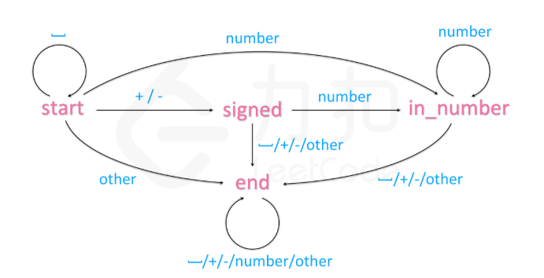
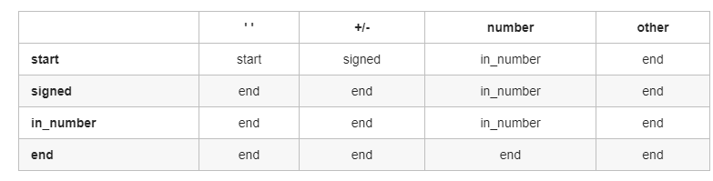

来源：[力扣中国](https://leetcode-cn.com/)

### 确认有限状态机

**DFA**： deterministic finite automaton 


字符串转整数的题里面看到这个官方题解，感觉很巧妙的解决了代码反复验证边界条件的问题，这里记录一下：

https://leetcode-cn.com/problems/string-to-integer-atoi/solution/zi-fu-chuan-zhuan-huan-zheng-shu-atoi-by-leetcode-/








可以看到，这里除了边界判定比较复杂（Integer最大最小值，起始也可以用long接收，最后直接和Integer.MAX_VALUE比较）以外还是比较清晰。

```java
class Automaton {
    private String state = "start";//初始状态就是 start
    public int sign = 1;//转化后 整数的符号位
    public int ans = 0;//转换后的结果

    Map<String, String[]> stateTable = new HashMap<>() {
        {
            put("start", new String[]{"start", "signed", "in_number", "end"});
            put("signed", new String[]{"end", "end", "in_number", "end"});
            put("in_number", new String[]{"end", "end", "in_number", "end"});
            put("end", new String[]{"end", "end", "end", "end"});
        }
    };

    //根据输入的字符获取状态表的列
    private int getCol(char c) {
        if (c == ' ') return 0;
        if (c == '+' || c == '-') return 1;
        if (c >= '0' && c <= '9') return 2;
        return 3;
    }

    public boolean get(char c) {
        //根据输入字符获取下一个状态
        state = stateTable.get(state)[getCol(c)];
        if (state.equals("in_number")) {
            //数据需要边界判定
            if (sign == 1) {
                if (ans > Integer.MAX_VALUE / 10 || (ans == Integer.MAX_VALUE / 10 && (c - '0') > 7)) {
                    ans = Integer.MAX_VALUE;
                    return false;
                }
            } else if (ans > Integer.MAX_VALUE / 10 || (ans == Integer.MAX_VALUE / 10 && (c - '0') > 8)) {
                ans = Integer.MIN_VALUE;
                sign = 1;//已经是最终值了，不需要再进行符号处理
                return false;
            }
            ans = ans * 10 + (c - '0');
        } else if (state.equals("signed"))
            sign = c == '+' ? 1 : -1;
        else if (state.equals("end"))
            return false;
        return true;
    }

}

class Solution {
    public int myAtoi(String str) {
        Automaton automaton = new Automaton();
        for (char c : str.toCharArray()) {
            if (!automaton.get(c))
                break;
        }
        return automaton.sign * automaton.ans;
    }
}

```

