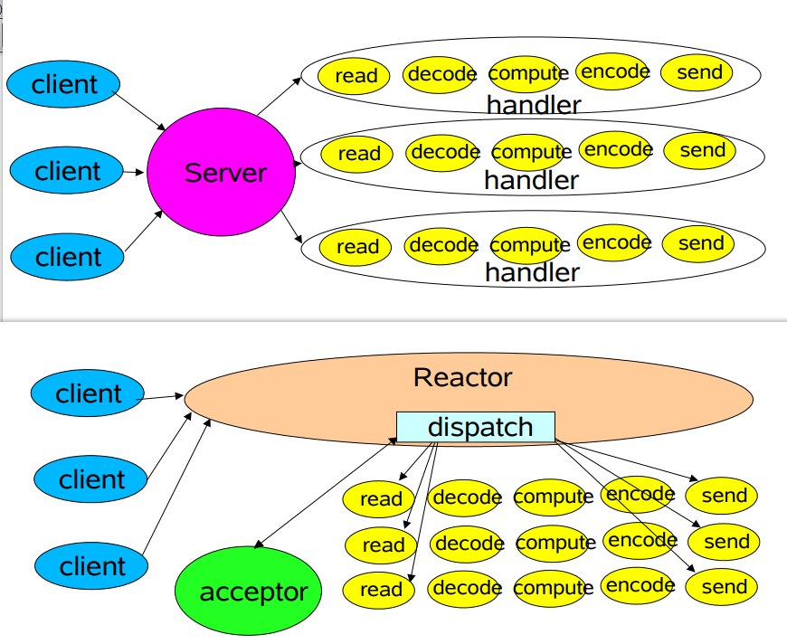
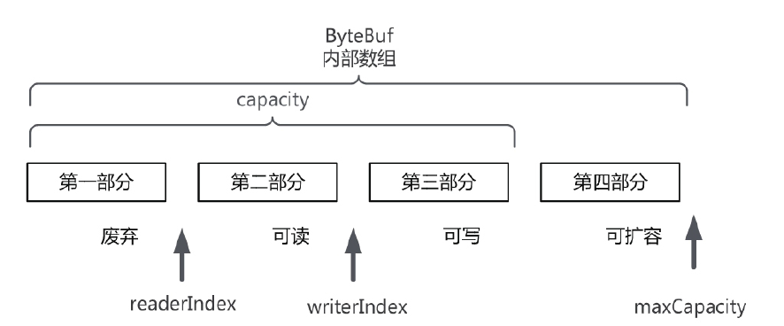

# 一. 基本概念

## File Descriptor

文件描述符，用于指代被打开的文件，所有的IO操作，都是通过FD来完成的。

linux下，使用`ulimit -n`查看单个进程的最大文件句柄数量

对应的选项：

```sh
ulimit(选项)
-a：显示目前资源限制的设定；
-c <core文件上限>：设定core文件的最大值，单位为区块；
-d <数据节区大小>：程序数据节区的最大值，单位为KB；
-f <文件大小>：shell所能建立的最大文件，单位为区块；
-H：设定资源的硬性限制，也就是管理员所设下的限制；
-m <内存大小>：指定可使用内存的上限，单位为KB；
-n <文件数目>：指定同一时间最多可开启的文件数；
-p <缓冲区大小>：指定管道缓冲区的大小，单位512字节；
-s <堆叠大小>：指定堆叠的上限，单位为KB；
-S：设定资源的弹性限制；
-t <CPU时间>：指定CPU使用时间的上限，单位为秒；
-u <程序数目>：用户最多可开启的程序数目；
-v <虚拟内存大小>：指定可使用的虚拟内存上限，单位为KB。
```


## IO基本原理

用户程序调用底层read/write操作

read是把数据从内核缓冲区复制到进程缓冲区

write则相反


物理级别的（内核缓冲区与物理设备）操作是内核Kernel来进行操作完成的。


如果是socket操作的话：

客户端read：首先等待数据通过网络到达网卡，分组达到后复制到内核缓冲区。之后数据从内核缓冲区复制到应用进程缓冲区。

服务端write（实际上读写双向的，这里只是说一个流程）：java程序在自己的用户完成客户端的请求处理。构造响应数据从用户缓冲区写入内核缓冲区(write指令)，linux内核通过网络IO，将内核缓冲区的数据写入网卡，网卡封装协议发送数据。


​	

## IO模型

阻塞与非阻塞：阻塞就是等待内核IO操作完成之后，才回到用户控件操作。

同步与异步：同步是用户空间线程主动发IO请求，异步是指内核主动发起IO请求。


主要的IO模型包括：

同步阻塞：用户空间发请求之后，一直等待直到复制到用户线程缓冲区

同步非阻塞：用户空间程序发送请求后可以马上获取状态值，IO操作暂时不能执行就下一次再请求（但是数据从内核复制到用户进程缓冲区还是要等的）

IO多路复用：selector帮助多个IO线程监听可读数据。本质还是阻塞IO，适用于多线程高并发。对应的系统调用为select/epoll，可以通过一个进程来监听多个FD，一旦某个描述符就绪，内核就可以把就绪的状态返回对应的应用程序，之后应用程序才会开始IO系统调用。通过一个选择器的线程就维护了大量的连接，避免系统创建大量线程。

异步IO：用户空间的线程注册了各种IO事件的回调函数，由内核主动调用。因为大量的高并发服务器端都是在Linux下，而Linux底层对异步IO的实现还是epoll，所以性能下没有明显的优势。


## NIO的基础概念

OIO面向流，而NIO面向缓冲区


通道（Channel）

选择器（Selector）:实现对多个FD的监控

缓冲区（Buffer）:position(位置)、capacity(容量)、limit(限制)、mark(标记与复原)，使用flip切换


## Reactor反应器模式

理解Reactor反应模式：

http://gee.cs.oswego.edu/dl/cpjslides/nio.pdf



可以看出来Reactor替换了Server的角色。


角色:

- Reactor反应器线程，负责响应IO事件，分发到Handler处理器
- Handler处理器

就像AWT里面在按键上绑定监听器一样，Handler绑定到了事件上面，绑定的这一点就是使用NIO里面的`Selectors`来监听IO事件，使用`SelectionKeys`来管理IO事件的状态以及附加的（`attach`与`attachment`方法）Handler。


还是这篇文章里面，单线程Reactor模式里面使用的是通过attachment取出Handler然后执行，因为这里使用的是Runnable的run方法，所以实际上这里还是在单线程里面执行。


单线程的Reactor模型如果有Handler出现阻塞，那么这个线程就无法继续执行其他的Handler。所以会出现多线程池的Reactor反应器（为啥不直接多线程，这又回到了线程过多会出现资源浪费的问题上）

设计的思路包括：

- IO操作与监听的线程池分开避免阻塞。
- 服务器多核的情况（Netty就是根据内核来做线程池初始化的），反应器线程拆分为多个子反应器（SubReactor）线程，同时每个线程管理一个Selector这样能够提升大通道的能力。


# 二. Netty基本组件

首先看一个简单的服务器例子：

```java
package com.zr.network.basic.tcp.netty.discard;

import io.netty.bootstrap.ServerBootstrap;
import io.netty.buffer.ByteBuf;
import io.netty.buffer.PooledByteBufAllocator;
import io.netty.channel.*;
import io.netty.channel.nio.NioEventLoopGroup;
import io.netty.channel.socket.SocketChannel;
import io.netty.channel.socket.nio.NioServerSocketChannel;
import io.netty.util.ReferenceCountUtil;

/**
 * Description:
 *
 * @author zhangr
 * 2020/12/9 16:37
 */
public class DiscardServer {
    public void startServer() {
        ServerBootstrap bootstrap = new ServerBootstrap();
        NioEventLoopGroup bossLoopGroup = new NioEventLoopGroup(1);
        NioEventLoopGroup workLoopGroup = new NioEventLoopGroup();
        try {

            //设置反应器的线程组：其实就是两个线程组分别负责等待连接与IO操作
            bootstrap.group(bossLoopGroup, workLoopGroup);
            //nio通道的实现类
            bootstrap.channel(NioServerSocketChannel.class);
            //设置监听端口
            bootstrap.localAddress(8080);
            //通道参数
            bootstrap.option(ChannelOption.SO_KEEPALIVE, true);
            bootstrap.option(ChannelOption.ALLOCATOR, PooledByteBufAllocator.DEFAULT);
            //子通道的流水线
            bootstrap.childHandler(new ChannelInitializer<SocketChannel>() {
                @Override
                protected void initChannel(SocketChannel ch) throws Exception {
                    //在流水线通道中增加handler处理器
                    ch.pipeline().addLast(new NettyDiscardHandler());
                }
            });
            //绑定服务器之后使用sync异步方法
            ChannelFuture channelFuture = bootstrap.bind().sync();
            System.out.println("启动成功：端口" + channelFuture.channel().localAddress());
            //等待任务结束，sync()就是等待执行结果，这里的closeFuture返回的ChannelFuture当成功关闭后会通知，所以再调用sync来确定关闭完成
            ChannelFuture closeFuture = channelFuture.channel().closeFuture();
            closeFuture.sync();
        } catch (Exception e) {
            e.printStackTrace();
        } finally {
            bossLoopGroup.shutdownGracefully();
            workLoopGroup.shutdownGracefully();
        }
    }

    class NettyDiscardHandler extends ChannelInboundHandlerAdapter {
        @Override
        public void channelRead(ChannelHandlerContext ctx, Object msg) throws Exception {

            ByteBuf in = (ByteBuf) msg;
            try {
                System.out.println("收到消息,丢弃如下:");
                while (in.isReadable()) {
                    System.out.print((char) in.readByte());
                }
                System.out.println();
            } finally {
                ReferenceCountUtil.release(msg);
            }
        }
    }

    public static void main(String[] args) {
        new DiscardServer().startServer();
    }
}

```


结合Reactor多线程模型来粗略的理解Netty里面的组件，

Bootstrap作为启动类负责创建通道，启动注册到EventLoop

pipeline作为流水线整合通道与Handler的绑定，其中Handler完成业务的处理（编解码、读取与响应）分为in和out两个类型

EventLoop就是负责处理IO事件的线程，也就是管理Selector通过轮询负责分发事件，EventLoopGroup是管理其的线程池，分为负责新连接的和负责业务处理的，所以会出现两个。我们之前写的Acceptor就相当于这里的bossGroup


## Bootstrap启动器类

负责Netty组件的组装：

- Bootstrap 客户端使用
- ServerBootstrap服务端使用


### 父子通道

NioSocketChannel封装的是Java NIO通道，NIO底层对应操作系统的socket描述符，这样的描述符分为两类：

- 连接监听：服务端用来接收客户端套接字连接
- 数据传输：客户端使用

一个连接监听的描述符可以接收多个传输类的


NioServerSocketChannel对应的就是连接监听

NioSocketChannel对应数据传输的套接字


我们也把NioServerSocketChannel成为Parent Channel

对应NioSocketChannel为Child Channel


### EventLoopGroup线程组

在Reactor多线程模型的版本里面，我们使用每个子反应器SubReactor来管理一个Selector


我们可以把EventLoopGroup视为一个多线程的子反应器，也就是一个线程池管理EventLoop，每个EventLoop管理一个Selector选择器

为了及时接受新的连接，我们把处理连接请求和处理IO业务的分为两个线程池，具体到Netty的实现也就是分为两个EventLoopGroup


### Bootstrap启动流程

```java
    public void runServer() {
        //创建reactor 线程组
        EventLoopGroup bossLoopGroup = new NioEventLoopGroup(1);
        EventLoopGroup workerLoopGroup = new NioEventLoopGroup();

        try {
            //1 设置reactor 线程组
            b.group(bossLoopGroup, workerLoopGroup);
            //2 设置nio类型的channel
            b.channel(NioServerSocketChannel.class);
            //3 设置监听端口
            b.localAddress(serverPort);
            //4 设置通道的参数
            b.option(ChannelOption.SO_KEEPALIVE, true);
            b.option(ChannelOption.ALLOCATOR, PooledByteBufAllocator.DEFAULT);
            b.childOption(ChannelOption.ALLOCATOR, PooledByteBufAllocator.DEFAULT);

            //5 装配子通道流水线
            b.childHandler(new ChannelInitializer<SocketChannel>() {
                //有连接到达时会创建一个channel
                protected void initChannel(SocketChannel ch) throws Exception {
                    // pipeline管理子通道channel中的Handler
                    // 向子channel流水线添加一个handler处理器
                    ch.pipeline().addLast(new NettyDiscardHandler());
                }
            });
            // 6 开始绑定server
            // 通过调用sync同步方法阻塞直到绑定成功
            ChannelFuture channelFuture = b.bind().sync();
            Logger.info(" 服务器启动成功，监听端口: " +
                    channelFuture.channel().localAddress());

            // 7 等待通道关闭的异步任务结束
            // 服务监听通道会一直等待通道关闭的异步任务结束
            ChannelFuture closeFuture = channelFuture.channel().closeFuture();
            closeFuture.sync();
        } catch (Exception e) {
            e.printStackTrace();
        } finally {
            // 8 优雅关闭EventLoopGroup，
            // 释放掉所有资源包括创建的线程
            workerLoopGroup.shutdownGracefully();
            bossLoopGroup.shutdownGracefully();
        }

    }
```


## Channel通道

在

```java
b.channel(NioServerSocketChannel.class);
```

中指定了通道类型，实际上是设定了`channelFactory`，之后每次操作会使用工厂类创建新的通道。


其中Bootstrap的bind、connect都会创建新的通道。


## Handler处理器

Reactor模型里面IO操作包括：

- 通道读取数据
- 解码
- 业务处理
- 编码
- 写数据到通道


具体到用户程序使用Handler来进行处理，处理的步骤包括

- 解码
- 业务处理
- 编码
- 写数据到通道

也就是读取数据会有netty自己来完成


入站操作：netty的内部通道 ————> ChannelInboundHandler 入站处理器

出站操作： ChannelInboundHandler出站处理器————> netty的内部通道

其实很好理解，因为入站是从外部先读取到netty内部，之后依次处理，出站则相反。

入站操作包括：解码、业务处理

出站操作包括：编码、数据包写入通道


### ChannelInboudHandler入站处理器

首先看一下几个触发的位置：

1. channelRegistered：新的客户端连接的时候
2. channelActive：通道激活
3. channelRead：通道缓冲区可读
4. channelReadComplete
5. channelInactive：连接被断开或者不可用
6. exceptionCaught： 通道处理发生异常情况


我们一般使用ChannelInboudHandler的默认实现ChannelInboudHandlerAdapter来处理。


### ChannelOutboundHandler出站处理器

处理出站操作（Netty的通道去操作底层的java IO通道）的时间点：

- bind()完成底层Java IO通道的IP地址绑定

- connect()完成底层IO通道的服务器端连接

- writ() netty通道写数据到底层IO

- flush

- read

- disConnect

- close


### 处理器顺序

这里用代码记一下出入站不同的顺序：


入站处理器：A->B->C

```java
channel.pipeline().addLast(new InboudHandlerA());
channel.pipeline().addLast(new InboudHandlerB());
channel.pipeline().addLast(new InboudHandlerC());
```


出站处理器：C->B->A

```java
channel.pipeline().addLast(new OutboudHandlerA());
channel.pipeline().addLast(new OutboudHandlerB());
channel.pipeline().addLast(new OutboudHandlerC());
```


## ByteBuf

ByteBuf是java NIO ByteBuffer的增强版：

逻辑上分为四个部分：




操作和概念和ByteBuffer差不多，读写对应操作对应的指针进行变动（和java的ByteBuffer的明细区别就是读写不用进行flip()操作）。


操作就是：

- 分配
- 写数据
- 读数据

读写就是对应的方法（其中get不改变指针的变动）

分配的方法随选择的类型不同有变化

其中使用：`ButeBufAllocator.DEFAULT.buffer()`根据源码中`io.netty.allocator.type`的配置来操作：

```java
 		String allocType = SystemPropertyUtil.get("io.netty.allocator.type", "unpooled").toLowerCase(Locale.US).trim();
        ByteBufAllocator alloc;
        if ("unpooled".equals(allocType)) {
            alloc = UnpooledByteBufAllocator.DEFAULT;
            logger.debug("-Dio.netty.allocator.type: {}", allocType);
        } else if ("pooled".equals(allocType)) {
            alloc = PooledByteBufAllocator.DEFAULT;
            logger.debug("-Dio.netty.allocator.type: {}", allocType);
        } else {
            alloc = UnpooledByteBufAllocator.DEFAULT;
            logger.debug("-Dio.netty.allocator.type: unpooled (unknown: {})", allocType);
        }

        DEFAULT_ALLOCATOR = alloc;
```

可以看到，如果不进行配置，那么就是使用的非池化的方式来创建


### 分配器的区别：池化与非池化

池化的ByteBuf缓冲区使用缓存池避免频繁创建


分配至分别是：

PoolByteBufAllocator

UnpooledByteBufAllocator


### 引用计数


可以看到ByteBuf实现了ReferenceCountedf接口

设计引用计数的两个方法：

- retain(ByteBuf)
- release(ReferenceCounted)


一般是结对调用的，也可以调用`refCnt()`来查看计数值

计数为0的时候，由Netty对ByteBuf进行回收：

池化的话就是放回缓存池

非池化Unpooled也是分两种，如果是在堆上创建直接由JVM进行回收，如果是Direct类型，本地方法来释放外部内存


### ByteBuf缓冲区的区别：堆缓冲区和直接缓冲区

堆缓冲区是存储在JVM的堆上，

直接缓冲区存储在操作系统物理内存


读写速度肯定直接缓冲快一些，但是释放和分配以及java操作（复制到堆上）堆缓冲区适合大量的操作

（同时池化可以解决重复大量创建释放的问题。）


都可以使用池化与非池化的分配器来分配：

`ByteBufAllocator.DEFAULT.buffer()`

`ByteBufAllocator.DEFAULT.directBuffer()`


区分可以使用：

hasArray来看，返回true就是heap的缓冲区，false就是直接缓冲区

```java
public class BufferTypeTest {
   final static Charset UTF_8 = Charset.forName("UTF-8");

    //堆缓冲区
    @Test
    public  void testHeapBuffer() {
        //取得堆内存
        //取得堆内存--netty4默认直接buffer，而非堆buffer
        //ByteBuf heapBuf = ByteBufAllocator.DEFAULT.buffer();
        ByteBuf heapBuf = ByteBufAllocator.DEFAULT.heapBuffer();
        heapBuf.writeBytes("疯狂创客圈:高性能学习社群".getBytes(UTF_8));
        if (heapBuf.hasArray()) {
            //取得内部数组
            byte[] array = heapBuf.array();
            int offset = heapBuf.arrayOffset() + heapBuf.readerIndex();
            int length = heapBuf.readableBytes();
            Logger.info(new String(array,offset,length, UTF_8));
        }
        heapBuf.release();

    }

    //直接缓冲区
    @Test
    public  void testDirectBuffer() {
        ByteBuf directBuf =  ByteBufAllocator.DEFAULT.directBuffer();
        directBuf.writeBytes("疯狂创客圈:高性能学习社群".getBytes(UTF_8));
        if (!directBuf.hasArray()) {
            int length = directBuf.readableBytes();
            byte[] array = new byte[length];
            //读取数据到堆内存
            directBuf.getBytes(directBuf.readerIndex(), array);
            Logger.info(new String(array, UTF_8));
        }
        directBuf.release();
    }
}
```


### 复合缓冲区CompositeByteBuf

向Http协议需要发送Header+Body的请求，信息切割多个数据包Header经常重复使用。

这个时候可以使用CompositeByteBuf来进行操作：       

```java
        CompositeByteBuf cbuf = ByteBufAllocator.DEFAULT.compositeBuffer();
        //消息头，底层就是heapBuffer
        ByteBuf headerBuf = Unpooled.copiedBuffer("header:", utf8);
        //消息体1
        ByteBuf bodyBuf = Unpooled.directBuffer("body", utf8);
        cbuf.addComponents(headerBuf, bodyBuf);
        .......	
        headerBuf.retain();
        cbuf.release();
```


使用nioBuffer可以合并为一个新的 JavaNIO的ByteBuffer

```java
    public void intCompositeBufComposite() {
        CompositeByteBuf cbuf = Unpooled.compositeBuffer(3);
        cbuf.addComponent(Unpooled.wrappedBuffer(new byte[]{1, 2, 3}));
        cbuf.addComponent(Unpooled.wrappedBuffer(new byte[]{4}));
        cbuf.addComponent(Unpooled.wrappedBuffer(new byte[]{5, 6}));
        //合并成一个单独的缓冲区
        ByteBuffer nioBuffer = cbuf.nioBuffer(0, 6);
        byte[] bytes = nioBuffer.array();
        System.out.print("bytes = ");
        for (byte b : bytes) {
            System.out.print(b);
        }
        cbuf.release();
    }
```


### ByteBuf浅层复制

浅层复制不改变底层数组（不会真的去复制，不会改变引用计数值）

#### slice()切片浅层复制

可读版本


#### duplicate 整体浅层复制

整个的浅层复制


# 三. 编解码

从流水线的处理顺序可以理解，解码实际上就是InboundHandler，编码实际上就是OutBoundHandler


Netty自定义的解码器和编码器包括（都是抽象类，需要自己实现）：

BtyeBuf到POJO： ByteToMessageDecoder MessageToByteEncoder

POJO到POJO:         MessageToMessageDecoder  MessageToMessageEncoder  

以及对应的年度版（编解码器）: ByteToMessageCodec      MessageToMessageCodec

 还有可以把自己的编解码器合并在一起的： CombinedCHannelDuplexHandler


对于解码器，还有很多特殊的（需要用的时候，看看ByteToMessageDecoder的继承树就可以了）    FixedLengthFrameDecoder、LineBasedFrameDecoder、DelimiterBasedFrameDecoder、LengthFieldBasedFrameDecoder


对于不要好理解的lengthFieldBasedFrameDecoder,中间`lengthAdjustment`其实就是一个header值：

```java
class StringProcessHandler extends ChannelInboundHandlerAdapter {
    @Override
    public void channelRead(ChannelHandlerContext ctx, Object msg) throws Exception {
        System.out.println("输出：" + msg);
    }
}

public class LengthFieldFrameDemo {
    public static void main(String[] args) throws UnsupportedEncodingException {
        ChannelInitializer i = new ChannelInitializer<EmbeddedChannel>() {
            @Override
            protected void initChannel(EmbeddedChannel ch) throws Exception {
                ch.pipeline().addLast(
                        new LengthFieldBasedFrameDecoder(1024, 0, 4, 2, 6));
                ch.pipeline().addLast(new StringDecoder());
                ch.pipeline().addLast(new StringProcessHandler());
            }
        };
        EmbeddedChannel channel = new EmbeddedChannel(i);
        for (int j = 0; j < 10; j++) {
            ByteBuf buffer = Unpooled.buffer();
            String s = j + "次发送";
            byte[] bytes = s.getBytes("UTF-8");
            buffer.writeInt(bytes.length);
            buffer.writeChar('C');
            buffer.writeBytes(bytes);
            channel.writeInbound(buffer);
        }

    }
}
```


对于编码器，也是一样（看MessageToByteEncoder继承树）。


# 四. 序列化（JSON与ProtoBuf）

序列化的方式：

- json：可读性强，性能差
- xml：同上
- 框架：Avro、Thrift 不了解
- Protobuf：传输效率较高的二进制序列化框架


## 粘包、拆包

我们接收数据需要保证的第一件事：

`接收端的ByteBuf二进制包一定是完整的应用二进制包，而不是半包或者粘包`


Netty每次复制内核缓冲区数据到进程的时候就会出现这些问题，

可以使用解码器来解决问题。


# 五. IM


