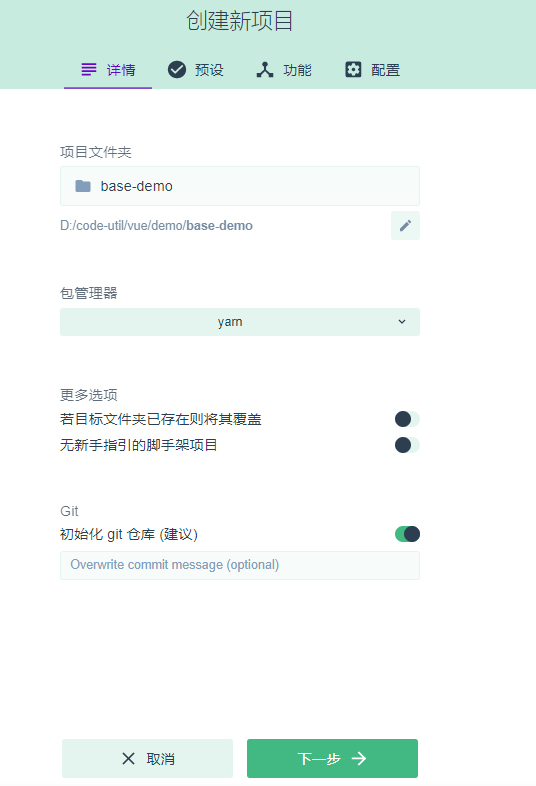

# Vue后台管理系统

## 一. 组件

### 1. vue-cli3

参考资料：https://cli.vuejs.org/zh/config/#vue-config-js

- 安装node

  - 安装地址：http://nodejs.cn/download/
  - 验证：`node -v`

- 安装vue-cli3

  - npm命令全局安装：`npm install -g @vue/cli`
  - 如果网络连接失败修改镜像地址：`npm config set registry https://registry.npm.taobao.org`
  - 验证：`vue -V`

- 创建项目

  - 安装yarn包：https://classic.yarnpkg.com/zh-Hans/docs/install#windows-stable

    - 验证：`yarn --version`

  - `vue create project`或者可视化创建`vue ui`

    - 选择安装位置
    - 创建新项目

    

    - 手动配置项目
    - 选择功能：Babel, Router, Vuex, 使用配置文件
    - 创建项目

  - `vue init webpack project`

- CLI服务

  - 