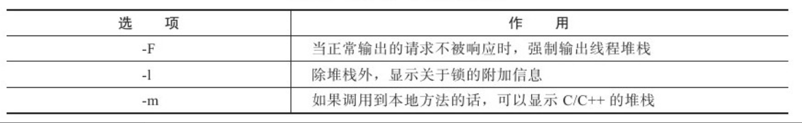
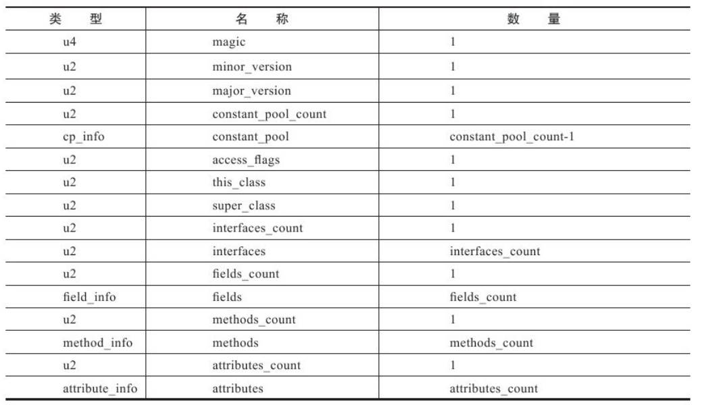
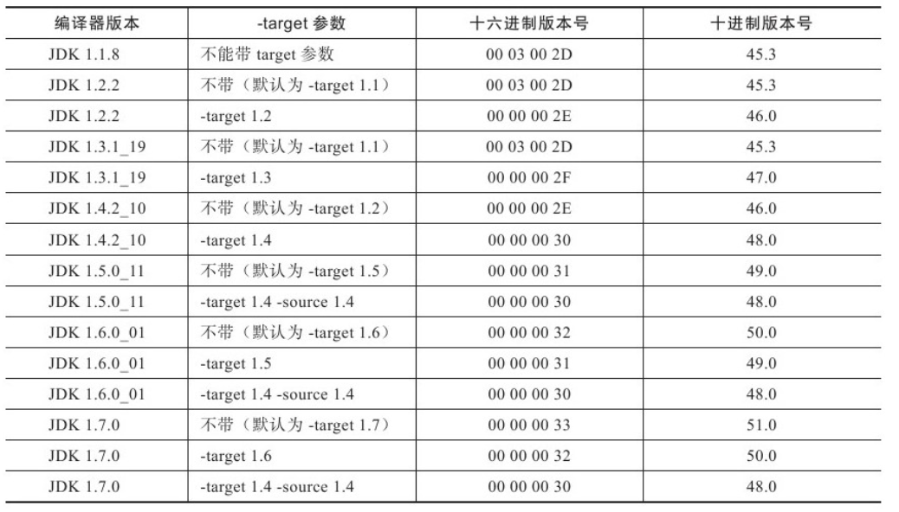

# 自动内存管理机制

## JAVA内存区域与内存溢出

### 运行时数据区域：


#### 程序计数器：

线程私有的内存，为了在线程切换后能够恢复到正确位置。


#### Java虚拟机栈

线程私有的，每个方法在执行的同时都会创建一个栈帧（Stack Frame[[1\]](part0031.xhtml#ch1-back)）用于存储**局部变量表**、操作数栈、动态链接、方法出口等信息。每一个方法从调用直至执行完成的过程，就对应着一个栈帧在虚拟机栈中入栈到出栈的过程。


#### 本地方法栈

虚拟机栈为虚拟机执行Java方法（也就是字节码）服务，而本地方法栈则为虚拟机使用到的Native方法服务。


#### 堆

Java堆是被所有线程共享的一块内存区域，在虚拟机启动时创建。

此内存区域的唯一目的就是存放对象实例，几乎所有的对象实例都在这里分配内存。

Java堆是垃圾收集器管理的主要区域，因此很多时候也被称做“GC堆”

由于现在收集器基本都采用分代收集算法，所以Java堆中还可以细分为：新生代和老年代；再细致一点的有Eden空间、From Survivor空间、To Survivor空间等。

根据Java虚拟机规范的规定，Java堆可以处于物理上不连续的内存空间中，只要逻辑上是连续的即可，就像我们的磁盘空间一样。

当前主流的虚拟机都是按照可扩展来实现的（通过-Xmx和-Xms控制）


#### 方法区

各个线程共享的内存区域，它用于存储已被虚拟机加载的类信息、常量、静态变量、即时编译器编译后的代码等数据。


#### 运行时常量池

运行时常量池（Runtime Constant Pool）是方法区的一部分。

常量池（Constant Pool Table）用于存放编译期生成的各种字面量和符号引用，这部分内容将在类加载后进入方法区的运行时常量池中存放。

运行时常量池相对于Class文件常量池的另外一个重要特征是具备动态性，Java语言并不要求常量一定只有编译期才能产生，也就是并非预置入Class文件中常量池的内容才能进入方法区运行时常量池，运行期间也可能将新的常量放入池中，这种特性被开发人员利用得比较多的便是String类的intern()方法。

常量池无法再申请到内存时会抛出OutOfMemoryError异常。


#### 直接内存

直接内存（Direct Memory）并不是虚拟机运行时数据区的一部分，也不是Java虚拟机规范中定义的内存区域。但是这部分内存也被频繁地使用，而且也可能导致OutOfMemoryError异常出现，所以我们放到这里一起讲解。


## HotSpot虚拟机

### 对象创建

虚拟机遇到new指令之后，首先在常量池定位类的符号引用，，并且检查这个符号引用代表的类是否已被加载、解析和初始化过。如果没有，那必须先执行相应的类加载过程。

对象分配空间的任务等同于把一块确定大小的内存从Java堆中划分出来。

### 对象的内存布局

- 对象头（Header）：

  对象头包括两部分信息，第一部分用于存储对象自身的运行时数据，如哈希码（HashCode）、GC分代年龄、锁状态标志、线程持有的锁、偏向线程ID、偏向时间戳等，另外一部分是类型指针，即对象指向它的类元数据的指针，虚拟机通过这个指针来确定这个对象是哪个类的实例。

- 实例数据（Instance Data）

  实例数据部分是对象真正存储的有效信息，也是在程序代码中所定义的各种类型的字段内容。

- 对齐填充（Padding）

  占位符


### 对象访问定位

取决于虚拟机实现而定的。目前主流的访问方式有使用句柄和直接指针两种。


使用句柄来访问的最大好处就是reference中存储的是稳定的句柄地址，在对象被移动（垃圾收集时移动对象是非常普遍的行为）时只会改变句柄中的实例数据指针，而reference本身不需要修改。


使用直接指针访问方式的最大好处就是速度更快，它节省了一次指针定位的时间开销。	


​	

### 参数说明

### 堆溢出

制Java堆的大小为20MB，不可扩展：

```
-Xms20m-Xmx20m
```


虚拟机在出现内存溢出异常时Dump出当前的内存堆转储快照以便事后进行分析

```
-XX:+HeapDumpOnOutOfMemoryError
```

### 虚拟机栈和本地方法栈溢出

对于HotSpot来说，虽然-Xoss参数（设置本地方法栈大小）存在，但实际上是无效的，栈容量只由**-Xss参数**设定。

```
-Xss128k
```


如果线程请求的栈深度大于虚拟机所允许的最大深度，将抛出StackOverflowError异常。

如果虚拟机在扩展栈时无法申请到足够的内存空间，则抛出OutOfMemoryError异常。


### 常量池溢出

测试String.intern引起的常量池溢出。在JDK 1.6及之前的版本中，由于常量池分配在永久代内，我们可以通过**-XX:PermSize和-XX:MaxPermSize限制方法区大小**，从而间接限制其中常量池的容量

```
-XX:PermSize=10M-XX:MaxPermSize=10M
```


### 方法区溢出

```
-XX:PermSize=10M-XX:MaxPermSize=10M
```


### 本机直接内存溢出

DirectMemory容量可通过**-XX:MaxDirectMemorySize**指定


```
-Xmx20M-XX:MaxDirectMemorySize=10M
```


>方法区用于存放Class的相关信息，如类名、访问修饰符、常量池、字段描述、方法描述等。对于这些区域的测试，基本的思路是运行时产生大量的类去填满方法区，直到溢出。
>
>
>
>常见的有：大量JSP或动态产生JSP文件的应用（JSP第一次运行时需要编译为Java类）、基于OSGi的应用（即使是同一个类文件，被不同的加载器加载也会视为不同的类）等。


# 垃圾收集齐和内存分配策略

## 判断对象是否不被引用

### 引用计数法

给对象中添加一个引用计数器，每当有一个地方引用它时，计数器值就加1；当引用失效时，计数器值就减1；任何时刻计数器为0的对象就是不可能再被使用的。

它很难解决对象之间相互循环引用的问题。


### 可达性分析算法

通过一系列的称为"GC Roots"的对象作为起始点，从这些节点开始向下搜索，搜索所走过的路径称为引用链（Reference Chain），当一个对象到GC Roots没有任何引用链相连（用图论的话来说，就是从GC Roots到这个对象不可达）时，则证明此对象是不可用的。


### finalize

如果对象在进行可达性分析后发现没有与GC Roots相连接的引用链，那它将会被第一次标记并且进行一次筛选，筛选的条件是此对象是否有必要执行finalize()方法。当对象没有覆盖finalize()方法，或者finalize()方法已经被虚拟机调用过，虚拟机将这两种情况都视为“没有必要执行”。


如果这个对象被判定为有必要执行finalize()方法，那么这个对象将会放置在一个叫做F-Queue的队列之中，并在稍后由一个由虚拟机自动建立的、低优先级的Finalizer线程去执行它。

## 垃圾收集算法

### 标记-清除算法

算法分为“标记”和“清除”两个阶段：首先标记出所有需要回收的对象，在标记完成后统一回收所有被标记的对象。


### 复制算法（新生代）

它将可用内存按容量划分为大小相等的两块，每次只使用其中的一块。当这一块的内存用完了，就将还存活着的对象复制到另外一块上面，然后再把已使用过的内存空间一次清理掉。


每次都是对整个半区进行内存回收，内存分配时也就不用考虑内存碎片等复杂情况，只要移动堆顶指针，按顺序分配内存即可，实现简单，运行高效。只是这种算法的代价是将内存缩小为了原来的一半，未免太高了一点。复制算法的执行过程如图所示。


基本商业虚拟机使用这种收集算法来回收**新生代**(新生代对象存活率低)，新生代不需要按照1:1的比例来划分内存空间，而是将内存分为一块较大的Eden空间和两块较小的Survivor空间，每次使用Eden和其中一块Survivor。


回收时，将Eden和Survivor中还存活着的对象一次性地复制到另外一块Survivor空间上，最后清理掉Eden和刚才用过的Survivor空间。


HotSpot虚拟机默认Eden和Survivor的大小比例是8:1。也就是每次新生代可用空间占据90%，当无法保证回收后**存活数据**只占据10%（剩下的survivor区域）。溢出的内容会依赖其他内存（老年区）进行分配担保。


>分配担保（Handle Promotion）:如果另外一块Survivor空间没有足够空间存放上一次新生代收集下来的存活对象时，这些对象将直接通过分配担保机制进入老年代。


### 标记-整理算法（老年代）

老年代对象存活率较高，没有额外的空间对它进行分配担保。


根据老年代的特点，提出了一种“标记-整理”（Mark-Compact）算法，标记过程仍然与“标记-清除”算法一样，但后续步骤不是直接对可回收对象进行清理，而是让所有存活的对象都向一端移动，然后直接清理掉端边界以外的内存。


## HotSpot算法实现

### 枚举根节点

**GC进行使用可达性分析时，必须停顿所有的java执行线程。**


当执行系统停顿下来后，并不需要一个不漏地检查完所有执行上下文和全局的引用位置，虚拟机应当是有办法直接得知哪些地方存放着对象引用。在HotSpot的实现中，是使用一组称为OopMap的数据结构来达到这个目的的，在类加载完成的时候，HotSpot就把对象内什么偏移量上是什么类型的数据计算出来，在JIT编译过程中，也会在特定的位置记录下栈和寄存器中哪些位置是引用

### 安全点

HotSpot没有为每条指令都生成OopMap（空间成本），只是在“特定的位置”记录了这些信息，这些位置称为安全点（Safepoint），即程序执行到达安全点时才能暂停。


> 安全点的选定基本上是以程序“是否具有让程序长时间执行的特征”为标准进行选定的——因为每条指令执行的时间都非常短暂，程序不太可能因为指令流长度太长这个原因而过长时间运行，“长时间执行”的最明显特征就是指令序列复用，例如方法调用、循环跳转、异常跳转等，所以具有这些功能的指令才会产生Safepoint。


分为：

- 抢先式中断（Preemptive Suspension）:线程终端，不在安全点的会恢复线程直到它跑到线程为止。
- 主动式中断（Voluntary Suspension）：线程会轮询标志位


### 安全区域

线程处于Sleep状态或者Blocked状态，这时候线程无法响应JVM的中断请求。

安全区域是指在一段代码片段之中，引用关系不会发生变化。在这个区域中的任意地方开始GC都是安全的。我们也可以把Safe Region看做是被扩展了的Safepoint。

 


## 垃圾收集器

### HotSpot的垃圾收集器：


#### Serial

暂停其他所有工作线程，直到它完成。

#### ParNew

Serial的多线程版本。多条线程进行垃圾收集。


默认开启的收集线程数与CPU的数量相同，在CPU非常多情况下，可以使用-XX:ParallelGCThreads参数来限制垃圾收集的线程数。


目前作为首选的虚拟机中新生代收集器，主要原因是只有它能与CMS收集器（真正意义上的并发收集器）配合工作。这里的**并发**指用户线程与垃圾收集线程同时执行（但不一定是并行的，可能会交替执行），用户程序在继续运行，而垃圾收集程序运行于另一个CPU上。


> 在JDK 1.5中使用CMS来收集老年代的时候，新生代只能选择ParNew或者Serial收集器中的一个。ParNew收集器也是使用**-XX:+UseConcMarkSweepGC**选项后的默认新生代收集器，也可以使用**-XX:+UseParNewGC**选项来强制指定它。


#### Parallel Scavenge

Parallel Scavenge收集器的目标则是达到一个可控制的吞吐量（Throughput）。

>吞吐量=运行用户代码时间/（运行用户代码时间+垃圾收集时间）


Parallel Scavenge收集器提供了两个参数用于精确控制吞吐量，分别是控制最大垃圾收集停顿时间的**-XX:MaxGCPauseMillis**参数以及直接设置吞吐量大小的**-XX:GCTimeRatio**参数。


**-XX:+UseAdaptiveSizePolicy**开关参数，当这个参数打开之后，就不需要手工指定新生代的大小（-Xmn）、Eden与Survivor区的比例（-XX:SurvivorRatio）、晋升老年代对象年龄（-XX:PretenureSizeThreshold）等细节参数了，虚拟机会根据当前系统的运行情况收集性能监控信息，动态调整这些参数以提供最合适的停顿时间或者最大的吞吐量，这种调节方式称为GC自适应的调节策略（GC Ergonomics）。


实际上，最大垃圾手机停顿时间越大，吞吐量越小（垃圾收集更为频繁，吞吐量下降），新生代的空间越小（小容量收集更快）。


#### Serial Old

Serial Old是Serial收集器的老年代版本，它同样是一个单线程收集器，使用“标记-整理”算法。

这个收集器的主要意义也是在于给Client模式下的虚拟机使用。如果在Server模式下，那么它主要还有两大用途：一种用途是在JDK 1.5以及之前的版本中与Parallel Scavenge收集器搭配使用，另一种用途就是作为CMS收集器的后备预案，在并发收集发生Concurrent Mode Failure时使用。


#### Parallel Old

Parallel Old是Parallel Scavenge收集器的老年代版本，使用多线程和“标记-整理”算法。

在注重吞吐量以及CPU资源敏感的场合，都可以优先考虑Parallel Scavenge加Parallel Old收集器。


#### CMS（Concurrent Mark Sweep）

CMS（Concurrent Mark Sweep）收集器是一种以获取最短回收停顿时间为目标的收集器。


目前很大一部分的Java应用集中在互联网站或者B/S系统的服务端上，这类应用重视响应速度，希望停顿时间短。


基于**标记-清除**算法，运作流程：

1.初始标记（CMS initial mark）

2.并发标记（CMS concurrent mark）

这两个过程还是需要暂停全部工作线程。


3.重新标记（CMS remark）

4.并发清除（CMS concurrent sweep）

最后两个过程可以并发执行。


缺点：

1.并发清除时期的浮动垃圾，因此在老年区需要预留空间	给不变方法给并发收集的程序使用。

2.使用的标记清除算法留下了大量的空间碎片。


#### G1（Garbage-First）收集器

可预测的停顿

步骤：

- 初始标记（Initial Marking）

- 并发标记（Concurrent Marking）

- 最终标记（Final Marking）

- 筛选回收（Live Data Counting and Evacuation）


## 内存分配与回收策略

### 对象优先在Eden分配


对象创建->新生代Eden区域分配->Eden区域没有足够的空间->Minor GC


>新生代GC（Minor GC）：指发生在新生代的垃圾收集动作，因为Java对象大多都具备朝生夕灭的特性，所以Minor GC非常频繁，一般回收速度也比较快。
>
>老年代GC（Major GC/Full GC）：指发生在老年代的GC，出现了Major GC，经常会伴随至少一次的Minor GC（但非绝对的，在Parallel Scavenge收集器的收集策略里就有直接进行Major GC的策略选择过程）。Major GC的速度一般会比Minor GC慢10倍以上。


示例:

```
-XX:+PrintGCDetails //虚拟机在发生垃圾收集行为时打印内存回收日志
-Xms20M、-Xmx20M、-Xmn10M	//限制了Java堆大小为20MB，不可扩展
-XX:SurvivorRatio=8			//新生代Eden区域与一个survivor区的空间比例8:1
```


## 大对象直接进入老年代

虚拟机提供了一个**-XX:PretenureSizeThreshold**参数，令大于这个设置值的对象直接在老年代分配。这样做的目的是避免在Eden区及两个Survivor区之间发生大量的内存复制。


### 长期存活对象进入老年代

Minor GC后，对象在Survivor区域	每经过一次Minor GC，年龄就增加一次，增加到一定程度就会晋升到老年代。这个晋升的年龄阈值，可以在**-XX:MaxTenuringThreshold**设置。


> 为了能更好地适应不同程序的内存状况，虚拟机并不是永远地要求对象的年龄必须达到了MaxTenuringThreshold才能晋升老年代，如果在Survivor空间中相同年龄所有对象大小的总和大于Survivor空间的一半，年龄大于或等于该年龄的对象就可以直接进入老年代，无须等到MaxTenuringThreshold中要求的年龄。


### 空间分配担保

在发生Minor GC之前，虚拟机会先检查老年代最大可用的连续空间是否大于新生代所有对象总空间，如果这个条件成立，那么Minor GC可以确保是安全的。如果不成立，则虚拟机会查看HandlePromotionFailure设置值是否允许担保失败。如果允许，那么会继续检查老年代最大可用的连续空间是否大于历次晋升到老年代对象的平均大小，如果大于，将尝试着进行一次Minor GC，尽管这次Minor GC是有风险的；如果小于，或者HandlePromotionFailure设置不允许冒险，那这时也要改为进行一次Full GC。


下面解释一下“冒险”是冒了什么风险，前面提到过，新生代使用复制收集算法，但为了内存利用率，只使用其中一个Survivor空间来作为轮换备份，因此当出现大量对象在Minor GC后仍然存活的情况（最极端的情况就是内存回收后新生代中所有对象都存活），就需要老年代进行分配担保，把Survivor无法容纳的对象直接进入老年代。与生活中的贷款担保类似，老年代要进行这样的担保，前提是老年代本身还有容纳这些对象的剩余空间，一共有多少对象会活下来在实际完成内存回收之前是无法明确知道的，所以只好取之前每一次回收晋升到老年代对象容量的平均大小值作为经验值，与老年代的剩余空间进行比较，决定是否进行Full GC来让老年代腾出更多空间。

取平均值进行比较其实仍然是一种动态概率的手段，也就是说，如果某次Minor GC存活后的对象突增，远远高于平均值的话，依然会导致担保失败（Handle Promotion Failure）。如果出现了HandlePromotionFailure失败，那就只好在失败后重新发起一次Full GC。虽然担保失败时绕的圈子是最大的，但大部分情况下都还是会将HandlePromotionFailure开关打开，避免Full GC过于频繁。


# 虚拟机性能监控和故障处理工具

##  JDK命令行工具

这些命令行工具大多数是jdk/lib/tools.jar类库的包装。

### 基本概念

LVMID：Local Virtual Machine Identifier

VMID：如果是远程的虚拟机进程，那么格式应该是：

```shell
[protocol:][//]lvmid[@hostname[:port]/servername]
```


### jps

jps（JVM Process Status Tool）虚拟机进程查看

```shell
jps[options][hostid]
```

参数项：


例如：

```shell
jps -v | grep apc
30432 apc-wlwaic.jar -Xms2048m -Xmx2048m -XX:MaxMetaspaceSize=1024m -XX:MetaspaceSize=512m -XX:InitialBootClassLoaderMetaspaceSize=256m
```


### jstat

jstat（JVM Statistics Monitoring Tool）虚拟机统计信息监视工具，是用于监视虚拟机各种运行状态信息的命令行工具。它可以显示本地或者远程虚拟机进程中的类装载、内存、垃圾收集、JIT编译等运行数据

```shell
jstat[option vmid[interval[s|ms][count]]]
```


**option** : 用户希望查询的信息:


例如，查询lvmid为1234进程在每250ms（interval）查询20次的垃圾收集信息。

```shell
jstat -gc 1234 250 20
```


查询进程的已使用空间占总空间的百分比：

```shell
jstat -gcutil 30432
```

结果：

```shell
  S0     S1     E      O      M     CCS    YGC     YGCT    FGC    FGCT     GCT   
  6.87   0.00  56.73   2.24  22.70  93.18     48   48.508     0    0.000   48.508
```

(E)eden区域占使用56.73%

(S0)survivor0占用6.87%

(O)old区域	2.24%

(M)元数据使用比例

(CCS)压缩使用比例

(YGC)程序运行以来共发生Minor GC 48次，也是年轻代垃圾回收次数，耗时48.508s(YGCT)	

(FGC)(FGCT)程序运行以来Full GC次数和耗时

(GCT)GC总耗时


### jinfo

jinfo（Configuration Info for Java）的作用是实时地查看和调整虚拟机各项参数。使用jps命令的-v参数可以查看虚拟机启动时显式指定的参数列表，但如果想知道未被显式指定的参数的系统默认值，除了去找资料外，就只能使用jinfo的-flag选项进行查询了（如果只限于JDK 1.6或以上版本的话，使用java-XX:+PrintFlagsFinal查看参数默认值也是一个很好的选择），jinfo还可以使用-sysprops选项把虚拟机进程的System.getProperties()的内容打印出来。这个命令在JDK 1.5时期已经随着Linux版的JDK发布，当时只提供了信息查询的功能，JDK 1.6之后，jinfo在Windows和Linux平台都有提供，并且加入了运行期修改参数的能力，可以使用-flag[+|-]name或者-flag name=value修改一部分运行期可写的虚拟机参数值。JDK 1.6中，jinfo对于Windows平台功能仍然有较大限制，只提供了最基本的-flag选项。


jinfo（Configuration Info for Java）的作用是实时地查看和调整虚拟机各项参数。

```shell
jinfo [option] pid
```


例如：

```shell
jinfo -sysprops 30432
```

​	

查询CMSInitiatingOccupancyFraction参数值:

```shell
jinfo-flag CMSInitiatingOccupancyFraction 1444
-XX:CMSInitiatingOccupancyFraction=85
```


### jmap

jmap（Memory Map for Java）命令用于生成堆转储快照（一般称为heapdump或dump文件）。

```
jmap [option] vmid
```


### jhat

jhat（JVM Heap Analysis Tool）命令与jmap搭配使用，来分析jmap生成的堆转储快照。


### jstack

jstack（Stack Trace for Java）命令用于生成虚拟机当前时刻的线程快照（一般称为threaddump或者javacore文件）。

```shell
jstack [option] vmid
```





jstack查看线程堆栈

```shell
jstack-l 3500
```


### 可视化工具

Jconsole:   jdk/bin/jconsole.exe


# 虚拟机执行子系统

## 类文件结构

### class文件结构

Class文件是一组以8位字节为基础单位的二进制流，各个数据项目严格按照顺序紧凑地排列在Class文件之中，中间没有添加任何分隔符，这使得整个Class文件中存储的内容几乎全部是程序运行的必要数据，没有空隙存在。当遇到需要占用8位字节以上空间的数据项时，则会按照高位在前的方式分割成若干个8位字节进行存储。


class文件使用类似c的伪结构体来存储数据，包含无符号数和表。

- 无符号数

无符号数属于基本的数据类型，以u1、u2、u4、u8来分别代表1个字节、2个字节、4个字节和8个字节的无符号数，无符号数可以用来描述数字、索引引用、数量值或者按照UTF-8编码构成字符串值。

- 表

表是由多个无符号数或者其他表作为数据项构成的复合数据类型，所有表都习惯性地以"_info"结尾。表用于描述有层次关系的复合结构的数据。


整个Class文件本质上就是一张表，它由表所示的数据项构成。




 class文件版本号：




### 常量池

constant_pool_count	常量池容量计数值

