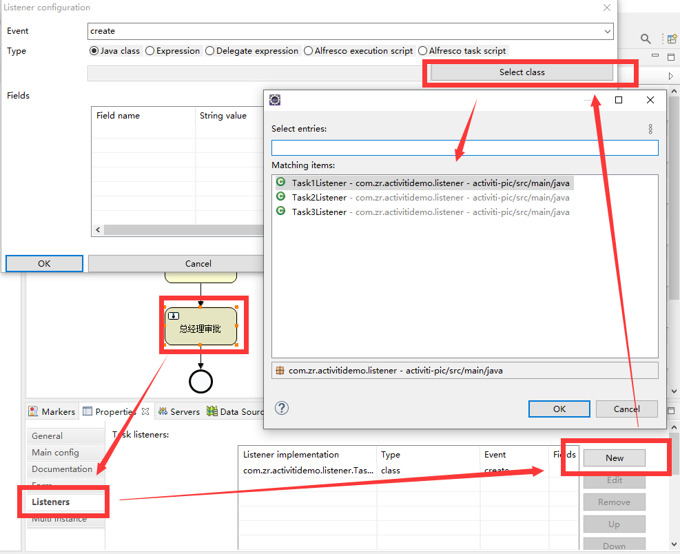

# Activiti笔记

[TOC]


项目地址：https://github.com/zrinGithub/activiti-demo.git

博客、资源：

[Activiti6.0教程](https://tomoya92.github.io/2019/04/24/activiti-env/)


## 一. 概念

### 1. 工作流框架

应用：

1. 适应流程变化
2. 优化开发速度和维护成本
3. 业务控制粒度可控，用户友好


开发步骤：

- 定义流程（制作流程图）创建表
- 部署流程
- 执行流程
- 处理任务
- 结束任务


### 2.BPMN

业务流程建模与标注：Business Process Model and Notation


也就是业务流程图。


### 3. 数据表

Activiti框架自动帮我们创建工作流数据表，这些表用于**存储流程中涉及的数据，如执行人、参数、流程记录等**。


数据表以`ACT_`开头：

`ACT_RE_*`：repository，流程第一以及流程静态资源（规则图片等）

`ACT_RU_*`：runtime，流程运行时保存的数据，包含流程实例、任务、变量、异步任务、运行数据等，因为只在运行时保存，所以数据很小。

`ACT_ID_*`：identity，身份信息

`ACT_HI_*`：history，历史数据

`ACT_GE_*`：general，通用数据


### 4. Service

Activiti里面有几个Service，他们都是从流程引擎`ProcessEngine`获取的，这一点在后面的配置也可以看出来。

| Service           | 管理的表                                                |
| ----------------- | ------------------------------------------------------- |
| RepositoryService | 通用类的表                                              |
| FormService       | 通过表单提交的任务的服务类                              |
| HistoryService    | 历史记录表                                              |
| IdentityService   | 用户信息表                                              |
| ManagementService | 自定义查询的服务类 `managementService.executeCustomSql` |
| RuntimeService    | 运行时相关表                                            |
| TaskService       | 任务表, 可以查询 `ACT_RU_` `ACT_HI_`                    |


## 二. 测试项目


### 1. 环境

生成流程图（xml）这种操作我们交给idea的插件来做：

插件名：[actiBPM](https://plugins.jetbrains.com/plugin/7429-actibpm)

（这个插件栏里面没搜到，最好在官网下载）


安装后为了避免中文乱码需要修改idea源字符集（Settings->Editor->FileEncodings里面改了没用）：

修改idea64.exe.vmoptions文件（建议使用内置菜单修改：HELP->Edit Custom VM Options）：

添加 `-Dfile.encoding=UTF-8`

改完需要重启


**这个插件后面一堆问题，现在使用Eclipse画了图再复制过来。**

Eclipse安装：

菜单Help

->Install new Software...

->Add...

->name 随便写 location: http://www.activiti.org/designer/update


**不过即使你使用的是拷贝的bpmn文件，在idea也需要安装插件，否则会找不到文件，改成xml会找不到对应任务，所以最好还是在Eclipse下开发**


### 2. 依赖

这里是在springboot环境下使用的依赖，其实还有`activiti-spring-boot-starter-basic`这个包可以使用，但是对配置文件以及流程图位置有一定的限制而且还有很多配置上的问题，这里使用`activiti-spring`集成不是太明显：

版本号：

```xml
    <properties>
        <project.build.sourceEncoding>UTF-8</project.build.sourceEncoding>
        <java.version>1.8</java.version>
        <druid.version>1.1.6</druid.version>
        <activiti-version>5.23.0</activiti-version>
    </properties>
```


依赖：

```xml
        <!-- Activiti核心引擎 -->
        <dependency>
            <groupId>org.activiti</groupId>
            <artifactId>activiti-engine</artifactId>
            <version>${activiti-version}</version>
        </dependency>
        <!-- Activiti整合Spring -->
        <dependency>
            <groupId>org.activiti</groupId>
            <artifactId>activiti-spring</artifactId>
            <version>${activiti-version}</version>
        </dependency>
        <!--mysql驱动-->
        <dependency>
            <groupId>mysql</groupId>
            <artifactId>mysql-connector-java</artifactId>
            <scope>runtime</scope>
        </dependency>
        <!-- druid连接池 -->
        <dependency>
            <groupId>com.alibaba</groupId>
            <artifactId>druid</artifactId>
            <version>${druid.version}</version>
        </dependency>
        <!--swagger-->
        <dependency>
            <groupId>io.springfox</groupId>
            <artifactId>springfox-swagger2</artifactId>
            <version>2.9.2</version>
        </dependency>
        <dependency>
            <groupId>io.springfox</groupId>
            <artifactId>springfox-swagger-ui</artifactId>
            <version>2.9.2</version>
        </dependency>
        <!--lombok-->
        <dependency>
            <groupId>org.projectlombok</groupId>
            <artifactId>lombok</artifactId>
            <version>1.18.8</version>
        </dependency>
```

实际上这里只有`activiti-engine`是相关API的，引入数据库连接是因为activiti需要管理数据库，`activiti-spring`只是使用spring包装了一些配置、执行器。


### 3. 配置

如果不使用spring，可以直接自己创建对应的类完成配置：

```java
    public static void main(String[] args) {
        ProcessEngineConfiguration cfg = new StandaloneProcessEngineConfiguration()
                .setJdbcUrl("")
            	.setJdbcUsername("")
            	.setJdbcPassword("")
                .setJdbcDriver("")
                .setJobExecutorActivate(true)
            	.setDatabaseSchemaUpdate("update");
        ProcessEngine processEngine = cfg.buildProcessEngine();
        
        String pName = processEngine.getName();
        String ver = ProcessEngine.VERSION;
        System.out.println("ProcessEngine [" + pName + "] Version: [" + ver + "]");
		//......
    }
```


使用spring的话，交给容器来管理：

`application.properties`

```properties
activiti.datasource.driver-class-name=com.mysql.cj.jdbc.Driver
activiti.datasource.url=jdbc:mysql://127.0.0.1:3306/activiti-demo?serverTimezone=GMT%2B8&useUnicode=true&characterEncoding=UTF-8&useSSL=false&autoReconnect=true&failOverReadOnly=false&maxReconnects=10
activiti.datasource.username=
activiti.datasource.password=
```


配置类：

```java
package com.zr.activitidemo.config;

import org.activiti.engine.*;
import org.activiti.engine.impl.cfg.ProcessEngineConfigurationImpl;
import org.activiti.engine.impl.history.HistoryLevel;
import org.activiti.spring.ProcessEngineFactoryBean;
import org.activiti.spring.SpringProcessEngineConfiguration;
import org.springframework.beans.factory.annotation.Value;
import org.springframework.context.annotation.Bean;
import org.springframework.context.annotation.Configuration;
import org.springframework.jdbc.datasource.DataSourceTransactionManager;
import org.springframework.jdbc.datasource.SimpleDriverDataSource;
import org.springframework.transaction.PlatformTransactionManager;

import javax.sql.DataSource;
import java.sql.Driver;

/**
 * Description:
 *
 * @author zhangr
 * 2020/8/3 11:24
 */
@Configuration
public class ActivitiConfig {
    @Value("${activiti.datasource.driver-class-name}")
    private String driverClassName;

    @Value("${activiti.datasource.url}")
    private String url;

    @Value("${activiti.datasource.username}")
    private String username;

    @Value("${activiti.datasource.password}")
    private String password;

    /**
     * 数据源配置
     */
    @Bean
    @SuppressWarnings("unchecked")
    public DataSource activitiDataSource() throws ClassNotFoundException {
        SimpleDriverDataSource dataSource = new SimpleDriverDataSource();
        dataSource.setUrl(url);
        dataSource.setDriverClass((Class<? extends Driver>) Class.forName(driverClassName));
        dataSource.setUsername(username);
        dataSource.setPassword(password);
        return dataSource;
    }

    /**
     * 事务管理配置
     */
    @Bean
    public PlatformTransactionManager transactionManager() throws ClassNotFoundException {
        return new DataSourceTransactionManager(activitiDataSource());
    }

    /**
     * 流程引擎配置
     */
    @Bean
    public ProcessEngineConfigurationImpl processEngineConfiguration() throws ClassNotFoundException {
        SpringProcessEngineConfiguration configuration = new SpringProcessEngineConfiguration();
        //设置数据源
        configuration.setDataSource(activitiDataSource());
        //创建表的规则 ProcessEngineConfiguration
        //false         即不会创建
        //create-drop   会删除重新创建
        //true          没有表自动创建
        //update        
        configuration.setDatabaseSchemaUpdate("update");
        configuration.setTransactionManager(transactionManager());
        configuration.setJobExecutorActivate(false);//activiti5
        configuration.setAsyncExecutorActivate(true); //activiti6
        configuration.setAsyncExecutorEnabled(true);//activiti5
        configuration.setHistory(HistoryLevel.FULL.getKey());

        return configuration;
    }

    /**
     * 这里就是和spring结合的地方了，spring使用FactoryBean生成对应的ProcessEngine
     */
    @Bean
    public ProcessEngineFactoryBean processEngineFactoryBean() throws ClassNotFoundException {
        ProcessEngineFactoryBean factoryBean = new ProcessEngineFactoryBean();
        factoryBean.setProcessEngineConfiguration(processEngineConfiguration());
        return factoryBean;
    }

    /**
     * processEngine
     */
    @Bean
    public ProcessEngine processEngine() {
        try {
            return processEngineFactoryBean().getObject();
        } catch (Exception e) {
            throw new RuntimeException(e);
        }
    }

    @Bean
    public RepositoryService repositoryService() {
        return processEngine().getRepositoryService();
    }

    @Bean
    public RuntimeService runtimeService() {
        return processEngine().getRuntimeService();
    }

    @Bean
    public TaskService taskService() {
        return processEngine().getTaskService();
    }

    @Bean
    public HistoryService historyService() {
        return processEngine().getHistoryService();
    }

    @Bean
    public FormService formService() {
        return processEngine().getFormService();
    }

    @Bean
    public IdentityService identityService() {
        return processEngine().getIdentityService();
    }

    @Bean
    public ManagementService managementService() {
        return processEngine().getManagementService();
    }
}
```


至此可以启动项目，对应的数据库开始创建对应的数据表。


### 4. 绘制流程图

在idea里面安装完actiBPM插件之后，就可以在项目直接右键右键BpmnFile文件。


如图左边用于编辑组件属性，右侧提供了可供拖拉的组件，中间画布用于绘制流程图。


1. 右键新建BPmnFile，在画布空白点击编辑流程图Id和名称（程序里面启动流程时可以关联Id找到流程）

   

2. 编辑任务名称和受理人，受理人这里直接写死，一般使用变量设置`${var}`，或者使用监听器配置（需要编写对应的监听器实现更加灵活的功能）

   同样的，其他几个任务也可以编辑，这里为了简单直接写死为user1、user2、user3

   

3. 指定线条逻辑，这里为了简单不设定Condition

   


至此完成。


### 5. 部署运行

```java
 @GetMapping("test")
    @ApiOperation("测试")
    public void test() {
        RepositoryService repositoryService = processEngine.getRepositoryService();
        //部署
        Deployment deploy = repositoryService.createDeployment()
                //流程名字
                .name("测试1")
                //流程资源文件
                .addClasspathResource("task/TestProcess1.bpmn")
                //部署
                .deploy();
        log.info("Deploy----- id:" + deploy.getId());

        //启动流程
        RuntimeService runtimeService = processEngine.getRuntimeService();
        //画流程图的时候指定的id
        String processDefinitionKey = "testProcess";
        //业务逻辑里面的id
        String businessKey = "1";
        ProcessInstance instance = runtimeService.startProcessInstanceByKey(processDefinitionKey, businessKey);
        log.info("Run----- id:" + instance.getId());
    }
```


### 6. 查询任务

查询任务的时候，我们使用受理人来查询，我们的第一个Task的受理人（Assignee）是user1：

```java
        //查询任务
        TaskService taskService = processEngine.getTaskService();
        List<Task> tasks = taskService.createTaskQuery().taskAssignee("user1")
                //可以设置分页
//                .listPage(1, 10)
                //排序
//                .orderByTaskCreateTime().desc()
                //确定只有一个结果的时候，可以直接取单个返回
//                .singleResult()
                .list();
```

这里`taskService`查询的方式有很多种：

```java
        taskService.createTaskQuery().taskId("").singleResult();
        taskService.createTaskQuery().taskName("").singleResult();
```


### 7.处理任务

根据受理人查询到对应的任务id之后，可以指定id完成任务

```java
       for (Task task : tasks) {
            String taskId = task.getId();
            log.info("Now complete Task id:" + taskId);
            //处理任务
            taskService.complete(taskId);
        }
```


处理任务的时候可以进行批注：

```java
        for (Task task : tasks) {
            //任务id
            String taskId = task.getId();
            //流程实例id
            String instanceId = task.getProcessInstanceId();
            //批注信息
            String comment = "同意";
            Authentication.setAuthenticatedUserId("user1");
            //添加批注
            taskService.addComment(taskId, instanceId, comment);

            log.info("Now complete Task id:" + taskId);
            //处理任务
            taskService.complete(taskId);
        }
```


### 8. 查询批注和BusinessKey

BusinessKey用于关联activiti本身的业务逻辑：

```java
        //查看批注与businessKey 
        List<Task> user2Tasks = taskService.createTaskQuery().taskAssignee("user2").list();
        for (Task task : user2Tasks) {
            List<Comment> comments = taskService.getProcessInstanceComments(task.getProcessInstanceId());
            log.info("task id: {} ", task.getId());
            for (Comment comment : comments) {
                log.info("comment user:{}", comment.getUserId());
                log.info("comment message:{}", comment.getFullMessage());
                log.info("comment time:{}", comment.getTime());
            }
            //拿到businessKey
            ProcessInstance instance1 = runtimeService.createProcessInstanceQuery()
                    .processInstanceId(task.getProcessInstanceId())
                    .singleResult();
            log.info("business key:{}", instance1.getBusinessKey());
        }
```


## 三. 进阶配置

之前我们在任务中设置的受理人都是写死的常量user1、user2、user3

实际情况中，我们可以使用监听或者动态变量的方式来配置。

### 1. 监听方式配置任务

首先写监听器类，需要实现`TaskListener`接口的`notify`方法：

```java
public class Task1Listener implements TaskListener {
    @Override
    public void notify(DelegateTask delegateTask) {
        delegateTask.setAssignee("user1");
    }
}
public class Task2Listener implements TaskListener {
    @Override
    public void notify(DelegateTask delegateTask) {
        delegateTask.setAssignee("user2");
    }
}
public class Task3Listener implements TaskListener {
    @Override
    public void notify(DelegateTask delegateTask) {
        delegateTask.setAssignee("user3");
    }
}
```


之后我们绘制`TestProcess2.bpmn`流程图用于测试：



这个idea上面点击有问题就不测试了。


### 2. 变量配置任务

同样的，activiti支持使用表达式${}来传入变量，这里我们把所有的代理人修改为`${username}`


启动流程：

```java
  // 创建一个Map存放变量
  Map<String, Object> variables = new HashMap<>();
  // 设置这个流程的下一个代理人是 user1
  variables.put("username", "user1");
  // 这次调用的方法是三个参数的, 最后一个是放变量的
  ProcessInstance instance = runtimeService.startProcessInstanceByKey("AskLeave", "1", variables);
  System.out.println("Id: " + instance.getId());
```


指定下一个受理人：

```java
  // 通过查询可以拿到user2的任务id是7502
  String taskId = "2505";
  // 选通过taskId查询任务
  Task task = taskService.createTaskQuery().taskId(taskId).singleResult();
  // 从任务里拿到流程实例id
  String processInstanceId = task.getProcessInstanceId();
  // 批注信息
  String message = "同意";
  Authentication.setAuthenticatedUserId("user1"); // 当前处理任务的用户的userId, 也可以放用户名
  // 给任务添加批注
  taskService.addComment(taskId, processInstanceId, message);
  // 创建一个Map存放变量
  Map<String, Object> variables = new HashMap<>();
  // 设置这个流程的下一个代理人是 user2
  variables.put("username", "user2");
  // 处理任务
  taskService.complete(taskId, variables);
```

